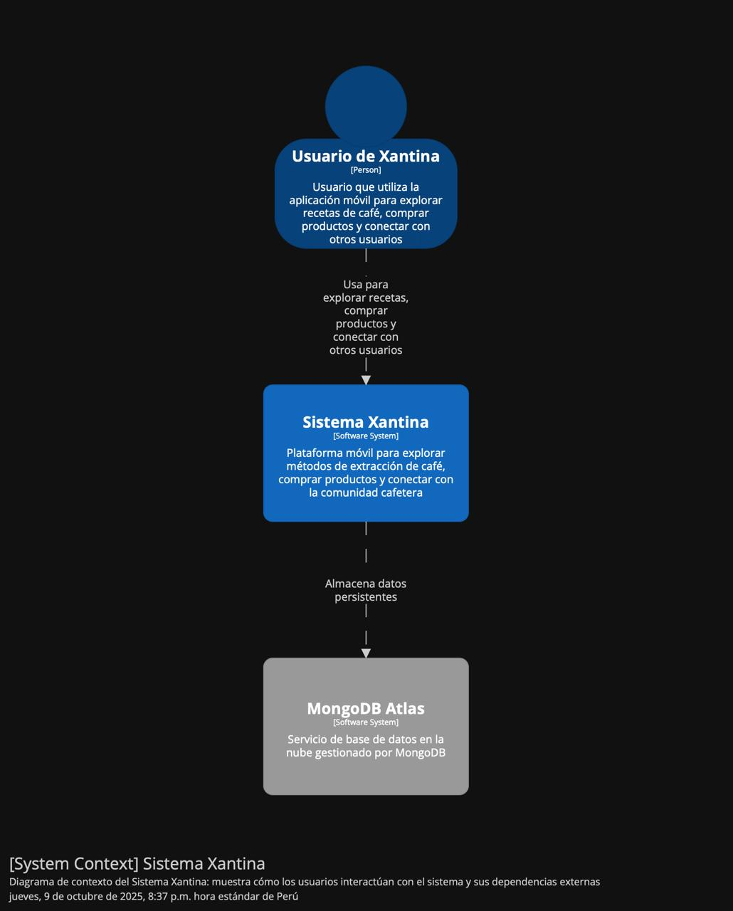
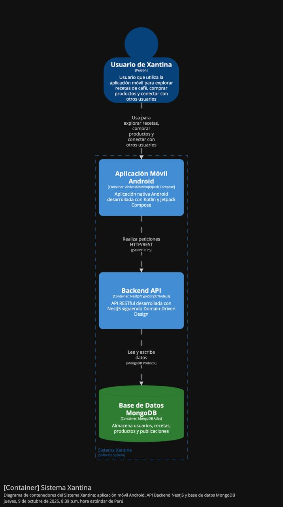
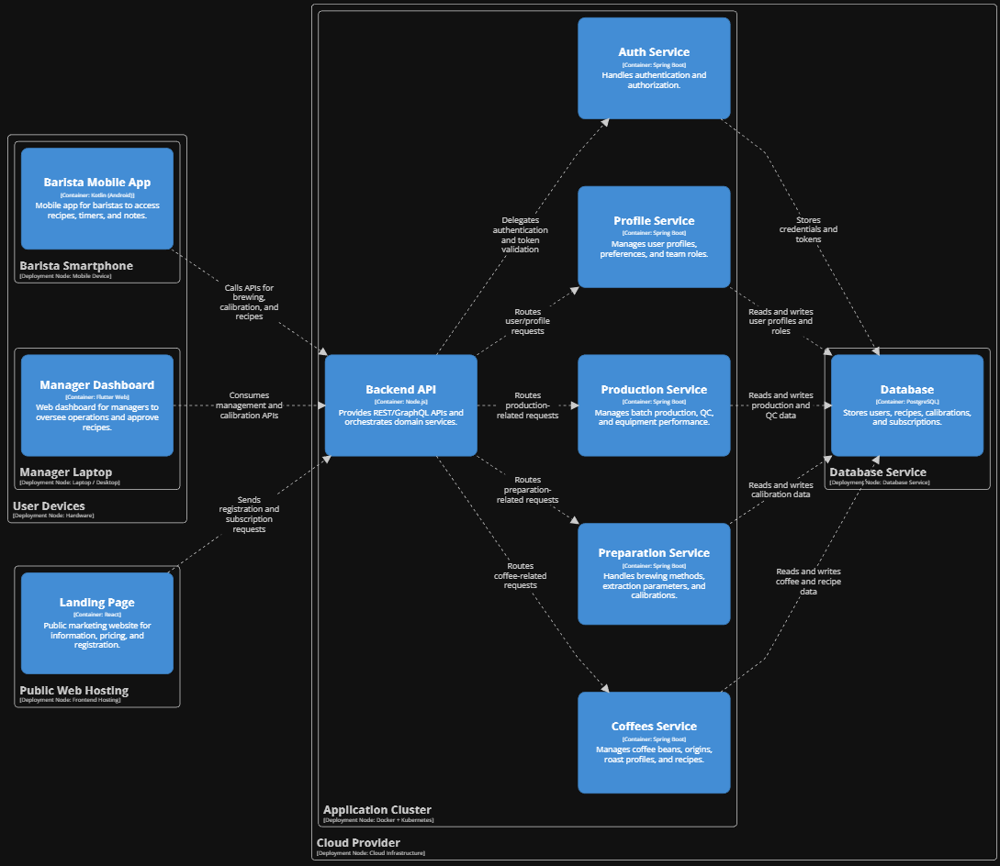

	
Universidad Peruana de Ciencias Aplicadas - Ingeniería de Software - Ciclo 2025-20

	<h1 style="margin: 10px 0; border-bottom: none;">1ACC0238 - Aplicaciones para Dispositivos Móviles</h1>
	
	<h4 style="margin: 10px 0; border-bottom: none;">NRC: 2005</h4>
	<h4 style="margin: 10px 0; border-bottom: none;">Mayta Guillermo, Jorge Luis</h4>
	<h2 style="margin: 10px 0; border-bottom: none;">Informe de Trabajo Final</h2>
	<h3 style="margin: 10px 0; border-bottom: none;">Startup: AromaTech</h3>
	<h3 style="margin: 10px 0; border-bottom: none;">Producto: Xantina</h3>
	<h4 style="margin: 10px 0; border-bottom: none;">Integrantes:</h4>
	<ul style="display: inline-block; text-align: left; padding: 0;">
		<li style="padding: 5px 0;">León Vivas, Fabrizio Amir (20211b994)</li>
		<li style="padding: 5px 0;">Pereira Vasquez, Nelson Fabrizzio (202417468)</li>
		<li style="padding: 5px 0;">Oliva López, Fabián Alejandro (202312013)</li>
		<li style="padding: 5px 0;">Vidal Castro, Miguel Angel (202314186)</li>
		<li style="padding: 5px 0;">Mondoñedo Rodriguez, Juan Diego Javier (202110373)</li>
		<li style="padding: 5px 0;">Tantaleán Mesta, Guillermo Fabián (202311958)</li>
	</ul>
	<h4 style="margin: 10px 0; border-bottom: none;">Setiembre de 2025</h4>

# Registro de Versiones del Informe

<table style="border-collapse: collapse; width: 100%; text-align: left;">
  <thead>
    <tr>
      <th style="border: 1px solid black; padding: 8px; font-weight: bold; text-align: center;">Versión</th>
      <th style="border: 1px solid black; padding: 8px; font-weight: bold; text-align: center;">Fecha</th>
      <th style="border: 1px solid black; padding: 8px; font-weight: bold; text-align: center;">Autor</th>
      <th style="border: 1px solid black; padding: 8px; font-weight: bold;">Descripción de modificación</th>
    </tr>
  </thead>
  <tbody>
    <tr>
      <td style="border: 1px solid black; padding: 8px;">1.0</td>
      <td style="border: 1px solid black; padding: 8px;">11/09/2025</td>
      <td style="border: 1px solid black; padding: 8px;">
        <ul style="margin: 0; padding-left: 18px;">
          <li>León Vivas, Fabrizio Amir</li>
          <li>Pereira Vasquez, Nelson Fabrizzio</li>
          <li>Vidal Castro, Miguel Angel</li>
          <li>Oliva López, Fabián Alejandro</li>
          <li>Mondoñedo Rodriguez, Juan Diego Javier</li>
          <li>Tantaleán Mesta, Guillermo Fabián</li>
        </ul>
      </td>
      <td style="border: 1px solid black; padding: 8px;">
        <strong>Adición de secciones:</strong> 
        
Registro de Versiones del Informe

        
Project Report Collaboration Insights

        
Student Outcome

        
Objetivos SMART

        
Capítulo I: Introducción

        
1.1. Startup Profile

        
1.1.1. Descripción de la Startup

        
1.1.2. Perfiles de integrantes del equipo

        
1.2. Solution Profile

        
1.2.1. Antecedentes y problemática

        
1.2.2. Lean UX Process

        
1.2.2.1. Lean UX Problem Statements

        
1.2.2.2. Lean UX Assumptions

        
1.2.2.3. Lean UX Hypothesis Statements

        
1.2.2.4. Lean UX Canvas

        
1.3. Segmentos objetivo

        
Capítulo II: Requirements Development and Software Solution Design

        
2.1. Competidores

        
2.1.1. Análisis competitivo

        
2.1.2. Estrategias y tácticas frente a competidores

        
2.2. Entrevistas

        
2.2.1. Diseño de entrevistas

        
2.2.2. Registro de entrevistas

        
2.2.3. Análisis de entrevistas

        
2.3. Needfinding

        
2.3.1. User Personas

        
2.3.2. User Task Matrix

        
2.3.3. User Journey Mapping

        
2.3.4. Empathy Mapping

        
2.3.5. Ubiquitous Language

        
2.4. Requirements specification

        
2.4.1. User Stories

        
2.4.2. Impact Mapping

        
2.4.3. Product Backlog

        
2.5. Strategic-Level Domain-Driven Design

        
2.5.1. EventStorming

        
2.5.1.1. Candidate Context Discovery

        
2.5.1.2. Domain Message Flows Modeling

        
2.5.1.3. Bounded Context Canvases

        
2.5.2. Context Mapping

        
2.5.3. Software Architecture

        
2.5.3.1. Software Architecture Context Level Diagrams

        
2.5.3.2. Software Architecture Container Level Diagrams

        
2.5.3.3. Software Architecture Deployment Diagrams

        
2.6. Tactical-Level Domain-Driven Design

        
2.6.1. Bounded Context: &lt;Bounded Context Name&gt;

        
2.6.1.1. Domain Layer

        
2.6.1.2. Interface Layer

        
2.6.1.3. Application Layer

        
2.6.1.4. Infrastructure Layer

        
2.6.1.5. Bounded Context Software Architecture Component Level Diagrams

        
2.6.1.6. Bounded Context Software Architecture Code Level Diagrams

        
2.6.1.6.1. Bounded Context Domain Layer Class Diagrams

        
2.6.1.6.2. Bounded Context Database Design Diagram

      </td>
    </tr>
  </tbody>
</table>

# Project Report Collaboration Insights

El desarrollo del informe se realizó en un repositorio dedicado en la organización de GitHub. Enlace: [https://github.com/CodyLionVivo/ProjectReport](https://github.com/CodyLionVivo/ProjectReport)

Se presenta una tabla que especifica qué miembro del equipo se corresponde con qué usuario de GitHub.

<table cellpadding="6" cellspacing="0" style="border-collapse: collapse; width: 100%;">
  <tr>
	<th>Team Member  (Last Name, First Name)</th>
	<th>GitHub Username</th>
  </tr>
  <tr>
	<td>León Vivas, Fabrizio Amir</td>
	<td>CodyLionVivo</td>
  </tr>
  <tr>
	<td>Vidal Castro, Miguel Angel</td>
	<td>Gossk</td>
  </tr>
  <tr>
	<td>Oliva López, Fabián Alejandro</td>
	<td>FabulousFabStar</td>
  </tr>
  <tr>
	<td>Mondoñedo Rodriguez, Juan Diego Javier</td>
	<td>Jmondonedor</td>
  </tr>
  <tr>
	<td>Tantaleán Mesta, Guillermo Fabián</td>
	<td>guillermotantalean1</td>
  </tr>
	<tr>
	<td>Pereira Vasquez, Nelson Fabrizzio</td>
	<td>fabrizzioper</td>
  </tr>
</table>

**TB1**

Este entregable comprende la elaboración del informe desde el Capítulo I hasta el Capítulo II, desarrollado íntegramente a partir del proceso de investigación en equipo y del diseño del sistema.

# Contenido

- [Registro de Versiones del Informe](#registro-de-versiones-del-informe)
- [Project Report Collaboration Insights](#project-report-collaboration-insights)
- [Student Outcome](#student-outcome)
- [Capítulo I: Introducción](#capítulo-i-introducción)
  - [1.1. Startup Profile](#11-startup-profile)
    - [1.1.1. Descripción de la Startup](#111-descripción-de-la-startup)
    - [1.1.2. Perfiles de integrantes del equipo](#112-perfiles-de-integrantes-del-equipo)
  - [1.2. Solution Profile](#12-solution-profile)
    - [1.2.1. Antecedentes y problemática](#121-antecedentes-y-problemática)
    - [1.2.2. Lean UX Process](#122-lean-ux-process)
      - [1.2.2.1. Lean UX Problem Statements](#1221-lean-ux-problem-statements)
      - [1.2.2.2. Lean UX Assumptions](#1222-lean-ux-assumptions)
      - [1.2.2.3. Lean UX Hypothesis Statements](#1223-lean-ux-hypothesis-statements)
      - [1.2.2.4. Lean UX Canvas](#1224-lean-ux-canvas)
  - [1.3. Segmentos objetivo](#13-segmentos-objetivo)

- [Capítulo II: Requirements Development and Software Solution Design](#capítulo-ii-requirements-development-and-software-solution-design)
  - [2.1. Competidores](#21-competidores)
    - [2.1.1. Análisis competitivo](#211-análisis-competitivo)
    - [2.1.2. Estrategias y tácticas frente a competidores](#212-estrategias-y-tácticas-frente-a-competidores)
  - [2.2. Entrevistas](#22-entrevistas)
    - [2.2.1. Diseño de entrevistas](#221-diseño-de-entrevistas)
    - [2.2.2. Registro de entrevistas](#222-registro-de-entrevistas)
    - [2.2.3. Análisis de entrevistas](#223-análisis-de-entrevistas)
  - [2.3. Needfinding](#23-needfinding)
    - [2.3.1. User Personas](#231-user-personas)
    - [2.3.2. User Task Matrix](#232-user-task-matrix)
    - [2.3.3. User Journey Mapping](#233-user-journey-mapping)
    - [2.3.4. Empathy Mapping](#234-empathy-mapping)
    - [2.3.5. Ubiquitous Language](#235-ubiquitous-language)
  - [2.4. Requirements specification](#24-requirements-specification)
    - [2.4.1. User Stories](#241-user-stories)
    - [2.4.2. Impact Mapping](#242-impact-mapping)
    - [2.4.3. Product Backlog](#243-product-backlog)
  - [2.5. Strategic-Level Domain-Driven Design](#25-strategic-level-domain-driven-design)
    - [2.5.1. EventStorming](#251-eventstorming)
      - [2.5.1.1. Candidate Context Discovery](#2511-candidate-context-discovery)
      - [2.5.1.2. Domain Message Flows Modeling](#2512-domain-message-flows-modeling)
      - [2.5.1.3. Bounded Context Canvases](#2513-bounded-context-canvases)
    - [2.5.2. Context Mapping](#252-context-mapping)
    - [2.5.3. Software Architecture](#253-software-architecture)
      - [2.5.3.1. Software Architecture Context Level Diagrams](#2531-software-architecture-context-level-diagrams)
      - [2.5.3.2. Software Architecture Container Level Diagrams](#2532-software-architecture-container-level-diagrams)
      - [2.5.3.3. Software Architecture Deployment Diagrams](#2533-software-architecture-deployment-diagrams)
  - [2.6. Tactical-Level Domain-Driven Design](#26-tactical-level-domain-driven-design)
    - [2.6.1. Bounded Context: Sprint 1](#261-bounded-context-sprint-1)
      - [2.6.1.1. Domain Layer](#2611-domain-layer)
      - [2.6.1.2. Interface Layer](#2612-interface-layer)
      - [2.6.1.3. Application Layer](#2613-application-layer)
      - [2.6.1.4. Infrastructure Layer](#2614-infrastructure-layer)
      - [2.6.1.5. Bounded Context Software Architecture Component Level Diagrams](#2615-bounded-context-software-architecture-component-level-diagrams)
      - [2.6.1.6. Bounded Context Software Architecture Code Level Diagrams](#2616-bounded-context-software-architecture-code-level-diagrams)
        - [2.6.1.6.1. Bounded Context Domain Layer Class Diagrams](#26161-bounded-context-domain-layer-class-diagrams)
        - [2.6.1.6.2. Bounded Context Database Design Diagram](#26162-bounded-context-database-design-diagram)
- [Conclusiones](#conclusiones)
- [Bibliografía](#bibliografía)
- [Anexos](#anexos)

# Student Outcome

<table style="border-collapse: collapse; width: 100%; text-align: left;">
	<thead>
		<tr>
			<th style="border: 1px solid black; padding: 8px; font-weight: bold; width: 25%;">Criterio Específico</th>
			<th style="border: 1px solid black; padding: 8px; font-weight: bold; width: 45%;">Acciones realizadas</th>
			<th style="border: 1px solid black; padding: 8px; font-weight: bold; width: 30%;">Conclusiones</th>
		</tr>
	</thead>
	<tbody>
		<tr>
			<td>
				Actualiza conceptos y conocimientos necesarios para su desarrollo profesional y en especial para su proyecto en soluciones de software.
			</td>
			<td>
				<strong>TB1:</strong> 
				<ul>
					<li><strong>Fabrizio León:</strong>
          Realiza una investigación mediante el uso de entrevistas para la validación de los items hechos en el Lean UX Process.
          </li>
					<li><strong>Juan Diego Mondoñedo:</strong> Analicé los resultados de nuestras entrevistas para desarrollar parte del needfinding y definir las user stories </li>
          <li><strong>Fabián Oliva López:</strong> Investigué acerca de posibles competidores y desarrollo su respectivo análisis competitivo a su vez de estrategias frente a estos competidores</li>
          <li><strong>Miguel Vidal Castro</strong> Determiné mediante las entrevistas del segmento objetivo de dueño de café, información relevante para entender que bounded contexts desarrollar en la aplicación para poder cubrir sus necesidades. </li>
          <li><strong>Fabrizio:</strong> </li>
          <li><strong>Fabrizzio Pereira:</strong> Investigué el dominio del café de especialidad y desarrollé la arquitectura completa del sistema usando metodologías como Lean UX y Domain-Driven Design.</li>
					<li><strong>Guillermo: Desarrollé toda la parte de DDD como el event storming identificando los principales bounded context.</strong>  </li>
				</ul>
			</td>
			<td>
				<strong>TB1:</strong>  
			</td>
		</tr>
		<tr>
			<td>
				Reconoce la necesidad del aprendizaje permanente para el desempeño profesional y el desarrollo de proyectos en soluciones de software. 
			</td>
			<td>
				<strong>TB1:</strong> 
				<ul>
					<li><strong>Fabrizio León:</strong>
          Fue importante que aprenda sobre del modelo de negocio para así desarrollar los artefactos de una mejora manera. Además, investigue más acerca del DDD para su correcto planteamiento. </li>
					<li><strong>Juan Diego Mondoñedo:</strong> Refresqué mis conocimientos sobre las user stories e investigué sobre el ambiente laboral de nuestro publico objetivo para plantear user stories pertinentes. </li>
          <li><strong>Fabian Oliva López:</strong> Pude aprender la necesidad de investigar acerca de competidores lo cual ayuda a ver puntos estrategicos los cuales puede improvisar nuestro trabajor para entregar un producto de buena calidad </li>
          <li><strong>Miguel Vidal Castro:</strong> Pude aprendar a investigar sobre como realizar un diagrama C4, reforzando conocimientos pasados. Realicé un Event Storming del proyecto lo que me ayudó a identificar los bounded contexts</li>
          <li><strong>Fabrizio:</strong> </li>
          <li><strong>Fabrizzio Pereira:</strong> Aprendí sobre café de especialidad desde cero y estudié nuevas metodologías de desarrollo que no conocía previamente.</li>
					<li><strong>Guillermo: Realicé investigación del modelo de negocio del tema en cuestión para el trabajo lo cual me permitió entender la aplicación de conocimientos de software a nivel de dirección. </strong>  </li>
				</ul>
			</td>
			<td>
				<strong>TB1:</strong>  
			</td>
		</tr>
	</tobdy>
</table>

# Objetivos SMART

<table style="border-collapse: collapse; width: 100%; text-align: left;">
  <thead>
    <tr>
      <th style="border: 1px solid #000; padding: 8px;" rowspan="2">Nombre del estudiante</th>
      <th style="border: 1px solid #000; padding: 8px; text-align: center;" colspan="2">Objetivos</th>
    </tr>
  </thead>
  <tbody>
    <tr>
      <td style="border: 1px solid #000; padding: 8px;">León Vivas, Fabrizio Amir</td>
      <td style="border: 1px solid #000; padding: 8px;">Desarrollar proyectos de alto impacto en la sociedad que permita que las personas tengan una mejor calidad de vida.</td>
      <td style="border: 1px solid #000; padding: 8px;">Completar soluciones de software con los artefactos aprendidos y conocimientos adquiridos a lo largo de mi carrera universitario como lo es con Xantina.</td>
    </tr>
    <tr>
      <td style="border: 1px solid #000; padding: 8px;">Pereira Vasquez, Fabrizzio</td>
      <td style="border: 1px solid #000; padding: 8px;">Completar el diseño de la arquitectura de software para AromaTech/Xantina aplicando Domain-Driven Design incluyendo bounded contexts, agregados y servicios del dominio del café de especialidad.</td>
      <td style="border: 1px solid #000; padding: 8px;">Desarrollar y documentar el Lean UX Process completo (Problem Statements, Assumptions, Hypothesis Statements y Canvas) </td>
    </tr>
    <tr>
      <td style="border: 1px solid #000; padding: 8px;">Tantaleán Mesta, Guillermo Fabián</td>
      <td style="border: 1px solid #000; padding: 8px;">Definir y documentar la arquitectura de software de Xantina mediante la aplicación de Domain-Driven Design, incluyendo la delimitación de bounded contexts, modelos de comunicación y decisiones estratégicas del dominio.
;</td>
      <td style="border: 1px solid #000; padding: 8px;">Elaborar y validar el proceso Lean UX para Xantina, integrando problem statements, supuestos, hipótesis y el Lean UX Canvas, como base para el diseño centrado en el usuario.</td>
    </tr>
    <tr>
      <td style="border: 1px solid #000; padding: 8px;">Mondoñedo Rodriguez, Juan Diego Javier</td>
      <td style="border: 1px solid #000; padding: 8px;">Resolver parte de las problematicas y dolores diarios del grupo objetivo que seleccionamos para nuestro enfoque de proyecto para brindarles mayor satisfaccion de vida.</td>
      <td style="border: 1px solid #000; padding: 8px;">Identificar correctamente las necesidades de nuestros segmentos mediante el needfinding e interpretarlas para definir user stories adecuados para su caso.</td>
    </tr>
    <tr>
      <td style="border: 1px solid #000; padding: 8px;">Oliva López Fabián Alejandro;</td>
      <td style="border: 1px solid #000; padding: 8px;">&nbsp;</td>
      <td style="border: 1px solid #000; padding: 8px;">&nbsp;</td>
    </tr>
    <tr>
      <td style="border: 1px solid #000; padding: 8px;">Vidal Castro Miguel Angel</td>
      <td style="border: 1px solid #000; padding: 8px;">Completar la parte de Software Architecture Diagrams, entrevistar al segmento objetivo de dueño de cafetería.</td>
      <td style="border: 1px solid #000; padding: 8px;">Determinar que bounded context se aplican en los diagramas para saber identificarlos. Realización de Event Storming para entender que bounded context se usan.</td>
    </tr>
    <tr>
      <td style="border: 1px solid #000; padding: 8px;">&nbsp;</td>
      <td style="border: 1px solid #000; padding: 8px;">&nbsp;</td>
      <td style="border: 1px solid #000; padding: 8px;">&nbsp;</td>
    </tr>
    <tr>
      <td style="border: 1px solid #000; padding: 8px;">&nbsp;</td>
      <td style="border: 1px solid #000; padding: 8px;">&nbsp;</td>
      <td style="border: 1px solid #000; padding: 8px;">&nbsp;</td>
    </tr>
  </tbody>
</table>

# Capítulo I: Introducción

## 1.1. Startup Profile

En esta sección se presenta una **visión general** de la startup del proyecto. Se resume su **propósito**, el **problema** que busca resolver y la **propuesta de valor** a alto nivel, junto con una descripción breve del **equipo** y sus **roles**. El objetivo es contextualizar al lector antes de entrar a los detalles de producto en capítulos posteriores.

### 1.1.1. Descripción de la Startup

AromaTech es una startup que crea aplicaciones móviles para el café de especialidad. Ayudamos a baristas, cafeterías y entusiastas a estandarizar recetas, registrar catas y simplificar el trabajo en barra. También somos entusiastas del café: desde la barra y el origen hemos vivido que el valor del café no termina en “pedir y tomar”, sino en entender su viaje —del grano a la taza— y compartirlo con una comunidad curiosa. Por eso diseñamos herramientas rápidas y usables que convierten cada preparación en una experiencia de aprendizaje.

**Misión**  
Educar a baristas y amantes del café sobre los derivados (espresso, cappuccino, latte, macchiato, cold brew, etc.) y sus recetas; explicar de forma simple la extracción (relación café/agua, molienda, temperatura, presión, tiempo), la química del grano (tostado, compuestos solubles, desgasificación) y la texturización de la leche. Todo mediante experiencias móviles guiadas, prácticas y colaborativas que invitan a experimentar, registrar y compartir.

**Visión** 
Construir la plataforma móvil de referencia para el café de especialidad en Latinoamérica: accesible para aprender, útil para operar y abierta para compartir. Conectar origen, barra y consumidor a través de recetas reutilizables, métricas claras y una comunidad que documenta, mejora y celebra cada taza.

### 1.1.2. Perfiles de integrantes del equipo
<table style="width: 100%; border-collapse: collapse; margin-bottom: 20px;">
        <thead>
            <tr>
                <th style="border: 1px solid #ddd; padding: 10px; text-align: left; width: 25%;">Foto</th>
                <th style="border: 1px solid #ddd; padding: 10px; text-align: left; width: 15%;">Nombres y Apellidos</th>
                <th style="border: 1px solid #ddd; padding: 10px; text-align: left; width: 15%;">Código de Alumno</th>
                <th style="border: 1px solid #ddd; padding: 10px; text-align: left; width: 15%;">Carrera</th>
                <th style="border: 1px solid #ddd; padding: 10px; text-align: left; width: 30%;">Habilidades</th>
            </tr>
        </thead>
        <tbody>
            <tr>
                <td style="border: 1px solid #ddd; padding: 10px; text-align: left; background-color: #f2f2f2; color: #333;"></td>
                <td style="border: 1px solid #ddd; padding: 10px; text-align: left; background-color: #f2f2f2; color: #333;"></td>
                <td style="border: 1px solid #ddd; padding: 10px; text-align: left; background-color: #f2f2f2; color: #333;">202224135</td>
                <td style="border: 1px solid #ddd; padding: 10px; text-align: left; background-color: #f2f2f2; color: #333;">Ingeniería de Software</td>
                <td style="max-width: 300px; overflow: hidden; text-overflow: ellipsis; white-space: normal;">
                    <ul>
                        <li>Diseño web</li>
                        <li>Gestión y diseño de bases de datos SQL y noSQL</li>
                        <li>Programación en C++ y Python</li>
                    </ul>
                </td>
            </tr>
            <tr>
                <td style="border: 1px solid #ddd; padding: 10px; text-align: left; background-color: #f2f2f2; color: #333;"></td>
                <td style="border: 1px solid #ddd; padding: 10px; text-align: left; background-color: #f2f2f2; color: #333;">León Vivas, Fabrizio Amir</td>
                <td style="border: 1px solid #ddd; padding: 10px; text-align: left; background-color: #f2f2f2; color: #333;">20211b994</td>
                <td style="border: 1px solid #ddd; padding: 10px; text-align: left; background-color: #f2f2f2; color: #333;">Ingeniería de Software</td>
                <td style="max-width: 300px; overflow: hidden; text-overflow: ellipsis; white-space: normal;">
                    <ul>
                        <li>Desarrollo front-end</li>
                        <li>Conocimiento de TI en sistemas basados en UNIX</li>
                        <li>Competente en C++, JavaScript y Python</li>
                        <li>Experiencia con Frameworks ágiles</li>
                    </ul>
                </td> 
            </tr>
            <tr>
                <td style="border: 1px solid #ddd; padding: 10px; text-align: left; background-color: #f2f2f2; color: #333;"></td>
                <td style="border: 1px solid #ddd; padding: 10px; text-align: left; background-color: #f2f2f2; color: #333;">Mondoñedo Rodriguez, Juan Diego Javier</td>
                <td style="border: 1px solid #ddd; padding: 10px; text-align: left; background-color: #f2f2f2; color: #333;">202110373</td>
                <td style="border: 1px solid #ddd; padding: 10px; text-align: left; background-color: #f2f2f2; color: #333;">Ingeniería de Software</td>
                <td style="max-width: 300px; overflow: hidden; text-overflow: ellipsis; white-space: normal;">
                    <ul>
                        <li>Desarrollo front-end</li>
                        <li>Manejo de bases de datos con mySQL</li>
                        <li>Conocimiento en sistemas Linux</li>
                        <li>Competente con frameworks de desarrollo como Angular y Vue</li> 
                    </ul>
                </td>
            </tr>
            <tr>
                <td style="border: 1px solid #ddd; padding: 10px; text-align: left; background-color: #f2f2f2; color: #333;">
                <td style="border: 1px solid #ddd; padding: 10px; text-align: left; background-color: #f2f2f2; color: #333;">Oliva López, Fabián Alejandro</td>
                <td style="border: 1px solid #ddd; padding: 10px; text-align: left; background-color: #f2f2f2; color: #333;">202312013</td>
                <td style="border: 1px solid #ddd; padding: 10px; text-align: left; background-color: #f2f2f2; color: #333;">Ingeniería de Software</td>
                <td style="max-width: 300px; overflow: hidden; text-overflow: ellipsis; white-space: normal;">
                    <ul>
                        <li>Programación con Python y JavaScript</li>
                        <li>Fundamentos de arquitectura de software</li>
                        <li>Diseño UX/UI con figma</li>
                        <li>Aplicación de herramientas y prácticas para la agilidad</li>
                        <li>Buenas prácticas de programación orientada a objetos, patrones, code quality & readability</li>
                    </ul>
                </td>
            </tr>
            <tr>
                <td style="border: 1px solid #ddd; padding: 10px; text-align: left; background-color: #f2f2f2; color: #333;"></td>
                <td style="border: 1px solid #ddd; padding: 10px; text-align: left; background-color: #f2f2f2; color: #333;">Vidal Castro, Miguel Angel</td>
                <td style="border: 1px solid #ddd; padding: 10px; text-align: left; background-color: #f2f2f2; color: #333;">202314186</td>
                <td style="border: 1px solid #ddd; padding: 10px; text-align: left; background-color: #f2f2f2; color: #333;">Ingeniería de Software</td>
                <td style="max-width: 300px; overflow: hidden; text-overflow: ellipsis; white-space: normal;">
                    <ul>
                        <li>Conocimiento en sistemas operativos tipo Linux</li>
                        <li>Manejo de Azure para la gestión de máquinas virtuales</li>
                        <li>Conocimiento avanzado en sistemas Linux.</li>
                        <li>Familiaridad con SOA y Layered Architecture.</li>
                    </ul>
                </td> 
            </tr>
            <tr>
                <td style="border: 1px solid #ddd; padding: 10px; text-align: left; background-color: #f2f2f2; color: #333;"></td>
                <td style="border: 1px solid #ddd; padding: 10px; text-align: left; background-color: #f2f2f2; color: #333;"></td>
                <td style="border: 1px solid #ddd; padding: 10px; text-align: left; background-color: #f2f2f2; color: #333;">20221e247</td>
                <td style="border: 1px solid #ddd; padding: 10px; text-align: left; background-color: #f2f2f2; color: #333;">Ingeniería de Software</td>
                <td style="max-width: 300px; overflow: hidden; text-overflow: ellipsis; white-space: normal;">
                    <ul>
                        <li>Conocimiento en sistemas operativos tipo Linux</li>
                        <li>Manejo de Azure para la gestión de máquinas virtuales</li>
                        <li>Conocimiento avanzado en sistemas Linux.</li>
                        <li>Familiaridad con SOA y Layered Architecture.</li>
                    </ul>
                </td> 
            </tr>
			  <tr>
                <td style="border: 1px solid #ddd; padding: 10px; text-align: left; background-color: #f2f2f2; color: #333;"></td>
                <td style="border: 1px solid #ddd; padding: 10px; text-align: left; background-color: #f2f2f2; color: #333;">Nelson Fabrizzio, Pereira Vasquez</td>
                <td style="border: 1px solid #ddd; padding: 10px; text-align: left; background-color: #f2f2f2; color: #333;">202417468</td>
                <td style="border: 1px solid #ddd; padding: 10px; text-align: left; background-color: #f2f2f2; color: #333;">Ingeniería de Software</td>
                <td style="max-width: 300px; overflow: hidden; text-overflow: ellipsis; white-space: normal;">
                    <ul>
                      <li>Dominio en <strong>desarrollo web</strong> con énfasis en <strong>React</strong> y su ecosistema.</li>
					  <li>Experiencia en la creación de <strong>proyectos prácticos</strong> como método de aprendizaje.</li>
					  <li>Conocimientos en <strong>ingeniería de software</strong> aplicados al desarrollo y buenas prácticas.</li>
					  <li>Habilidad para <strong>trabajar en equipo</strong>, colaborar y apoyar en la resolución de problemas.</li>
                    </ul>
                </td> 
            </tr>
        </tbody>
</table>

## 1.2. Solution Profile

Esta sección presenta el contexto y la coyuntura del café de especialidad que justifican la viabilidad de AromaTech/Xantina —técnica, de negocio y de experiencia—. Resume antecedentes y problemática con 5W2H y da paso al Lean UX Process (Problem Statements, Assumptions, Hypothesis y Lean UX Canvas), enlazando con Segmentos objetivo (1.3).

### 1.2.1 Antecedentes y problemática

**Aproximación preliminar a los antecedentes**  

En el ecosistema del café de especialidad, la formación práctica suele darse en escuelas o talleres presenciales y, en el día a día, mediante transferencia informal de conocimiento en barra. Aunque existen videos y blogs, el contenido está disperso, no siempre es confiable ni está adaptado al flujo real de trabajo. Esto genera una curva de aprendizaje lenta para baristas en formación y para emprendedores que quieren abrir una cafetería. A la vez, el consumidor final está cada vez más interesado en entender el “viaje del grano a la taza”, pero rara vez accede a información clara y breve sobre el origen, los procesos y el valor social del café.

**Problemática**  

1) **Aprendizaje técnico accesible y estructurado**  
   Falta una vía gratuita y digital que enseñe, de forma guiada y práctica, cómo preparar café con consistencia. Esto incluye:
   - Bebidas y métodos: espresso, cappuccino, latte, macchiato, moka, cold brew, entre otros.  
   - Parámetros de extracción: dosis, molienda, relación café/agua, temperatura, presión y tiempo.  
   - Procedimientos de barra: calibración, tiempos de tiro, purga, limpieza y control básico de insumos.  
   La ausencia de un repositorio único y usables “paso a paso” ralentiza la capacitación, dificulta estandarizar recetas y afecta la calidad del servicio.

2) **Visibilidad del origen y cultura cafetera**  
   El trabajo en finca y el valor del origen (cultivo, cosecha, beneficiado, secado, clasificación, tostado) rara vez se comunica de forma simple en el punto de consumo. Esto contribuye a:
   - Desconexión entre consumidor y productor.  
   - Subvaloración del esfuerzo en campo y de la cadena de valor.  
   - Pérdida de oportunidades educativas sobre química del café (compuestos solubles, desgasificación) y texturización de la leche (microespuma, control térmico).  
   Se requiere un espacio breve y recurrente —p. ej., cápsulas tipo “loading tips” en la app— que divulgue datos, procesos y buenas prácticas para elevar la cultura del café de forma amena.

**Síntesis**

Existe una oportunidad clara para **centralizar y democratizar** el aprendizaje técnico (recetas, extracción, operación en barra) y, en paralelo, **contar el relato del origen** mediante cápsulas educativas cortas. Con esto se acelera la formación de baristas y emprendedores, y se reconoce el valor del café desde la finca hasta la taza.

**Objetivos de la Solución**

Democratizar el aprendizaje del café de especialidad y estandarizar la operación en barra mediante una app móvil (Android) con backend cloud, para mejorar la consistencia en taza y difundir la cultura del café desde el origen hasta la preparación.

- Democratizar el aprendizaje del café de especialidad mediante una app móvil en Android con backend cloud, acercando contenido confiable y práctico a baristas, emprendedores y entusiastas.
- Estandarizar recetas por método y lote, documentar dosis, molienda, relación café/agua, temperatura, presión y tiempo para lograr preparaciones consistentes.
- Guiar la operación en barra con pasos claros, listas de verificación y calibraciones rápidas, reduciendo retrabajos y variabilidad en el servicio.
- Registrar catas con notas sensoriales y perfiles de taza, facilitar la comparación y el aprendizaje continuo del equipo.
- Divulgar cápsulas breves tipo “loading tips” sobre origen, procesos (beneficiado, tostado, desgasificación) y texturización de la leche, fortalecer la cultura cafetera.
- Visibilizar el trabajo en origen y la cadena de valor, conectar a productores, barra y consumidor mediante historias, datos y buenas prácticas.
- Simplificar el control básico de insumos con inventario por lotes y alertas tempranas, evitar quiebres en momentos críticos.
- Garantizar una experiencia de uso ágil y sin fricciones, priorizar flujos cortos, uso con una mano y soporte offline con sincronización posterior.
- Fortalecer la plataforma técnica con API REST documentada (OpenAPI), autenticación segura, patrones DDD y despliegue cloud nativo con CI/CD y observabilidad.
- Fomentar la adopción y la comunidad al permitir compartir recetas, buenas prácticas y aprendizajes entre cafeterías y usuarios afines.

**Restricciones**

- **Duración:** completar el proyecto en un plazo máximo de **4 meses calendario**.
- **Licenciamiento y stack:** construir la aplicación móvil (y sus servicios) con herramientas y librerías **open source**, evitando dependencias propietarias salvo justificación.
- **Calidad del producto:**
  - **Accesibilidad:** ofrecer una interfaz usable para todo tipo de usuarios (contraste, tamaños de texto, navegación simple).
  - **Seguridad:** proteger datos en tránsito y en reposo; implementar autenticación y autorización adecuadas.
  - **Escalabilidad y eficiencia:** diseñar para crecer sin degradar el rendimiento y evitar consumos innecesarios de recursos.
  - **Simplicidad:** mantener arquitectura y UX sin complejidad innecesaria para facilitar implementación y mantenimiento.

**Análisis 5W+2H**

| Pregunta | Observaciones clave |
|---|---|
| **Who (Quiénes)** | Baristas (junior/senior), jefes de barra y dueños de cafeterías; entusiastas que desean aprender; emprendedores que evalúan abrir una cafetería. Actores indirectos: formadores y productores (para visibilizar el origen). |
| **What (Qué)** | Contenidos y guías prácticas para preparar bebidas (espresso, cappuccino, latte, moka, cold brew, etc.), estandarizar recetas y registrar catas; cápsulas breves sobre origen, procesos y cultura; apoyos operativos simples (checklists, recordatorios). |
| **Where (Dónde)** | Barra de cafeterías, academias de barismo y hogar. Entornos con ruido, tiempos cortos, manos ocupadas y múltiples distracciones; sesiones breves, retomables y fáciles de “escanear”. |
| **When (Cuándo)** | Durante la calibración y la preparación en turno; antes/después del servicio para reforzar; en tiempos de espera para microaprendizaje; en la etapa de puesta en marcha de nuevas cafeterías para capacitación inicial. |
| **Why (Por qué)** | Reducir la variabilidad en taza, acelerar la curva de aprendizaje, facilitar el onboarding del equipo y revalorizar el café visibilizando el trabajo en origen y su cadena de valor. |
| **How (Cómo)** | Ofrecer rutas guiadas paso a paso; microlecciones consumibles en minutos; fichas de receta claras y reutilizables; catas con estructura simple; cápsulas tipo “tip” que informen sin interrumpir; tono cercano y vocabulario común del barismo. |
| **How much (Cuánto)** | Tiempo de proyecto acotado (máximo 4 meses); esfuerzo de adopción bajo dentro de cada tienda; contenidos accesibles y gratuitos como puerta de entrada; sesiones de uso cortas (1–3 min) integradas en la rutina. |

### 1.2.2 Lean UX Process

Esta sección presenta la visión del modelo de negocio soportado por el producto, a través de **Problem Statements**, **Assumptions** y **Hypothesis Statements**. Cierra con el **Lean UX Canvas**.

#### 1.2.2.1. Lean UX Problem Statements

El objetivo del producto es ofrecer un espacio de aprendizaje flexible para baristas —en formación o en ejercicio— que permita practicar y perfeccionar habilidades a su propio ritmo y en tiempos asincrónicos, además de brindar un canal claro y ameno sobre la producción del café en el Perú y su cadena de valor.

Hoy, la capacitación ocurre principalmente en formatos presenciales o mediante contenidos dispersos y poco aplicables en barra, lo que encarece y ralentiza el aprendizaje, dificulta la estandarización de recetas y procedimientos, y mantiene invisibles muchos procesos del origen. 

¿Cómo podríamos facilitar un aprendizaje práctico y a ritmo propio, centralizar el conocimiento crítico de preparación y, a la vez, acercar de forma breve el “viaje del grano a la taza” sin imponer horarios ni elevar costos?

#### 1.2.2.2. Lean UX Assumptions

**Outcomes**

* Convertir a Xantina en la herramienta diaria de aprendizaje y consulta en barra en las tiendas piloto de Lima en un plazo de 6 meses.

* Estandarizar recetas por método y por lote en los equipos de barra de cafeterías aliadas en Lima en 6 meses.

* Institucionalizar el registro de catas y la revisión conjunta al cierre de turno como hábito del equipo en Lima en 6 a 9 meses.

* Integrar cápsulas breves sobre origen, procesos y cultura como parte natural de la experiencia de uso en Lima en 4 a 6 meses.

* Extender Xantina a nuevas cafeterías fuera del piloto, comenzando por Lima Metropolitana, en 9 a 12 meses.

* Consolidar una comunidad que comparta recetas y aprendizajes con base en Lima y alcance nacional en 9 a 12 meses.

* Posicionar a Xantina como la referencia móvil en formación y estandarización del café de especialidad en el Perú en 12 a 18 meses.

**Assumptions Worksheet**

1. Creo que mis clientes necesitan **aprender y estandarizar** la preparación de bebidas de café con guías simples, paso a paso y reutilizables.
2. Estas necesidades se pueden resolver con **una app móvil** que ofrezca recetas aprobadas por método/lote, microlecciones breves, checklists de calibración y registro de catas.
3. Mis clientes iniciales son (o serán) **cafeterías de especialidad en Lima** con equipos de barra pequeños (baristas junior/senior) y **entusiastas avanzados**.
4. El valor #1 que un cliente quiere de mi servicio es **consistencia en taza** con **confianza en turno** (recetas claras y comparables).
5. El cliente también puede obtener estos beneficios adicionales **onboarding más rápido**, **aprendizaje continuo** con catas, **lenguaje común** de barismo y **cápsulas** de cultura/origen.
6. Voy a adquirir la mayoría de mis clientes a través de **alianzas con tostadores y escuelas de barismo**, **referencias entre cafeterías**, **eventos/comunidades** y **demostraciones en tienda**.
7. Haré dinero a través de **modelo freemium** (aprendizaje base gratuito) y **suscripción B2B** para cafeterías (equipo multiusuario, recetas compartidas, administración básica). Opcional: **patrocinios** de contenido educativo con tostadores.
8. Mi competencia principal en el mercado será **contenido disperso** (YouTube/IG/TikTok), **cursos presenciales** y **apps genéricas de temporizador/recetas** no adaptadas al flujo de barra.
9. Los venceremos debido a **flujos pensados para barra**, **contenido en español contextualizado**, **microaprendizaje** de 1–3 minutos y **todo en un solo lugar** (recetas, catas, cápsulas).
10. Mi mayor riesgo de producto es **baja adopción en equipos** por fricción de uso o **falta de confianza** de jefes de barra en el contenido/recetas.
11. Resolveremos esto a través de **co-diseño con tiendas piloto**, **recetas aprobadas por el equipo**, **onboarding guiado**, **flujos muy cortos** y **mejoras rápidas** a partir de feedback.
12. Otras suposiciones críticas: **permiten usar el móvil en servicio**, **los dueños apoyan la estandarización**, **hay interés real por cultura/origen**, **los tostadores comparten datos de lote** y **los usuarios aceptan políticas de privacidad**. Si esto se prueba falso, el proyecto pierde tracción.

**Preguntas**

1. ¿Quién es el usuario?  
   Baristas (junior/senior), jefes de barra y dueños; secundario: entusiastas avanzados.

2. ¿Dónde encaja nuestro producto en su trabajo o vida?  
   En la **operación diaria** (calibración y preparación), en **cierre de turno** (catas) y en **tiempos cortos** para microaprendizaje.

3. ¿Qué problemas debe resolver nuestro producto?  
   **Variabilidad** en preparaciones, **aprendizaje disperso/no aplicable**, **falta de registro** de catas y **baja visibilidad** del origen.

4. ¿Cuándo y cómo es nuestro producto usado?  
   **Antes y durante el turno** para consultar/crear recetas y calibrar; **después del turno** para registrar catas; **entre acciones** para cápsulas breves.

5. ¿Qué características son importantes?  
   **Recetas estandarizadas**, **checklists simples**, **catas con notas comparables**, **cápsulas** de cultura/origen, **búsqueda rápida** y **navegación clara**.

6. ¿Cómo debe verse nuestro producto y comportarse?  
   **Claro, rápido y usable con una mano**; información “escaneable” en segundos; tono cercano de barismo; mínima fricción en tareas clave.

#### 1.2.2.3. Lean UX Hypothesis Statements

Hemos formulado como equipo las siguientes hipótesis orientadas a probar las distintas funcionalidades que hemos obtenido como parte del Lean UX Process:

* Creemos que ofrecer guías paso a paso y recetas aprobadas en Xantina para baristas junior de las tiendas piloto en Lima logrará que Xantina se convierta en su herramienta diaria de aprendizaje y consulta en barra en 6 meses. Sabremos que esto es cierto cuando veamos uso recurrente al inicio de turno y jefes de barra reportando que se consultan guías/recetas durante el servicio.
* Creemos que habilitar “recetas de la casa” reutilizables por método y por lote para todos los baristas de cada tienda en Lima logrará preparaciones estandarizadas entre turnos. Sabremos que esto es cierto cuando veamos que la mayoría de órdenes se inician desde una receta aprobada y los jefes de barra confirman resultados similares entre turnos.
* Creemos que incluir un registro simple de catas con notas y rueda de sabores para equipos de barra logrará aprendizaje estructurado tras el cierre de turno. Sabremos que esto es cierto cuando veamos catas registradas al cierre y discusiones del equipo sobre ajustes basados en esas notas durante 2–4 semanas de piloto.
* Creemos que agregar un checklist de calibración al inicio de cada turno para jefes de barra y baristas senior logrará menos errores de extracción en horas pico. Sabremos que esto es cierto cuando veamos checklists completados antes del servicio y menos bebidas reiniciadas según registros del jefe de barra en 2–3 semanas.
* Creemos que mostrar cápsulas breves (“tips”) sobre origen, procesos y cultura para baristas y clientes curiosos en Lima logrará mayor conciencia del “grano a la taza”. Sabremos que esto es cierto cuando veamos tips abiertos/guardados en momentos de espera y al personal referenciándolos en conversaciones con clientes.
* Creemos que ofrecer un flujo de onboarding con “tareas del primer día” para baristas nuevos logrará una incorporación más rápida hasta el servicio autónomo. Sabremos que esto es cierto cuando veamos nuevos baristas completando el flujo sin ayuda y jefes confirmando autonomía temprana durante las primeras 2–3 semanas.
* Creemos que sumar recordatorios de inventario por lote para insumos críticos para encargados de tienda logrará evitar quiebres inesperados. Sabremos que esto es cierto cuando veamos recordatorios atendidos a tiempo y ausencia de faltantes imprevistos durante el piloto.
* Creemos que permitir buscar y filtrar recetas por método, lote y parámetros clave para baristas en servicio logrará acceso más rápido a la receta correcta. Sabremos que esto es cierto cuando veamos recetas localizadas en pocos segundos y menos consultas verbales entre compañeros durante 2 semanas.
* Creemos que estructurar microlecciones de 1–3 minutos con pasos accionables para baristas en formación logrará mejor retención de procedimientos en barra. Sabremos que esto es cierto cuando veamos microlecciones completadas y replicadas en práctica, con jefes observando menos errores al repetir el procedimiento.
* Creemos que habilitar notas rápidas ligadas a cada receta para equipos de barra logrará documentar ajustes locales sin perder consistencia. Sabremos que esto es cierto cuando veamos recetas con notas recientes usadas por distintos baristas y menor necesidad de “recordatorios de pasillo” durante el servicio.

#### 1.2.2.4. Lean UX Canvas

El Lean UX Canvas del proyecto Xantina refleja un enfoque claro hacia la democratización del aprendizaje barista y la estandarización de recetas en cafeterías de especialidad, orientado principalmente a baristas (junior/senior), jefes de barra y dueños, con alcance secundario a entusiastas. Se identifican problemáticas como el contenido de aprendizaje disperso, la curva de capacitación lenta, la variabilidad entre turnos por falta de recetas aprobadas y la baja visibilidad del origen y los procesos del café. Las soluciones propuestas incluyen guías paso a paso, recetas “de la casa” por método y lote, registro de catas con notas comparables, checklists de calibración al inicio de turno, cápsulas breves sobre origen y cultura integradas en momentos naturales de uso y inventario básico por lotes para evitar quiebres. Los usuarios clave —baristas, jefes de barra y dueños de tiendas piloto en Lima— validan estas necesidades mediante entrevistas y pruebas en barra. Como resultados esperados, se plantea adopción como herramienta diaria en tiendas piloto de Lima en 6 meses, estandarización de preparaciones entre turnos en 6 meses, institucionalización del cierre con catas y revisión conjunta en 6–9 meses y expansión a nuevas cafeterías con una comunidad activa que comparte recetas y aprendizajes en 12 meses.

## 1.3. Segmentos objetivo

Esta sección describe los segmentos asociados al dominio del problema (café de especialidad) e incluye características demográficas, comportamientos y notas para el sustento estadístico.

### 1.3.1. Baristas (junior y senior)
- **Demografía y rol:** 18–35 años (mayoría), educación técnica o cursos cortos de barismo; trabajan en cafeterías de especialidad en Lima.
- **Contexto de uso:** inicio de turno (calibración), horas pico (consulta rápida de recetas), cierre (registro de catas).
- **Necesidades:** aprender “haciendo”, estandarizar recetas por método/lote, resolver dudas en segundos, registrar notas y ajustes.
- **Dolores:** aprendizaje disperso/no aplicable; variabilidad entre turnos; presión por velocidad y consistencia.
- **Motivadores:** mejorar la taza, confianza en servicio, reconocimiento del equipo.
- **Criterios de adopción:** app rápida, usable con una mano, lenguaje de barismo y recetas “de la casa”.
- **Indicadores para sustento (a recolectar):** % baristas en tiendas de especialidad, rotación en barra, número de cafeterías por distrito, horarios pico.

### 1.3.2. Jefes de barra / Dueños
- **Demografía y rol:** 25–45 años; responsables de estándar de marca, capacitación y operación.
- **Contexto de uso:** apertura (checklist de calibración), seguimiento en servicio, cierre (revisión de catas).
- **Necesidades:** alinear resultados entre turnos, acelerar onboarding, tener “recetas aprobadas” reutilizables.
- **Dolores:** curva de aprendizaje lenta, retrabajo por preparaciones incorrectas, conocimiento tribal.
- **Motivadores:** consistencia de marca, eficiencia operativa, satisfacción del cliente.
- **Criterios de adopción:** control básico (recetas aprobadas, checklists), bajo esfuerzo de implementación.
- **Indicadores para sustento (a recolectar):** número de locales por cadena/independientes, tiempo promedio de capacitación, frecuencia de cambios de personal.

### 1.3.3. Entusiastas avanzados (home brewers) – Segmento secundario
- **Demografía y rol:** 20–45 años; aficionados que invierten en métodos (V60, AeroPress, espresso casero).
- **Contexto de uso:** hogar y talleres; consulta de recetas/microlecciones y registro de catas personales.
- **Necesidades:** guías confiables, lenguaje claro, comparar resultados.
- **Motivadores:** aprender, compartir y mejorar su taza.
- **Criterios de adopción:** contenidos breves, recetas probadas, comunidad.
- **Indicadores para sustento (a recolectar):** ventas de métodos en Lima, participación en talleres/comunidades, búsquedas relacionadas.

### 1.3.4. Aliados del ecosistema (tostadores, escuelas) – Influenciadores
- **Rol:** validan contenido, comparten datos de lotes/origen, derivan usuarios.
- **Interés:** visibilidad de marca y educación alineada a calidad.
- **Indicadores para sustento (a recolectar):** número de tostadores activos, escuelas/talleres y calendarios de cursos.

---

### 1.3.5. Mapa de priorización (MVP)
1) **Primario:** Baristas (junior/senior) y Jefes de barra/Dueños de **tiendas piloto en Lima**.  
2) **Secundario:** Entusiastas avanzados (aprendizaje y catas).  
3) **Influenciadores:** Tostadores y escuelas (alianzas y contenido).

---

### 1.3.6. Tamaño de mercado (marco de estimación)
> Para sustentar con cifras sin “inventar”, usar el siguiente marco con fuentes abiertas (INEI, Producción, gremios, directorios locales, cámaras):
- **TAM (Perú, café de especialidad):** total de cafeterías + escuelas + entusiastas con métodos en hogar.
- **SAM (Lima Metropolitana):** cafeterías de especialidad y academias activas en Lima.
- **SOM (pilot & año 1):** tiendas piloto + nuevas tiendas alcanzables por distrito.
- **Datos a recopilar:** # de cafeterías por distrito, aforo/turno, personal de barra por local, frecuencia de cursos/talleres, crecimiento anual.

> **Sugerencias de fuentes:** INEI (CIIU servicios de alimentos/bebidas), Ministerio de la Producción (MYPE), directorios de cafeterías de especialidad locales, escuelas/tostadores (calendarios y redes), observación de campo por distritos objetivo (Miraflores, Barranco, Surco, San Isidro, etc.).

---

### 1.3.7. Señales de ajuste por segmento (qué observar)
- **Baristas:** uso de recetas aprobadas al abrir, consultas rápidas durante pico, registro de catas al cierre.
- **Jefes/Dueños:** adopción de checklists, aprobación/actualización de recetas “de la casa”, reducción de retrabajo.
- **Entusiastas:** finalización de microlecciones y uso de recetas en casa; participación en comunidad.
- **Aliados:** disposición a compartir datos de lote/origen y co-crear cápsulas educativas.

# Capítulo II: Requirements Development and Software Solution Design

## 2.1. Competidores

- **Filtru**  
Filtru es una aplicación centrada en la temporización y control del proceso de preparación del café, diseñada para baristas y aficionados que buscan mejorar la calidad de su café mediante un temporizador simple y efectivo. Su enfoque está en la experiencia práctica y repetible del café.

- **Coffee.cup.guru**  
Coffee.cup.guru es una plataforma educativa y comunitaria que ofrece recursos para baristas, incluyendo técnicas de cata, recetas y consejos para mejorar la calidad del café. Se enfoca en la formación y el intercambio de conocimientos dentro de la comunidad cafetera.

- **Brew Timer**  
Brew Timer es una aplicación móvil que ayuda a los usuarios a cronometrar y optimizar sus métodos de preparación de café, con alertas y recomendaciones para asegurar un café consistente y de calidad. Está dirigida principalmente a usuarios caseros y baristas que buscan simplicidad y precisión en la preparación.

### 2.1.1. Análisis competitivo

<table border="1" cellpadding="8" cellspacing="0" style="border-collapse: collapse; width: 100%;">
    <tr>
        <th colspan="7" style="text-align:center; border: 1px solid #000;">Competitive Analysis Landscape</th>
    </tr>
    <tr>
        <th style="text-align:center; border: 1px solid #000;">¿Por qué llevar a cabo este análisis?</th>
        <td colspan="6" style="border: 1px solid #000;">
            Este análisis busca identificar las fortalezas, debilidades y estrategias de los competidores de Xantina en el mercado del café de especialidad, para entender cómo posicionar nuestra solución (software + IoT) y destacar frente a competidores establecidos.
        </td>
    </tr>
    <tr>
        <th style="border: 1px solid #000;"></th>
        <th style="text-align:center; border: 1px solid #000;"></th>
        <th style="text-align:center; border: 1px solid #000;">
            Xantina 
            
        </th>
        <th style="text-align:center; border: 1px solid #000;">
            Filtru 
            
        </th>
        <th style="text-align:center; border: 1px solid #000;">
            Brew Timer - Hacer buen café 
            
        </th>
        <th style="text-align:center; border: 1px solid #000;">
            coffee.cup.guru 
            
        </th>
    </tr>
    <tr>
        <th rowspan="2" style="text-align:center; border: 1px solid #000;">Perfil</th>
        <td style="border: 1px solid #000;"><strong>Overview</strong></td>
        <td style="border: 1px solid #000;">
            Plataforma web e IoT para gestión integral de cafeterías especializadas, con módulos para tueste, cata, calibración y trazabilidad.
        </td>
        <td style="border: 1px solid #000;">
            Aplicación móvil enfocada en la optimización del tiempo de preparación de café para baristas y amantes del café.
        </td>
        <td style="border: 1px solid #000;">
            App móvil que ayuda a los usuarios a temporizar correctamente su preparación de café para mejorar sabor y consistencia.
        </td>
        <td style="border: 1px solid #000;">
            Plataforma educativa y comunidad digital para amantes del café, con guías, recetas y tips para mejorar la preparación.
        </td>
    </tr>
    <tr>
        <td style="border: 1px solid #000;"><strong>Ventaja competitiva ¿Qué valor ofrece a los clientes?</strong></td>
        <td style="border: 1px solid #000;">
            Integración de sensores IoT para monitoreo en tiempo real y análisis avanzado de procesos cafeteros.
        </td>
        <td style="border: 1px solid #000;">
            Simplicidad y precisión en la medición del tiempo de extracción para mejorar la calidad del café.
        </td>
        <td style="border: 1px solid #000;">
            Temporizador fácil de usar con recomendaciones para distintos métodos de preparación.
        </td>
        <td style="border: 1px solid #000;">
            Contenido accesible y comunidad activa que impulsa la mejora continua en la preparación del café casero y profesional.
        </td>
    </tr>
    <tr>
        <th rowspan="2" style="text-align:center; border: 1px solid #000;">Perfil de Marketing</th>
        <td style="border: 1px solid #000;"><strong>Mercado objetivo</strong></td>
        <td style="border: 1px solid #000;">
            América Latina con planes de expansión hacia mercados internacionales.
        </td>
        <td style="border: 1px solid #000;">
            Usuarios globales interesados en herramientas digitales para mejorar su técnica de café.
        </td>
        <td style="border: 1px solid #000;">
            Usuarios de apps móviles amantes del café, especialmente en América y Europa.
        </td>
        <td style="border: 1px solid #000;">
            Comunidad global de entusiastas del café, especialmente en plataformas digitales y redes sociales.
        </td>
    </tr>
    <tr>
        <td style="border: 1px solid #000;"><strong>Estrategias de marketing</strong></td>
        <td style="border: 1px solid #000;">
            Marketing digital, alianzas con asociaciones de café, ferias y eventos especializados.
        </td>
        <td style="border: 1px solid #000;">
            Marketing en redes sociales, colaboraciones con baristas reconocidos y tutoriales en video.
        </td>
        <td style="border: 1px solid #000;">
            Campañas en redes sociales, tutoriales y colaboraciones con influencers del café.
        </td>
        <td style="border: 1px solid #000;">
            Creación de contenido educativo, webinars y comunidades online para fidelizar usuarios.
        </td>
    </tr>
    <tr>
        <th rowspan="3" style="text-align:center; border: 1px solid #000;">Perfil de Producto</th>
        <td style="border: 1px solid #000;"><strong>Productos & Servicios</strong></td>
        <td style="border: 1px solid #000;">
            Plataforma web con módulos para tueste, calibración, cata, trazabilidad y sensores IoT integrados.
        </td>
        <td style="border: 1px solid #000;">
            App móvil para temporización precisa en la preparación de cafés filtrados y espresso.
        </td>
        <td style="border: 1px solid #000;">
            App móvil temporizadora con guías para diferentes métodos de café.
        </td>
        <td style="border: 1px solid #000;">
            Plataforma educativa online con contenido interactivo, guías y consejos para preparar café.
        </td>
    </tr>
    <tr>
        <td style="border: 1px solid #000;"><strong>Precios & Costos</strong></td>
        <td style="border: 1px solid #000;">
            Suscripciones escalonadas: Básica ($5/mes), Premium ($15/mes).
        </td>
        <td style="border: 1px solid #000;">
            App gratuita con opciones premium para funciones avanzadas.
        </td>
        <td style="border: 1px solid #000;">
            App gratuita con opción de donaciones.
        </td>
        <td style="border: 1px solid #000;">
            Acceso gratuito, con contenido premium mediante donaciones o membresías.
        </td>
    </tr>
    <tr>
        <td style="border: 1px solid #000;"><strong>Canales de distribución (web/móvil)</strong></td>
        <td style="border: 1px solid #000;">
            Plataforma web y app móvil.
        </td>
        <td style="border: 1px solid #000;">
            App móvil iOS y Android.
        </td>
        <td style="border: 1px solid #000;">
            App móvil iOS y Android.
        </td>
        <td style="border: 1px solid #000;">
            Plataforma web y apps móviles.
        </td>
    </tr>
    <tr>
        <th rowspan="4" style="text-align:center; border: 1px solid #000;">ANÁLISIS SWOT</th>
        <td style="border: 1px solid #000;"><strong>Fortalezas</strong></td>
        <td style="border: 1px solid #000;">
            Integración completa de IoT, análisis avanzado y enfoque regional claro.
        </td>
        <td style="border: 1px solid #000;">
            Facilidad de uso, enfoque en precisión de temporización y buena experiencia de usuario.
        </td>
        <td style="border: 1px solid #000;">
            Temporizador simple y efectivo, enfoque en facilidad de uso.
        </td>
        <td style="border: 1px solid #000;">
            Comunidad sólida, contenido educativo amplio y accesibilidad.
        </td>
    </tr>
    <tr>
        <td style="border: 1px solid #000;"><strong>Debilidades</strong></td>
        <td style="border: 1px solid #000;">
            Falta de aplicación móvil robusta y mercado global limitado aún.
        </td>
        <td style="border: 1px solid #000;">
            Funcionalidad limitada solo a temporización, sin integración con hardware.
        </td>
        <td style="border: 1px solid #000;">
            Limitada a temporizador, sin funciones avanzadas de análisis.
        </td>
        <td style="border: 1px solid #000;">
            Depende fuertemente de la comunidad y falta de monetización clara.
        </td>
    </tr>
    <tr>
        <td style="border: 1px solid #000;"><strong>Oportunidades</strong></td>
        <td style="border: 1px solid #000;">
            Expansión en mercados emergentes y desarrollo de nuevas funcionalidades IoT.
        </td>
        <td style="border: 1px solid #000;">
            Ampliar funciones premium y colaboraciones con marcas de café.
        </td>
        <td style="border: 1px solid #000;">
            Incorporar nuevas funciones, integración con hardware o comunidades.
        </td>
        <td style="border: 1px solid #000;">
            Crecimiento de la cultura del café y aumento de usuarios digitales.
        </td>
    </tr>
    <tr>
        <td style="border: 1px solid #000;"><strong>Amenazas</strong></td>
        <td style="border: 1px solid #000;">
            Competencia creciente en el sector de IoT y software especializado.
        </td>
        <td style="border: 1px solid #000;">
            Competencia de apps más completas y hardware dedicado.
        </td>
        <td style="border: 1px solid #000;">
            Saturación de apps temporizadoras y bajo compromiso de usuarios.
        </td>
        <td style="border: 1px solid #000;">
            Saturación de contenido en línea y falta de diferenciación clara.
        </td>
    </tr>
</table>

### 2.1.2. Estrategias y tácticas frente a competidores

Nuestra estrategia se centra en ofrecer una solución tecnológica integral que combine software avanzado con hardware IoT, dirigida a baristas y cafeterías de especialidad, destacándonos por la innovación, accesibilidad y educación. Las tácticas clave que implementaremos son:

🟩 **Mejorar la experiencia del usuario en la plataforma**  
Desarrollar una interfaz intuitiva y atractiva para usuarios profesionales y aficionados, con dashboards claros que integren control de tueste, cata y monitoreo IoT en tiempo real. Así, facilitamos la adopción y fidelización frente a competidores que ofrecen apps o herramientas más fragmentadas, como Brew Timer y coffee.cup.guru.

🟩 **Establecer alianzas estratégicas con comunidades y certificadoras**  
Colaborar con asociaciones de baristas, certificadoras de café de especialidad y eventos internacionales para fortalecer la confianza en Xantina y ofrecer valor agregado en términos de trazabilidad y calidad certificada, diferenciándonos de aplicaciones que solo se centran en temporización o comunidad, como Filtru y Brew Timer.

🟩 **Implementar campañas educativas y de contenido de valor**  
Generar contenido multimedia (webinars, blogs, tutoriales) que eduquen sobre buenas prácticas en almacenamiento, tueste y calibración, destacando cómo Xantina mejora la calidad del café mediante el uso de sensores IoT y análisis de datos, superando la comunicación básica que ofrecen otros competidores.

🟩 **Promover la adopción mediante planes accesibles y beneficios iniciales**  
Ofrecer un plan gratuito básico con funciones esenciales para pequeños baristas y cafeterías, junto con incentivos como descuentos en planes avanzados y acceso a herramientas exclusivas durante los primeros meses. Esto permitirá atraer usuarios nuevos, validar el modelo y construir una comunidad sólida frente a competidores que tienen costos elevados o modelos menos accesibles.

## 2.2. Entrevistas
En esta sección se presenta la investigación cualitativa realizada mediante entrevistas a representantes de los segmentos objetivo: baristas (junior y senior), dueños/jefes de barra y entusiastas del café. El propósito es comprender con mayor profundidad la problemática detectada y **validar** la pertinencia de soluciones digitales derivadas del análisis previo.

### 2.2.1. Diseño de entrevistas

Dividimos la guía en **dos bloques** por segmento. El **Bloque A (descubrimiento)** profundiza en la problemática desde la voz del usuario; el **Bloque B (exploración de solución)** contrasta la pertinencia de propuestas digitales de Xantina (recetas “de la casa”, checklists de calibración, registro de catas y cápsulas breves de cultura/origen). Este diseño nos permite comprender el contexto real de uso y validar el encaje de la solución antes de construir.

**Objetivo del estudio**
- Comprender dolores, hábitos y barreras en barra (y hogar).
- Validar qué ideas de Xantina resuelven mejor los problemas priorizados. 

**Segmento objetivo 1: Baristas (junior/senior)**

**Bloque A — Problemática (núcleo)**
1. Cuéntame tu turno típico (inicio, pico, cierre). ¿En qué momentos aparecen más dudas?
2. La última vez que **no te salió** una bebida, ¿qué pasó? ¿Qué hiciste para corregirla?
3. ¿Cómo calibras al abrir? ¿Qué pasos sigues y cuáles omites por tiempo?
4. ¿Dónde consultas parámetros (dosis, molienda, tiempo, temperatura) cuando no los recuerdas?
5. ¿Cómo cambian tus preparaciones cuando llega **un lote nuevo** o tostado distinto?
6. ¿Registran catas/pruebas? ¿Para qué les sirven y dónde quedan esas notas?

**Bloque B — Solución (núcleo)**
1. Si tuvieras **recetas “de la casa” por método/lote**, ¿cuándo y cómo las usarías en turno?
2. Un **checklist de 1 min** antes de abrir, ¿qué debe incluir para ayudarte (no estorbar)?
3. Un **registro de catas simple**, ¿qué campos sí o sí? (ej.: método, ratio, tiempo, notas, acuerdos)
4. ¿Cómo deberían verse las **cápsulas de cultura/origen** para que las leas sin interrumpir tu flujo?
5. ¿Qué te haría **confiar** en una receta aprobada? ¿Quién debería validarla?
6. ¿Qué te haría **volver** a consultar la misma receta?

*Opcionales (profundización):* “la última semana…”, “si estuvieras solo en barra…”, “si cambia el grinder…”

---

**Segmento objetivo 2: Dueños de cafeterías**

**Bloque A — Problemática (núcleo)**
1. ¿En qué situaciones se **rompe la consistencia** entre turnos?
2. ¿Cómo incorporas a un **barista nuevo**? ¿Qué parte se lleva más tiempo?
3. ¿Cómo deciden que una **receta está bien**? ¿Qué evidencia buscan?
4. ¿Qué pasa cuando cambian **lote/tostado** o hay **pico** de clientes?
5. ¿Registran **cierre** (catas, acuerdos, incidencias)? ¿Cómo lo usan al día siguiente?
6. ¿Qué fricciones te gustaría eliminar mañana mismo?

**Bloque B — Solución (núcleo)**
1. ¿Qué convertiría a una receta en “**estándar de la casa**”? (proceso de aprobación/actualización)
2. ¿Cómo te gustaría notificar **cambios de receta** al equipo?
3. ¿Qué **checklist** de apertura te daría confianza real en calibración?
4. ¿Qué valor tendría ver **catas** y **acuerdos** al final del día? ¿Cómo quieres revisarlos?
5. ¿Dónde encajarían **cápsulas** de cultura/origen en la experiencia de la tienda?
6. Si tuvieras que **priorizar una sola** funcionalidad para mañana, ¿cuál sería y por qué?

### 2.2.2. Registro de entrevistas
<table style="
          width: 100%;
          border-collapse: collapse;
          font-family: Arial, sans-serif;
          margin-bottom: 40px;">
  <thead>
    <tr>
      <th style="
            text-align: left;
            padding: 12px;
            background-color: #f0f0f0;
            font-size: 22px;"><strong>SEGMENTO OBJETIVO: BARISTA</strong></th>
      <th style="
            text-align: left;
            padding: 12px;
            background-color: #f0f0f0;
            font-size: 22px;"><strong>#1</strong></th>
    </tr>
  </thead>
  <tbody>
    <tr>
      <td colspan="2" style="padding: 0; vertical-align: top; background-color: #fff border-top: 1px solid #ddd;" style="padding: 0; vertical-align: top; background-color: #fff border-top: 1px solid #ddd;">
        

          

            
Datos generales

            <ul style="margin: 0; padding-left: 20px; list-style-type: disc; font-size: 1.05em; line-height: 1.7; color: #333;">
              <li><strong>Nombres:</strong> Richard Alberto</li>
              <li><strong>Apellidos:</strong> Alvarado Flores</li>
              <li><strong>Edad:</strong> 23</li>
              <li><strong>Distrito:</strong> San Borja</li>
              <li><strong>URL Entrevista:</strong> <a href="https://upcedupe-my.sharepoint.com/:v:/g/personal/u20211b994_upc_edu_pe/EdrzyrYimb5Ail4Jx6mqBMEBFv7kOmMJCXt7YLxTAVuznw?nav=eyJyZWZlcnJhbEluZm8iOnsicmVmZXJyYWxBcHAiOiJPbmVEcml2ZUZvckJ1c2luZXNzIiwicmVmZXJyYWxBcHBQbGF0Zm9ybSI6IldlYiIsInJlZmVycmFsTW9kZSI6InZpZXciLCJyZWZlcnJhbFZpZXciOiJNeUZpbGVzTGlua0NvcHkifX0&e=MmQAAK" target="_blank">Ver video</a></li>
              <li><strong>Timestamp:</strong> 00:00</li>
              <li><strong>Duración:</strong> 06:17</li>
            </ul>
          

          
        

      </td>
    </tr>
  </tbody>
</table>

<table style="
          width: 100%;
          border-collapse: collapse;
          font-family: Arial, sans-serif;
          margin-bottom: 40px;">
  <thead>
    <tr>
      <th style="
            text-align: left;
            padding: 12px;
            background-color: #f0f0f0;
            font-size: 22px;"><strong>SEGMENTO OBJETIVO: BARISTA</strong></th>
      <th style="
            text-align: left;
            padding: 12px;
            background-color: #f0f0f0;
            font-size: 22px;"><strong>#2</strong></th>
    </tr>
  </thead>
  <tbody>
    <tr>
      <td colspan="2" style="padding: 0; vertical-align: top; background-color: #fff border-top: 1px solid #ddd;" style="padding: 0; vertical-align: top; background-color: #fff border-top: 1px solid #ddd;">
        

          

            
Datos generales

            <ul style="margin: 0; padding-left: 20px; list-style-type: disc; font-size: 1.05em; line-height: 1.7; color: #333;">
              <li><strong>Nombres:</strong> Mario Joaquin</li>
              <li><strong>Apellidos:</strong> Lopez Acuña</li>
              <li><strong>Edad:</strong> 25</li>
              <li><strong>Distrito:</strong> La Molina</li>
              <li><strong>URL Entrevista:</strong> <a href="https://upcedupe-my.sharepoint.com/:v:/g/personal/u20211b994_upc_edu_pe/EdrzyrYimb5Ail4Jx6mqBMEBFv7kOmMJCXt7YLxTAVuznw?nav=eyJyZWZlcnJhbEluZm8iOnsicmVmZXJyYWxBcHAiOiJPbmVEcml2ZUZvckJ1c2luZXNzIiwicmVmZXJyYWxBcHBQbGF0Zm9ybSI6IldlYiIsInJlZmVycmFsTW9kZSI6InZpZXciLCJyZWZlcnJhbFZpZXciOiJNeUZpbGVzTGlua0NvcHkifX0&e=MmQAAK" target="_blank">Ver video</a></li>
              <li><strong>Timestamp:</strong> 06:17</li>
              <li><strong>Duración:</strong> 06:25</li>
            </ul>
          

          
        

      </td>
    </tr>
  </tbody>
</table>

<table style="
          width: 100%;
          border-collapse: collapse;
          font-family: Arial, sans-serif;
          margin-bottom: 40px;">
  <thead>
    <tr>
      <th style="
            text-align: left;
            padding: 12px;
            background-color: #f0f0f0;
            font-size: 22px;"><strong>SEGMENTO OBJETIVO: BARISTA</strong></th>
      <th style="
            text-align: left;
            padding: 12px;
            background-color: #f0f0f0;
            font-size: 22px;"><strong>#3</strong></th>
    </tr>
  </thead>
  <tbody>
    <tr>
      <td colspan="2" style="padding: 0; vertical-align: top; background-color: #fff border-top: 1px solid #ddd;" style="padding: 0; vertical-align: top; background-color: #fff border-top: 1px solid #ddd;">
        

          

            
Datos generales

            <ul style="margin: 0; padding-left: 20px; list-style-type: disc; font-size: 1.05em; line-height: 1.7; color: #333;">
              <li><strong>Nombres:</strong> Jorge Rolando</li>
              <li><strong>Apellidos:</strong> Garcia Roque</li>
              <li><strong>Edad:</strong> 27</li>
              <li><strong>Distrito:</strong> San Miguel</li>
              <li><strong>URL Entrevista:</strong> <a href="https://upcedupe-my.sharepoint.com/:v:/g/personal/u20211b994_upc_edu_pe/EdrzyrYimb5Ail4Jx6mqBMEBFv7kOmMJCXt7YLxTAVuznw?nav=eyJyZWZlcnJhbEluZm8iOnsicmVmZXJyYWxBcHAiOiJPbmVEcml2ZUZvckJ1c2luZXNzIiwicmVmZXJyYWxBcHBQbGF0Zm9ybSI6IldlYiIsInJlZmVycmFsTW9kZSI6InZpZXciLCJyZWZlcnJhbFZpZXciOiJNeUZpbGVzTGlua0NvcHkifX0&e=MmQAAK" target="_blank">Ver video</a></li>
              <li><strong>Timestamp:</strong> 12:43</li>
              <li><strong>Duración:</strong> 07:48</li>
            </ul>
          

          
        

      </td>
    </tr>
  </tbody>
</table>

<table style="
          width: 100%;
          border-collapse: collapse;
          font-family: Arial, sans-serif;
          margin-bottom: 40px;">
  <thead>
    <tr>
      <th style="
            text-align: left;
            padding: 12px;
            background-color: #f0f0f0;
            font-size: 22px;"><strong>SEGMENTO OBJETIVO: DUEÑO DE CAFETERÍA</strong></th>
      <th style="
            text-align: left;
            padding: 12px;
            background-color: #f0f0f0;
            font-size: 22px;"><strong>#1</strong></th>
    </tr>
  </thead>
  <tbody>
    <tr>
      <td colspan="2" style="padding: 0; vertical-align: top; background-color: #fff border-top: 1px solid #ddd;" style="padding: 0; vertical-align: top; background-color: #fff border-top: 1px solid #ddd;">
        

          

            
Datos generales

            <ul style="margin: 0; padding-left: 20px; list-style-type: disc; font-size: 1.05em; line-height: 1.7; color: #333;">
              <li><strong>Nombres:</strong> Jorge Rolando</li>
              <li><strong>Apellidos:</strong> Garcia Roque</li>
              <li><strong>Edad:</strong> 27</li>
              <li><strong>Distrito:</strong> San Miguel</li>
              <li><strong>URL Entrevista:</strong> <a href="https://upcedupe-my.sharepoint.com/:v:/g/personal/u20211b994_upc_edu_pe/EdrzyrYimb5Ail4Jx6mqBMEBFv7kOmMJCXt7YLxTAVuznw?nav=eyJyZWZlcnJhbEluZm8iOnsicmVmZXJyYWxBcHAiOiJPbmVEcml2ZUZvckJ1c2luZXNzIiwicmVmZXJyYWxBcHBQbGF0Zm9ybSI6IldlYiIsInJlZmVycmFsTW9kZSI6InZpZXciLCJyZWZlcnJhbFZpZXciOiJNeUZpbGVzTGlua0NvcHkifX0&e=MmQAAK" target="_blank">Ver video</a></li>
              <li><strong>Timestamp:</strong> 20:31</li>
              <li><strong>Duración:</strong> 03:39</li>
            </ul>
          

          
        

      </td>
    </tr>
  </tbody>
</table>

<table style="
          width: 100%;
          border-collapse: collapse;
          font-family: Arial, sans-serif;
          margin-bottom: 40px;">
  <thead>
    <tr>
      <th style="
            text-align: left;
            padding: 12px;
            background-color: #f0f0f0;
            font-size: 22px;"><strong>SEGMENTO OBJETIVO: DUEÑO DE CAFETERÍA</strong></th>
      <th style="
            text-align: left;
            padding: 12px;
            background-color: #f0f0f0;
            font-size: 22px;"><strong>#2</strong></th>
    </tr>
  </thead>
  <tbody>
    <tr>
      <td colspan="2" style="padding: 0; vertical-align: top; background-color: #fff border-top: 1px solid #ddd;" style="padding: 0; vertical-align: top; background-color: #fff border-top: 1px solid #ddd;">
        

          

            
Datos generales

            <ul style="margin: 0; padding-left: 20px; list-style-type: disc; font-size: 1.05em; line-height: 1.7; color: #333;">
              <li><strong>Nombres:</strong> Jorge Rolando</li>
              <li><strong>Apellidos:</strong> Garcia Roque</li>
              <li><strong>Edad:</strong> 27</li>
              <li><strong>Distrito:</strong> San Miguel</li>
              <li><strong>URL Entrevista:</strong> <a href="https://upcedupe-my.sharepoint.com/:v:/g/personal/u20211b994_upc_edu_pe/EdrzyrYimb5Ail4Jx6mqBMEBFv7kOmMJCXt7YLxTAVuznw?nav=eyJyZWZlcnJhbEluZm8iOnsicmVmZXJyYWxBcHAiOiJPbmVEcml2ZUZvckJ1c2luZXNzIiwicmVmZXJyYWxBcHBQbGF0Zm9ybSI6IldlYiIsInJlZmVycmFsTW9kZSI6InZpZXciLCJyZWZlcnJhbFZpZXciOiJNeUZpbGVzTGlua0NvcHkifX0&e=MmQAAK" target="_blank">Ver video</a></li>
              <li><strong>Timestamp:</strong> 24:09</li>
              <li><strong>Duración:</strong> 04:24</li>
            </ul>
          

          
        

      </td>
    </tr>
  </tbody>
</table>

<table style="
          width: 100%;
          border-collapse: collapse;
          font-family: Arial, sans-serif;
          margin-bottom: 40px;">
  <thead>
    <tr>
      <th style="
            text-align: left;
            padding: 12px;
            background-color: #f0f0f0;
            font-size: 22px;"><strong>SEGMENTO OBJETIVO: DUEÑO DE CAFETERÍA</strong></th>
      <th style="
            text-align: left;
            padding: 12px;
            background-color: #f0f0f0;
            font-size: 22px;"><strong>#3</strong></th>
    </tr>
  </thead>
  <tbody>
    <tr>
      <td colspan="2" style="padding: 0; vertical-align: top; background-color: #fff border-top: 1px solid #ddd;" style="padding: 0; vertical-align: top; background-color: #fff border-top: 1px solid #ddd;">
        

          

            
Datos generales

            <ul style="margin: 0; padding-left: 20px; list-style-type: disc; font-size: 1.05em; line-height: 1.7; color: #333;">
              <li><strong>Nombres:</strong> Jorge Rolando</li>
              <li><strong>Apellidos:</strong> Garcia Roque</li>
              <li><strong>Edad:</strong> 27</li>
              <li><strong>Distrito:</strong> San Miguel</li>
              <li><strong>URL Entrevista:</strong> <a href="https://upcedupe-my.sharepoint.com/:v:/g/personal/u20211b994_upc_edu_pe/EdrzyrYimb5Ail4Jx6mqBMEBFv7kOmMJCXt7YLxTAVuznw?nav=eyJyZWZlcnJhbEluZm8iOnsicmVmZXJyYWxBcHAiOiJPbmVEcml2ZUZvckJ1c2luZXNzIiwicmVmZXJyYWxBcHBQbGF0Zm9ybSI6IldlYiIsInJlZmVycmFsTW9kZSI6InZpZXciLCJyZWZlcnJhbFZpZXciOiJNeUZpbGVzTGlua0NvcHkifX0&e=MmQAAK" target="_blank">Ver video</a></li>
              <li><strong>Timestamp:</strong> 28:32</li>
              <li><strong>Duración:</strong> 04:55</li>
            </ul>
          

          
        

      </td>
    </tr>
  </tbody>
</table>

### 2.2.3. Análisis de entrevistas

**Baristas**

Muestra: n = 3 baristas (21-30 años) en Lima Metropolitana.

a) Distrito de residencia

<table>
<tr>
  <th> Distrito </th>
  <th> Conteo </th>
  <th> % </th>
</tr>
<tr>
  <th> Surco </th>
  <th> 1 </th>
  <th> 33.3% </th>
</tr>
<tr>
  <th> San Borja </th>
  <th> 1 </th>
  <th> 33.3% </th>
</tr>
<tr>
  <th>Ate</th>
  <th> 1 </th>
  <th> 33.3% </th>
</tr>
</table>

b) Edades
* Valores: 23, 25, 27 años
* Rango: 23-27
* Media: 25.0 años
* Mediana: 25 años

c) Experiencia en barra

<table>
<tr>
  <th> Nivel </th>
  <th> Criterio (aprox.) </th>
  <th> Conteo </th>
  <th> % </th>
</tr>
<tr>
  <th> Junior </th>
  <th> < 1 años </th>
  <th> 1 </th>
  <th> 33.3% </th>
</tr>
<tr>
  <th> Intermedio </th>
  <th> 1-2 años </th>
  <th> 1 </th>
  <th> 33.3.% </th>
</tr>
<tr>
  <th>Senior / Jefe de turno</th>
  <th> ≥ 3 años </th>
  <th> 1 </th>
  <th> 33.3% </th>
</tr>
</table>

* Años totales reportados: 0.7 + 1.5 + 3.0 = 5.2
* Media de experiencia: 1.7 años (aprox. 20 meses)
* Rango de experiencia: 0.7-3.0 años

d) Momentos críticos de trabajo

<table>
<tr>
  <th> Momento </th>
  <th> Apariciones </th>
  <th> % </th>
</tr>
<tr>
  <th> Apertura / calibración </th>
  <th> 3 </th>
  <th> 100% </th>
</tr>
<tr>
  <th> Horas pico </th>
  <th> 3</th>
  <th> 100% </th>
</tr>
<tr>
  <th>Cierre / catas</th>
  <th> 2 </th>
  <th> 66.7% </th>
</tr>
</table>

**Características objetivas**

* Momentos críticos donde aparece el problema

  * Apertura/calibración: 100%

  * Horas pico: 100%

  * Cierre/catas: 66.7%

* Hechos que generan variabilidad

  * Cambios de lote/tostado sin guía clara: 66.7%

  * Ausencia de una receta “de la casa” única y vigente: 66.7%

  * Consulta a papel/WhatsApp durante el servicio: 33.3%

* Necesidades funcionales directamente ligadas a la solución

  * Recetas aprobadas por método/lote accesibles en ≤2 toques: 100%

  * Checklist de apertura (≤1 minuto) para calibrar: 66.7%

  * Registro de catas con acuerdos de ajuste al cierre: 66.7%

  * Búsqueda/filtros por método y lote para hallar la receta correcta en segundos: 66.7%

  * Notas rápidas ligadas a la receta (ajustes locales): 33.3%

  * Cápsulas breves de origen/procesos en momentos de espera (no intrusivas): 33.3%
* Comportamientos actuales observados (problema)

  * Calibración “a ojo” cuando hay prisa o cambia el lote: 66.7%

  * Falta de registro sistemático de catas/acuerdos: 66.7%

  * Actualización informal de recetas (memoria/voz): 66.7%

**Características subjetivas**

* Dolores percibidos

  * Inseguridad al preparar en pico por no tener la receta a mano.

  * Frustración cuando cambia el lote y se pierden intentos de calibración.

  * Sensación de “estándar perdido” entre turnos.

* Qué esperan de la solución

  * Confianza inmediata con una receta única y validada (“de la casa”).

  * Guía breve y usable: pasos claros, sin scroll, lenguaje de barismo.

  * Checklist ágil que no estorbe (solo lo esencial).

  * Catas que terminen en acuerdos concretos para el día siguiente.

  * Tips de cultura/origen solo en momentos naturales (carga/espera).

* Barreras percibidas a la adopción

  * Apps lentas o con texto excesivo.

  * Interrupciones del flujo en horas pico.

  * Falta de validador (quién aprobó la receta y cuándo).

* Criterios de aceptación implícitos

  * Acceso en ≤2 toques y ≤10 s para iniciar una preparación.

  * Ver método, dosis, molienda, tiempo/temperatura sin scrollear.

  * Mostrar “aprobado por [jefe] – última actualización [fecha]”.

  * Poder anotar ajustes y que el equipo los vea.
  * Tips cortos, no bloqueantes, con opción “guardar para después”.

## 2.3. Needfinding

El needfinding facilita detectar las necesidades reales de los usuarios a través de entrevistas y del estudio de su contexto. Con esos hallazgos se elaboraron artefactos clave que permitieron entender con mayor precisión sus objetivos, tareas, emociones y puntos de frustración.

### 2.3.1. User Personas
 
Los **User Personas** se construyeron a partir de los hallazgos de las entrevistas y representan perfiles fieles de los segmentos objetivo. Cada ficha resume rasgos demográficos, patrones de comportamiento y motivaciones/emociones, sirviendo como guía para las decisiones de diseño funcional y visual de la plataforma.

**User Persona: Barista**

Profesional de barra en una cafetería de especialidad, responsable del servicio central en tienda (preparación, calibración y atención al cliente). Necesita **agilizar procesos**, **mantener consistencia** en taza y **responder rápido** en horas pico. Valora el trabajo en equipo y la comunicación clara, busca **optimizar el tiempo** sin sacrificar calidad.

**User Persona: Dueño de cafetería**

Emprendedor y administrador de una tienda de café de especialidad, encargado de velar por la operación, calidad y capacitación del personal. Necesita **estandarizar recetas**, acelerar el onboarding de nuevos baristas y reducir costos operativos mediante un control más claro de procesos e insumos. Valora la **consistencia de marca, la eficiencia operativa y la satisfacción del cliente,** y busca herramientas que le permitan mantener un **equipo alineado y autónomo en el día a día.

### 2.3.2. User Task Matrix

En el User Task Matrix se especifican las tareas claves de cada segmento, seguidos por su frecuencia e importancia.

| Tarea clave (independiente del software) | Miguel Vergara — Frec. | Miguel Vergara — Imp. | Harry Salazar — Frec. | Harry Salazar — Imp. |
|---|---|---|---|---|
| Calibrar espresso al inicio de turno | Alta | Alta | Alta | Alta |
| Confirmar receta “de la casa” por método/lote | Alta | Alta | Alta | Alta |
| Preparar bebidas durante horas pico | Alta | Alta | Media | Alta |
| Ajustar parámetros ante cambio de lote/tostado | Media | Alta | Alta | Alta |
| Registrar catas al cierre y acordar ajustes | Media | Media | Alta | Alta |
| Documentar notas rápidas ligadas a la receta | Media | Media | Alta | Alta |
| Buscar/filtrar la receta adecuada en servicio | Alta | Alta | Media | Alta |
| Comunicar cambios de receta al equipo | Media | Media | Alta | Alta |
| Capacitar / onboardear a un barista nuevo | Baja | Media | Alta | Alta |
| Verificar inventario básico de insumos (grano/leche) | Media | Media | Alta | Alta |
| Atender al cliente y responder sobre origen/procesos | Alta | Media | Media | Media |
| Limpieza y mantenimiento básico (purga, backflush, etc.) | Alta | Alta | Media | Alta |
| Revisar checklist de apertura/cierre | Alta | Alta | Alta | Alta |
| Supervisar consistencia entre turnos | Media | Alta | Alta | Alta |

**INTERPRETACIÓN DE RESULTADOS**

* Alta/Alta en ambos segmentos: calibrar, confirmar receta de la casa, checklist de apertura/cierre. Son las tareas núcleo que sostienen la consistencia.

* Diferencias clave: el segundo segmento (jefe/dueño por inferencia) asume Alta frecuencia e importancia en comunicar cambios, onboarding e inventario, mientras que para Miguel son Medias (participa, pero no lidera).

* Coincidencias: ambos valoran ajustes por lote, registro de catas y notas por receta, aunque el segundo segmento las realiza con mayor frecuencia para alinear al equipo.

* Implicancia para requisitos: priorizar historias que soporten calibración rápida, recetas aprobadas accesibles, checklist breve, y flujos de comunicación/actualización liderados por el segundo segmento pero visibles para Miguel.

### 2.3.3. User Journey Mapping

En esta sección se presentan los **User Journey Maps** de cada *User Persona* (Miguel Vergara y [segundo segmento]). Los mapas describen, etapa por etapa, **objetivos, tareas, emociones y puntos de dolor**, desde que el usuario **descubre Xantina** hasta que **comparte su feedback**. Con esto identificaremos oportunidades de mejora y prioridades de diseño.

* User Journey Map de Miguel Vergara:

### 2.3.3. User Journey Mapping — Miguel Vergara (Barista)

* User Journey Map de Harry Salazar:

### 2.3.3. User Journey Mapping — Harry Salazar (Owner)

### 2.3.4. Empathy Mapping

Se elaboraron **Empathy Maps** para los dos *User Personas* de Xantina: **Miguel Vergara (barista)** y el **Jefe de barra/Dueño** de cafetería. A partir de entrevistas y escenas de uso en barra, se sintetizó lo que **dicen, piensan, hacen y sienten** durante su jornada, identificando sus **pains** (fricciones: variabilidad, falta de estándares, poco tiempo) y **gains** esperados (consistencia, aprendizaje breve, coordinación del equipo). Estos mapas orientan las decisiones de diseño para que la solución responda realmente a sus necesidades y momentos críticos.

**Baristas**

**Dueños de cafeterías**

### 2.3.5. Ubiquitous Language

Glosario de términos clave del dominio del café de especialidad utilizados en AromaTech/Xantina:

**Rebote** (Recuperación rápida)
Arreglar un error en la preparación sin que el cliente lo note.

**Cascada** (Técnica de vertido)
El flujo perfecto del espresso cuando sale dorado y consistente.

**Espejear** (Acción de preparación)
Revisar y ajustar todas las variables antes de hacer un shot (dosis, tiempo, presión).

**Chispa** (Shot afinado)
Espresso con balance exacto, dulce y vibrante.

**Río** (Purgar)
Agua que corre al limpiar el grupo antes del siguiente café.

**Veludo** (Textura ideal)
Leche vaporizada con microespuma tersa y sedosa.

**Chispado** (Shot perfecto)
Cuando el espresso sale con crema dorada y tiempo exacto, listo para servir.

**Lechoso** (Leche lista)
Leche vaporizada en punto perfecto, ni muy caliente ni muy fría.

**Café Muerto** (Máquina apagada)
Estado cuando la máquina está apagada y lista para limpieza final.

**Seda** (Microespuma ideal)
Leche con textura perfecta para hacer arte latte.

# 2.4. Requirements specification
La presente sección detalla la especificación de requerimientos del sistema Xantina, orientado a la democratización del aprendizaje del café de especialidad y la estandarización de procesos en barra y en el hogar. Se describen los requerimientos funcionales y no funcionales que guiarán el diseño y desarrollo de la aplicación, asegurando que responda a las necesidades de los usuarios principales —baristas, dueños de cafeterías y entusiastas avanzados— y que cumpla con criterios de calidad, usabilidad, seguridad y escalabilidad. Esta especificación constituye la base para la validación con los stakeholders y servirá como marco de referencia durante el ciclo de desarrollo del proyecto.

## 2.4.1. User Stories
| EPIC ID | TÍTULO DE LA ÉPICA | Objetivo Principal |
| :--- | :--- | :--- |
| **EP01** | Gestión de Cuentas de Usuario | Que el usuario pueda crear su cuenta y acceder a ella de forma fácil y segura. |
| **EP02** | Gestión de Recetas | Que el barista pueda crear, estandarizar y acceder a las recetas de forma rápida y confiable. |
| **EP03** | Calibración y Operación en Barra | Permitir al barista calibrar su equipo y guiarlo en los procesos de preparación de forma ágil. |
| **EP04** | Registro y Análisis de Catas | Ayudar a los baristas a documentar sus catas, comparar perfiles y tomar decisiones para mejorar la consistencia. |
| **EP05** | Gestión de Inventario y Trazabilidad | Permitir el control básico de insumos y la trazabilidad de los granos de café. |

---

#### Desglose de Historias de Usuario por Épica

##### **EP01: Gestión de Cuentas de Usuario**

| Story ID | Título de la Historia | Descripción (Situación y Motivación) | Criterios de Aceptación |
| :--- | :--- | :--- | :--- |
| **EP01/US01** | Creacion de cuenta y union a una cafeteria| **Cuando** descargo la app por primera vez, **quiero** poder registrarme fácilmente y unirme a la organizacion de mi cafeteria, **para poder** acceder a las funcionalidades . | **Dado** que soy un usuario nuevo, **cuando** ingreso mi correo y una contraseña segura, **entonces** mi cuenta se crea y veo la pantalla principal. |
| **EP01/US02** | Entrar a mi cuenta | **Cuando** ya tengo una cuenta, **quiero** iniciar sesión rápidamente, **para poder** ver el inventario y recetas, controlar mis dispositivos, o registrar cambios en mis catas o tuestes. | **Dado** que ya estoy registrado, **cuando** pongo mi correo y contraseña correctos, **entonces** puedo entrar y ver mi Panel Principal. |
| **EP01/US03** | Recuperar mi acceso | **Cuando** olvido mi contraseña, **quiero** poder recuperarla usando mi correo, **para poder** volver a entrar a mi cuenta sin perder mis datos. | **Dado** que olvidé mi contraseña, **cuando** pido recuperarla y sigo los pasos que me llegan al correo, **entonces** puedo poner una nueva contraseña y volver a entrar. |

##### **EP02: Gestión de Recetas**

| Story ID | Título de la Historia | Descripción (Situación y Motivación) | Criterios de Aceptación |
| :--- | :--- | :--- | :--- |
| **EP02/US04** | Crear y guardar una receta | **Cuando** estoy desarrollando una nueva bebida, **quiero** poder crear y guardar una receta con todos sus parámetros, **para poder**  tenerla documentada y no olvidarla. | **Dado** que estoy en la app, **cuando** creo una nueva receta y registro el nombre, método, dosis, molienda, relación, temperatura, presión y tiempo, **entonces** la receta queda guardada en mi perfil para uso futuro. |
| **EP02/US05** | Anotar mis gastos diarios | **Cuando** estoy en la barra en horas pico, **quiero** acceder a una receta aprobada con un mínimo de toques, **para poder** preparar la bebida de forma rápida y sin errores. | **Dado** que ya tengo recetas guardadas, **cuando** selecciono una receta desde la pantalla principal, **entonces** veo los parámetros clave (dosis, molienda, tiempo) en una sola vista, optimizada para uso con una mano. |
| **EP02/US06** | Actualizar una receta por lote | **Cuando** el lote de café cambia, **quiero** poder ajustar los parámetros de una receta existente, **para poder** adaptarme a la nueva materia prima y mantener la consistencia. | **Dado** que estoy consultando una receta, **cuando** elijo la opción de editar y ajusto los parámetros (ej. molienda, tiempo), **entonces** los cambios se guardan y quedan registrados con un historial de modificaciones. |
| **EP02/US07** | Compartir una receta con mi equipo | **Cuando** mi jefe aprueba una receta, **quiero** poder compartirla con el equipo de mi cafetería, **para poder** asegurar que todos trabajemos con el mismo estándar.  | **Dado** que tengo una receta aprobada, **cuando** la comparto con el equipo de mi cafetería, **entonces** la receta aparece en la lista de recetas "de la casa" de todos los miembros.|

##### **EP03: Calibración y Operación en Barra**

| Story ID | Título de la Historia | Descripción (Situación y Motivación) | Criterios de Aceptación |
| :--- | :--- | :--- | :--- |
| **EP03/US08** | Seguir un checklist de calibración | **Cuando** estoy en la apertura, **quiero** seguir un checklist guiado, **para poder** calibrar el espresso y otros métodos de forma sistemática y no olvidar ningún paso. | **Dado** que empiezo mi turno, **cuando** selecciono la opción "Calibración del día", **entonces** la app me muestra una lista de verificación con los pasos esenciales a seguir.|
| **EP03/US09** | Usar un cronómetro integrado | **Cuando** estoy extrayendo un espresso, **quiero** usar un temporizador que se active al iniciar, **para poder** medir el tiempo de forma precisa sin usar un dispositivo extra.| **Dado** que he iniciado la preparación de una receta, **cuando** la app detecta el inicio del flujo, **entonces** un cronómetro en pantalla se activa automáticamente. |

##### **EP04: Registro y Análisis de Catas**

| Story ID | Título de la Historia | Descripción (Situación y Motivación) | Criterios de Aceptación |
| :--- | :--- | :--- | :--- |
| **EP04/US10** | Registrar una cata simplificada | **Cuando** estoy catando una preparación, **quiero** registrar los atributos principales de forma rápida y guiada, **para poder** documentar la experiencia sin tener un formulario largo. | **Dado** que estoy catando un café, **cuando** selecciono la opción "Registrar Cata", **entonces** veo un formulario conciso para ingresar notas sensoriales, puntaje y comentarios. |
| **EP04/US11** | Comparar catas del mismo café | **Cuando** quiero mejorar la consistencia, **quiero** ver y comparar los perfiles de cata de un mismo café, **para poder** identificar variaciones y proponer ajustes. | **Dado** que he registrado varias catas, **cuando** selecciono un café en el historial, **entonces** veo un gráfico que superpone los perfiles de sabor de cada cata registrada. |

##### **EP05: Gestión de Inventario y Trazabilidad**

| Story ID | Título de la Historia | Descripción (Situación y Motivación) | Criterios de Aceptación |
| :--- | :--- | :--- | :--- |
| **EP05/US12** | Controlar mis lotes de café | **Cuando** recibo un nuevo lote de café, **quiero** poder registrarlo en la app, **para poder** tener un control básico de inventario. | **Dado** que un nuevo lote ha llegado, **cuando** registro el nombre del grano, el tostador y la fecha de tueste, **entonces** el lote aparece en mi inventario de granos. |
| **EP05/US13** | Recibir una alerta de stock bajo | **Cuando** el inventario de un lote está por terminarse, **quiero** recibir una alerta, **para poder** hacer el pedido a tiempo y evitar quedarme sin granos. | **Dado** que el inventario de un lote ha caído por debajo de un umbral establecido, **cuando** estoy en la app, **entonces** veo una notificación visual en mi inventario. |

##### **EP06: Gestión de Usuarios y Permisos**

| Story ID | Título de la Historia | Descripción (Situación y Motivación) | Criterios de Aceptación |
| :--- | :--- | :--- | :--- |
| **EP06/US14** | Registrar a un nuevo barista | **Como** jefe de barra, **quiero** poder invitar a un nuevo barista a unirse a la cuenta de mi cafetería, **para que** pueda acceder a las recetas aprobadas y colaborar con el equipo. | **Dado** que soy jefe de barra, **cuando** envío una invitación a un nuevo barista, **entonces** el barista recibe acceso a las recetas aprobadas y puede colaborar con el equipo. |
| **EP06/US15** | Asignar roles y permisos | **Como** jefe de barra, **quiero** poder asignar diferentes niveles de acceso a los miembros de mi equipo (ej. barista junior, barista senior), **para** controlar quién puede editar las recetas y registrar catas de forma oficial. | **Dado** que tengo permisos de administrador, **cuando** asigno un rol a un miembro del equipo, **entonces** el usuario obtiene los permisos correspondientes a su nivel de acceso. |
| **EP06/US16** | Dar de baja a un usuario | **Como** jefe de barra, **quiero** poder eliminar el acceso de un barista que ya no trabaja con nosotros, **para** proteger la información y los estándares de mi cafetería. | **Dado** que un barista ya no forma parte del equipo, **cuando** elimino su acceso desde la configuración, **entonces** el usuario pierde todos los permisos y no puede acceder a la información de la cafetería. |

##### **EP07: Reportes y Análisis**

| Story ID | Título de la Historia | Descripción (Situación y Motivación) | Criterios de Aceptación |
| :--- | :--- | :--- | :--- |
| **EP07/US17** | Generar reporte de consumo | **Como** jefe de barra, **quiero** generar reportes de consumo de café por período, **para poder** planificar mejor las compras e identificar tendencias de uso. | **Dado** que tengo datos de inventario registrados, **cuando** solicito un reporte mensual de consumo, **entonces** veo gráficos con el consumo por lote y proyecciones de reposición. |

##### **EP08: Comunicación y Difusión de Información**

| Story ID | Título de la Historia | Descripción (Situación y Motivación) | Criterios de Aceptación |
| :--- | :--- | :--- | :--- |
| **EP08/US18** | Enviar comunicados al equipo | **Como** jefe de barra, **quiero** poder enviar comunicados importantes a todo mi equipo, **para poder** informar sobre cambios en recetas, nuevos procedimientos o actualizaciones del día. | **Dado** que tengo información importante que compartir, **cuando** creo un comunicado y lo envío al equipo, **entonces** todos los miembros reciben una notificación y pueden ver el mensaje en su panel principal. |
| **EP08/US19** | Compartir actualizaciones de lote | **Como** jefe de barra, **quiero** notificar automáticamente al equipo cuando hay cambios en los lotes de café, **para que** todos estén al tanto de ajustes necesarios en las recetas y preparaciones. | **Dado** que registro un nuevo lote o modifico parámetros de uno existente, **cuando** marco la opción "Notificar al equipo", **entonces** todos los baristas reciben una alerta con los detalles del cambio y las recetas afectadas. |

## 2.4.2. Impact Mapping

## 2.4.3. Product Backlog
# 📌 Product Backlog – Xantina

| ID        | Historia de Usuario (resumen)             | Épica                              | Prioridad | Estado  |
|-----------|-------------------------------------------|------------------------------------|-----------|---------|
| EP01/US01 | Creación de cuenta y unión a cafetería    | Gestión de Cuentas de Usuario      | Alta      | To Do   |
| EP01/US02 | Iniciar sesión                            | Gestión de Cuentas de Usuario      | Alta      | To Do   |
| EP01/US03 | Recuperar acceso (contraseña)             | Gestión de Cuentas de Usuario      | Media     | To Do   |
| EP02/US04 | Crear y guardar una receta                | Gestión de Recetas                 | Alta      | To Do   |
| EP02/US05 | Acceder a una receta aprobada rápidamente | Gestión de Recetas                 | Alta      | To Do   |
| EP02/US06 | Actualizar receta por lote                | Gestión de Recetas                 | Alta      | To Do   |
| EP02/US07 | Compartir receta con el equipo            | Gestión de Recetas                 | Alta      | To Do   |
| EP03/US08 | Seguir checklist de calibración           | Calibración y Operación en Barra   | Alta      | To Do   |
| EP03/US09 | Usar cronómetro integrado                 | Calibración y Operación en Barra   | Media     | To Do   |
| EP04/US10 | Registrar una cata simplificada           | Registro y Análisis de Catas       | Alta      | To Do   |
| EP04/US11 | Comparar catas del mismo café             | Registro y Análisis de Catas       | Media     | To Do   |
| EP05/US12 | Controlar lotes de café                   | Gestión de Inventario y Trazabilidad | Alta    | To Do   |
| EP05/US13 | Recibir alerta de stock bajo              | Gestión de Inventario y Trazabilidad | Alta    | To Do   |
| EP06/US14 | Registrar a un nuevo barista              | Gestión de Usuarios y Permisos     | Alta      | To Do   |
| EP06/US15 | Asignar roles y permisos                  | Gestión de Usuarios y Permisos     | Alta      | To Do   |
| EP06/US16 | Dar de baja a un usuario                  | Gestión de Usuarios y Permisos     | Alta      | To Do   |
| EP07/US17 | Generar reporte de consumo                | Reportes y Análisis                | Media     | To Do   |
| EP08/US18 | Enviar comunicados al equipo              | Comunicación y Difusión de Info    | Media     | To Do   |
| EP08/US19 | Compartir actualizaciones de lote         | Comunicación y Difusión de Info    | Media     | To Do   |

# 2.5. Strategic-Level Domain-Driven Design
En esta sección se aborda el Diseño Estratégico con Domain Driven Design (DDD) para el sistema Xantina. El objetivo es identificar y delimitar los diferentes subdominios del problema, comprender cómo interactúan entre sí y establecer los Bounded Contexts que estructurarán la solución. A nivel estratégico, este análisis permite alinear el modelo de negocio con la arquitectura técnica, clarificando responsabilidades, evitando ambigüedades en el lenguaje y facilitando la comunicación entre los equipos de desarrollo y los stakeholders.

## 2.5.1. EventStorming

### 2.5.1.1. Candidate Context Discovery

### 2.5.1.2. Domain Message Flows Modeling

### 2.5.1.3. Bounded Context Canvases

## 2.5.2. Context Mapping

Enlace al Miro: https://miro.com/app/board/uXjVJHF5uag=/

## 2.5.3. Software Architecture

### 2.5.3.1. Software Architecture Context Level Diagrams
Este es el diagrama de Contexto de nuestro sistema:

### 2.5.3.2. Software Architecture Container Level Diagrams
Este es el diagrama de Contenedores de nuestro sistema:

### 2.5.3.3. Software Architecture Deployment Diagrams
Este es el diagrama de Despliegue de nuestro sistema:

# 2.6. Tactical-Level Domain-Driven Design

## 2.6.1. Bounded Context: Sprint 1

En esta sección, para cada uno de los productos, se presentan las clases identificadas, explicando para cada una su nombre, propósito y la documentación de atributos y métodos considerados, junto con las relaciones entre ellas.

**Bounded Context: Coffees**

---

**1. Clase: Coffee**

**• Propósito:** Representa un café específico en el sistema, encapsulando toda la información básica de un café incluyendo su origen, variedad y características físicas. Es el Aggregate Root del bounded context.

**• Atributos:**
- `id: Long` → Identificador único del café (heredado de AuditableAbstractAggregateRoot).
- `name: CoffeeName` → Nombre del café (Value Object).
- `region: CoffeeRegion` → Región de origen del café (Value Object).
- `variety: CoffeeVariety` → Variedad específica del café (Value Object).
- `totalWeight: Double` → Peso total del café en kilogramos.
- `createdAt: Date` → Fecha de creación del registro (heredado de AuditableAbstractAggregateRoot).
- `updatedAt: Date` → Fecha de última actualización (heredado de AuditableAbstractAggregateRoot).

**• Métodos:**
- `getName(): String` → Devuelve el nombre del café.
- `getRegion(): String` → Devuelve la región de origen del café.
- `getVariety(): String` → Devuelve la variedad del café.
- `updateName(String name): void` → Actualiza el nombre del café.
- `updateRegion(String region): void` → Actualiza la región del café.
- `updateVariety(String variety): void` → Actualiza la variedad del café.
- `updateTotalWeight(Double totalWeight): void` → Actualiza el peso total del café.

**• Relaciones:**
- Un Coffee puede tener muchos Defect (relación con el bounded context de Defects).
- Un Coffee puede ser utilizado en muchos CoffeeLot (relación con el bounded context de Production).

---

**Bounded Context: Preparation**

**1. Clase: Recipe**

**• Propósito:** Representa una receta de preparación de café, encapsulando toda la información necesaria para preparar una bebida de café específica incluyendo método de extracción, ingredientes y pasos de preparación.

**• Atributos:**
- `id: Long` → Identificador único de la receta (heredado de AuditableAbstractAggregateRoot).
- `userId: Long` → Identificador del usuario propietario de la receta.
- `name: RecipeName` → Nombre de la receta (Value Object).
- `imageUrl: String` → URL de la imagen de la receta.
- `extractionMethod: ExtractionMethod` → Método de extracción (enum: espresso, pour-over, french-press, etc.).
- `extractionCategory: ExtractionCategory` → Categoría de extracción (enum: coffee, espresso).
- `ratio: String` → Proporción café/agua (ej: "1:16").
- `cuppingSessionId: Long` → Identificador de la sesión de cupping asociada.
- `portfolioId: Long` → Identificador del portfolio al que pertenece la receta.
- `preparationTime: Integer` → Tiempo de preparación en minutos.
- `steps: String` → Pasos detallados de preparación.
- `tips: String` → Consejos y recomendaciones para la preparación.
- `cupping: String` → Notas de cata.
- `grindSize: String` → Tamaño de molido requerido.
- `createdAt: Date` → Fecha de creación del registro (heredado de AuditableAbstractAggregateRoot).
- `updatedAt: Date` → Fecha de última actualización (heredado de AuditableAbstractAggregateRoot).

**• Métodos:**
- `getName(): String` → Devuelve el nombre de la receta.
- `getImageUrl(): String` → Devuelve la URL de la imagen.
- `getExtractionMethod(): ExtractionMethod` → Devuelve el método de extracción.
- `getExtractionCategory(): ExtractionCategory` → Devuelve la categoría de extracción.
- `getRatio(): String` → Devuelve la proporción café/agua.
- `getPreparationTime(): Integer` → Devuelve el tiempo de preparación.
- `getSteps(): String` → Devuelve los pasos de preparación.
- `getTips(): String` → Devuelve los consejos de preparación.
- `getCupping(): String` → Devuelve las notas de cata.
- `getGrindSize(): String` → Devuelve el tamaño de molido.
- `update(UpdateRecipeCommand command): Recipe` → Actualiza la receta con los datos del comando.

**• Relaciones:**
- Una Recipe pertenece a un Portfolio.
- Una Recipe puede tener muchos Ingredient.
- Una Recipe está asociada a una CuppingSession.

**2. Clase: Portfolio**

**• Propósito:** Representa una colección o portafolio de recetas de café, permitiendo organizar las recetas por categorías o proyectos específicos.

**• Atributos:**
- `id: Long` → Identificador único del portfolio (heredado de AuditableAbstractAggregateRoot).
- `userId: Long` → Identificador del usuario propietario del portfolio.
- `name: String` → Nombre del portfolio.
- `createdAt: Date` → Fecha de creación del registro (heredado de AuditableAbstractAggregateRoot).
- `updatedAt: Date` → Fecha de última actualización (heredado de AuditableAbstractAggregateRoot).

**• Métodos:**
- `getName(): String` → Devuelve el nombre del portfolio.
- `update(UpdatePortfolioCommand command): Portfolio` → Actualiza el portfolio con los datos del comando.

**• Relaciones:**
- Un Portfolio puede contener muchas Recipe.
- Un Portfolio pertenece a un User.

**3. Clase: Ingredient**

**• Propósito:** Representa un ingrediente específico utilizado en una receta de café, definiendo la cantidad y unidad de medida necesaria.

**• Atributos:**
- `id: Long` → Identificador único del ingrediente (heredado de AuditableAbstractAggregateRoot).
- `recipeId: Long` → Identificador de la receta a la que pertenece el ingrediente.
- `name: IngredientName` → Nombre del ingrediente (Value Object).
- `amount: Double` → Cantidad del ingrediente.
- `unit: String` → Unidad de medida (ej: "g", "ml", "cups").
- `createdAt: Date` → Fecha de creación del registro (heredado de AuditableAbstractAggregateRoot).
- `updatedAt: Date` → Fecha de última actualización (heredado de AuditableAbstractAggregateRoot).

**• Métodos:**
- `getName(): String` → Devuelve el nombre del ingrediente.
- `getAmount(): Double` → Devuelve la cantidad del ingrediente.
- `getUnit(): String` → Devuelve la unidad de medida.
- `update(UpdateIngredientCommand command): Ingredient` → Actualiza el ingrediente con los datos del comando.

**• Relaciones:**
- Un Ingredient pertenece a una Recipe.

**4. Clase: ExtractionMethod**

**• Propósito:** Enum que define los métodos de extracción disponibles para preparar café, proporcionando valores estandarizados y conversión de datos.

**• Atributos:**
- `value: String` → Valor del método de extracción (espresso, pour-over, french-press, etc.).

**• Métodos:**
- `getValue(): String` → Devuelve el valor del método de extracción.
- `fromString(String text): ExtractionMethod` → Convierte un string al enum correspondiente.
- `toString(): String` → Devuelve la representación string del enum.
- `ExtractionMethodConverter.convertToDatabaseColumn(ExtractionMethod attribute): String` → Convierte a formato de base de datos.
- `ExtractionMethodConverter.convertToEntityAttribute(String dbData): ExtractionMethod` → Convierte desde formato de base de datos.

**• Relaciones:**
- Es utilizado por la clase Recipe como atributo.

**5. Clase: ExtractionCategory**

**• Propósito:** Enum que categoriza los métodos de extracción en dos grupos principales: café filtrado y espresso, facilitando la organización y filtrado de recetas.

**• Atributos:**
- `value: String` → Valor de la categoría (coffee, espresso).

**• Métodos:**
- `getValue(): String` → Devuelve el valor de la categoría.
- `fromString(String text): ExtractionCategory` → Convierte un string al enum correspondiente.
- `toString(): String` → Devuelve la representación string del enum.
- `ExtractionCategoryConverter.convertToDatabaseColumn(ExtractionCategory attribute): String` → Convierte a formato de base de datos.
- `ExtractionCategoryConverter.convertToEntityAttribute(String dbData): ExtractionCategory` → Convierte desde formato de base de datos.

**• Relaciones:**
- Es utilizado por la clase Recipe como atributo.

---

**Bounded Context: Production**

**1. Clase: CoffeeLot**

**• Propósito:** Representa un lote específico de café en el sistema de producción, encapsulando toda la información relacionada con la adquisición, procesamiento y estado de un lote de café.

**• Atributos:**
- `id: Long` → Identificador único del lote de café (heredado de AuditableAbstractAggregateRoot).
- `userId: Long` → Identificador del usuario propietario del lote.
- `supplierId: Long` → Identificador del proveedor del lote.
- `lotName: CoffeeLotName` → Nombre del lote de café (Value Object).
- `coffeeType: CoffeeType` → Tipo de café (Value Object: Arábica, Robusta, Mezcla).
- `processingMethod: ProcessingMethod` → Método de procesamiento del café (Value Object).
- `altitude: Integer` → Altitud de cultivo en metros.
- `weight: Double` → Peso del lote en kilogramos.
- `origin: Origin` → Origen geográfico del café (Value Object).
- `status: CoffeeLotStatus` → Estado actual del lote (Value Object).
- `certifications: List<String>` → Lista de certificaciones del lote.
- `createdAt: Date` → Fecha de creación del registro (heredado de AuditableAbstractAggregateRoot).
- `updatedAt: Date` → Fecha de última actualización (heredado de AuditableAbstractAggregateRoot).

**• Métodos:**
- `getLotName(): String` → Devuelve el nombre del lote.
- `getCoffeeType(): String` → Devuelve el tipo de café.
- `getProcessingMethod(): String` → Devuelve el método de procesamiento.
- `getAltitude(): Integer` → Devuelve la altitud de cultivo.
- `getWeight(): Double` → Devuelve el peso del lote.
- `getOrigin(): String` → Devuelve el origen del café.
- `getStatus(): String` → Devuelve el estado del lote.
- `getCertifications(): List<String>` → Devuelve las certificaciones del lote.
- `update(UpdateCoffeeLotCommand command): CoffeeLot` → Actualiza el lote con los datos del comando.

**• Relaciones:**
- Un CoffeeLot pertenece a un Supplier.
- Un CoffeeLot puede tener muchos RoastProfile.
- Un CoffeeLot pertenece a un User.

**2. Clase: RoastProfile**

**• Propósito:** Representa un perfil de tueste específico para un lote de café, definiendo los parámetros de temperatura, duración y tipo de tueste para obtener características organolépticas deseadas.

**• Atributos:**
- `id: Long` → Identificador único del perfil de tueste (heredado de AuditableAbstractAggregateRoot).
- `userId: Long` → Identificador del usuario propietario del perfil.
- `name: RoastProfileName` → Nombre del perfil de tueste (Value Object).
- `type: RoastType` → Tipo de tueste (Value Object).
- `duration: Duration` → Duración del tueste en minutos (Value Object).
- `tempStart: Temperature` → Temperatura inicial del tueste en °C (Value Object).
- `tempEnd: Temperature` → Temperatura final del tueste en °C (Value Object).
- `isFavorite: Boolean` → Indica si el perfil es favorito del usuario.
- `coffeeLotId: Long` → Identificador del lote de café asociado.
- `createdAt: Date` → Fecha de creación del registro (heredado de AuditableAbstractAggregateRoot).
- `updatedAt: Date` → Fecha de última actualización (heredado de AuditableAbstractAggregateRoot).

**• Métodos:**
- `getName(): String` → Devuelve el nombre del perfil.
- `getType(): String` → Devuelve el tipo de tueste.
- `getDuration(): Integer` → Devuelve la duración del tueste.
- `getTempStart(): Double` → Devuelve la temperatura inicial.
- `getTempEnd(): Double` → Devuelve la temperatura final.
- `getIsFavorite(): Boolean` → Devuelve si es favorito.
- `update(UpdateRoastProfileCommand command): RoastProfile` → Actualiza el perfil con los datos del comando.
- `toggleFavorite(): void` → Cambia el estado de favorito.

**• Relaciones:**
- Un RoastProfile pertenece a un CoffeeLot.
- Un RoastProfile pertenece a un User.

**3. Clase: Supplier**

**• Propósito:** Representa un proveedor de café en el sistema, encapsulando la información de contacto y especialidades de los proveedores que suministran lotes de café.

**• Atributos:**
- `id: Long` → Identificador único del proveedor (heredado de AuditableAbstractAggregateRoot).
- `userId: Long` → Identificador del usuario propietario del proveedor.
- `name: SupplierName` → Nombre del proveedor (Value Object).
- `email: SupplierEmail` → Correo electrónico del proveedor (Value Object).
- `phone: Long` → Número de teléfono del proveedor.
- `location: SupplierLocation` → Ubicación del proveedor (Value Object).
- `specialties: List<String>` → Lista de especialidades del proveedor.
- `createdAt: Date` → Fecha de creación del registro (heredado de AuditableAbstractAggregateRoot).
- `updatedAt: Date` → Fecha de última actualización (heredado de AuditableAbstractAggregateRoot).

**• Métodos:**
- `getName(): String` → Devuelve el nombre del proveedor.
- `getEmail(): String` → Devuelve el correo electrónico.
- `getPhone(): Long` → Devuelve el número de teléfono.
- `getLocation(): String` → Devuelve la ubicación.
- `getSpecialties(): List<String>` → Devuelve las especialidades.
- `update(UpdateSupplierCommand command): Supplier` → Actualiza el proveedor con los datos del comando.

**• Relaciones:**
- Un Supplier puede suministrar muchos CoffeeLot.
- Un Supplier pertenece a un User.

---

**Bounded Context: Production**

**1. Clase: CoffeeLot**

**• Propósito:** Representa un lote específico de café en el sistema de producción, encapsulando toda la información relacionada con la adquisición, procesamiento y estado de un lote de café.

**• Atributos:**
- `id: Long` → Identificador único del lote de café (heredado de AuditableAbstractAggregateRoot).
- `userId: Long` → Identificador del usuario propietario del lote.
- `supplierId: Long` → Identificador del proveedor del lote.
- `lotName: CoffeeLotName` → Nombre del lote de café (Value Object).
- `coffeeType: CoffeeType` → Tipo de café (Value Object: Arábica, Robusta, Mezcla).
- `processingMethod: ProcessingMethod` → Método de procesamiento del café (Value Object).
- `altitude: Integer` → Altitud de cultivo en metros.
- `weight: Double` → Peso del lote en kilogramos.
- `origin: Origin` → Origen geográfico del café (Value Object).
- `status: CoffeeLotStatus` → Estado actual del lote (Value Object).
- `certifications: List<String>` → Lista de certificaciones del lote.
- `createdAt: Date` → Fecha de creación del registro (heredado de AuditableAbstractAggregateRoot).
- `updatedAt: Date` → Fecha de última actualización (heredado de AuditableAbstractAggregateRoot).

**• Métodos:**
- `getLotName(): String` → Devuelve el nombre del lote.
- `getCoffeeType(): String` → Devuelve el tipo de café.
- `getProcessingMethod(): String` → Devuelve el método de procesamiento.
- `getAltitude(): Integer` → Devuelve la altitud de cultivo.
- `getWeight(): Double` → Devuelve el peso del lote.
- `getOrigin(): String` → Devuelve el origen del café.
- `getStatus(): String` → Devuelve el estado del lote.
- `getCertifications(): List<String>` → Devuelve las certificaciones del lote.
- `update(UpdateCoffeeLotCommand command): CoffeeLot` → Actualiza el lote con los datos del comando.

**• Relaciones:**
- Un CoffeeLot pertenece a un Supplier.
- Un CoffeeLot puede tener muchos RoastProfile.
- Un CoffeeLot pertenece a un User.

**2. Clase: RoastProfile**

**• Propósito:** Representa un perfil de tueste específico para un lote de café, definiendo los parámetros de temperatura, duración y tipo de tueste para obtener características organolépticas deseadas.

**• Atributos:**
- `id: Long` → Identificador único del perfil de tueste (heredado de AuditableAbstractAggregateRoot).
- `userId: Long` → Identificador del usuario propietario del perfil.
- `name: RoastProfileName` → Nombre del perfil de tueste (Value Object).
- `type: RoastType` → Tipo de tueste (Value Object).
- `duration: Duration` → Duración del tueste en minutos (Value Object).
- `tempStart: Temperature` → Temperatura inicial del tueste en °C (Value Object).
- `tempEnd: Temperature` → Temperatura final del tueste en °C (Value Object).
- `isFavorite: Boolean` → Indica si el perfil es favorito del usuario.
- `coffeeLotId: Long` → Identificador del lote de café asociado.
- `createdAt: Date` → Fecha de creación del registro (heredado de AuditableAbstractAggregateRoot).
- `updatedAt: Date` → Fecha de última actualización (heredado de AuditableAbstractAggregateRoot).

**• Métodos:**
- `getName(): String` → Devuelve el nombre del perfil.
- `getType(): String` → Devuelve el tipo de tueste.
- `getDuration(): Integer` → Devuelve la duración del tueste.
- `getTempStart(): Double` → Devuelve la temperatura inicial.
- `getTempEnd(): Double` → Devuelve la temperatura final.
- `getIsFavorite(): Boolean` → Devuelve si es favorito.
- `update(UpdateRoastProfileCommand command): RoastProfile` → Actualiza el perfil con los datos del comando.
- `toggleFavorite(): void` → Cambia el estado de favorito.

**• Relaciones:**
- Un RoastProfile pertenece a un CoffeeLot.
- Un RoastProfile pertenece a un User.

**3. Clase: Supplier**

**• Propósito:** Representa un proveedor de café en el sistema, encapsulando la información de contacto y especialidades de los proveedores que suministran lotes de café.

**• Atributos:**
- `id: Long` → Identificador único del proveedor (heredado de AuditableAbstractAggregateRoot).
- `userId: Long` → Identificador del usuario propietario del proveedor.
- `name: SupplierName` → Nombre del proveedor (Value Object).
- `email: SupplierEmail` → Correo electrónico del proveedor (Value Object).
- `phone: Long` → Número de teléfono del proveedor.
- `location: SupplierLocation` → Ubicación del proveedor (Value Object).
- `specialties: List<String>` → Lista de especialidades del proveedor.
- `createdAt: Date` → Fecha de creación del registro (heredado de AuditableAbstractAggregateRoot).
- `updatedAt: Date` → Fecha de última actualización (heredado de AuditableAbstractAggregateRoot).

**• Métodos:**
- `getName(): String` → Devuelve el nombre del proveedor.
- `getEmail(): String` → Devuelve el correo electrónico.
- `getPhone(): Long` → Devuelve el número de teléfono.
- `getLocation(): String` → Devuelve la ubicación.
- `getSpecialties(): List<String>` → Devuelve las especialidades.
- `update(UpdateSupplierCommand command): Supplier` → Actualiza el proveedor con los datos del comando.

**• Relaciones:**
- Un Supplier puede suministrar muchos CoffeeLot.
- Un Supplier pertenece a un User.

---

**Bounded Context: Profile**

**1. Clase: Profile**

**• Propósito:** Representa el perfil completo de un usuario en el sistema, encapsulando toda la información personal, profesional y de configuración necesaria para personalizar la experiencia del usuario en la plataforma de café.

**• Atributos:**
- `id: Long` → Identificador único del perfil (heredado de AuditableAbstractAggregateRoot).
- `emailAddress: EmailAddress` → Dirección de correo electrónico del usuario (Value Object).
- `name: String` → Nombre completo del usuario.
- `password: String` → Contraseña encriptada del usuario.
- `role: String` → Rol del usuario en el sistema (ej: admin, user, barista).
- `cafeteriaName: String` → Nombre de la cafetería asociada al usuario.
- `experience: String` → Nivel de experiencia del usuario en café.
- `profilePicture: String` → URL o ruta de la imagen de perfil del usuario.
- `paymentMethod: String` → Método de pago preferido del usuario.
- `isFirstLogin: boolean` → Indica si es el primer inicio de sesión del usuario.
- `plan: String` → Plan de suscripción del usuario.
- `hasPlan: boolean` → Indica si el usuario tiene un plan activo.
- `createdAt: Date` → Fecha de creación del registro (heredado de AuditableAbstractAggregateRoot).
- `updatedAt: Date` → Fecha de última actualización (heredado de AuditableAbstractAggregateRoot).

**• Métodos:**
- `getEmailAddress(): String` → Devuelve la dirección de correo electrónico.
- `getName(): String` → Devuelve el nombre del usuario.
- `getPassword(): String` → Devuelve la contraseña del usuario.
- `getRole(): String` → Devuelve el rol del usuario.
- `getCafeteriaName(): String` → Devuelve el nombre de la cafetería.
- `getExperience(): String` → Devuelve el nivel de experiencia.
- `getProfilePicture(): String` → Devuelve la imagen de perfil.
- `getPaymentMethod(): String` → Devuelve el método de pago.
- `isFirstLogin(): boolean` → Devuelve si es el primer inicio de sesión.
- `getPlan(): String` → Devuelve el plan de suscripción.
- `hasPlan(): boolean` → Devuelve si tiene un plan activo.
- `updateName(String name): void` → Actualiza el nombre del usuario.
- `updateEmailAddress(String email): void` → Actualiza la dirección de correo electrónico.
- `updatePassword(String password): void` → Actualiza la contraseña del usuario.
- `updateRole(String role): void` → Actualiza el rol del usuario.
- `updateCafeteriaName(String cafeteriaName): void` → Actualiza el nombre de la cafetería.
- `updateExperience(String experience): void` → Actualiza el nivel de experiencia.
- `updateProfilePicture(String profilePicture): void` → Actualiza la imagen de perfil.
- `updatePaymentMethod(String paymentMethod): void` → Actualiza el método de pago.
- `updatePlan(String plan): void` → Actualiza el plan de suscripción.
- `updateFirstLoginStatus(boolean isFirstLogin): void` → Actualiza el estado de primer inicio de sesión.
- `updateHasPlanStatus(boolean hasPlan): void` → Actualiza el estado del plan.

**• Relaciones:**
- Un Profile puede estar asociado a múltiples entidades de otros bounded contexts como propietario.
- Un Profile puede tener múltiples CoffeeLot, Recipe, RoastProfile, etc. en otros contextos.

### 2.6.1.1. Domain Layer

Esta capa explica por medio de qué clases representará el core de la aplicación y las reglas de negocio que pertenecen al dominio para el bounded context. Aquí las clases de categorías como Entities, Value Objects, Aggregates, Factories, Domain Services.

**Bounded Context: Coffees**

**Aggregates**

**Coffee**

**• Tipo:** Aggregate Root  
**• Propósito:** Representa la raíz de agregado para el concepto de café, encapsulando todas las reglas de negocio relacionadas con la gestión de cafés en el sistema.

**• Responsabilidades:**
- Mantener la consistencia de los datos del café
- Validar las reglas de negocio del dominio de café
- Coordinar las operaciones sobre los value objects relacionados

**• Invariantes:**
- El café debe tener un nombre válido y no vacío
- La región debe ser especificada y válida
- La variedad debe estar definida
- El peso total debe ser un valor positivo

⸻

**Entities**

**Coffee**
**• Tipo:** Entity (Aggregate Root)  
**• Propósito:** Entidad principal que representa un café específico con identidad única en el sistema.

**• Atributos de Identidad:**
- `id: Long` → Identificador único del café

**• Atributos de Estado:**
- `name: CoffeeName` → Nombre del café (Value Object)
- `region: CoffeeRegion` → Región de origen (Value Object)
- `variety: CoffeeVariety` → Variedad del café (Value Object)
- `totalWeight: Double` → Peso total en kilogramos

**• Comportamientos:**
- Creación de café con validaciones de dominio
- Actualización de propiedades con mantenimiento de invariantes
- Consulta de información del café

---

**Value Objects**

**CoffeeName**
**• Propósito:** Encapsula el nombre del café asegurando que cumple con las reglas de negocio del dominio.

**• Reglas de Negocio:**
- No puede ser nulo o vacío
- Debe contener un valor significativo

**• Inmutabilidad:** Garantizada por el patrón record de Java

**CoffeeRegion**
**• Propósito:** Representa la región geográfica de origen del café con validaciones específicas del dominio.

**• Reglas de Negocio:**
- La región no puede ser nula o vacía
- Debe representar una región válida de cultivo de café

**• Inmutabilidad:** Garantizada por el patrón record de Java

**CoffeeVariety**
**• Propósito:** Define la variedad específica del café (ej: Bourbon, Typica, Caturra) con validaciones de dominio.

**• Reglas de Negocio:**
- La variedad no puede ser nula o vacía
- Debe representar una variedad conocida de café

**• Inmutabilidad:** Garantizada por el patrón record de Java

---

**Domain Services**

**CoffeeCommandService**
**• Tipo:** Domain Service Interface  
**• Propósito:** Define las operaciones de comando (escritura) para el dominio de café, encapsulando la lógica de negocio compleja.

**• Responsabilidades:**
- Procesar comandos de creación de café
- Validar reglas de negocio complejas
- Coordinar con repositorios para persistencia

**• Operaciones:**
- `handle(CreateCoffeeCommand): Optional<Coffee>` → Procesa la creación de un nuevo café

**CoffeeQueryService**
**• Tipo:** Domain Service Interface  
**• Propósito:** Define las operaciones de consulta (lectura) para el dominio de café, proporcionando acceso controlado a los datos.

**• Responsabilidades:**
- Procesar consultas de café
- Aplicar filtros de dominio
- Retornar datos en formato apropiado

**• Operaciones:**
- `handle(GetCoffeeByIdQuery): Optional<Coffee>` → Obtiene un café por su identificador
- `handle(GetAllCoffeesQuery): List<Coffee>` → Obtiene todos los cafés disponibles

---

**Reglas de Negocio del Dominio**

1. **Integridad del Café:**
   - Todo café debe tener un nombre único y descriptivo
   - La región de origen debe estar especificada
   - La variedad debe ser válida y reconocida

2. **Validaciones de Datos:**
   - Los nombres no pueden estar vacíos o ser nulos
   - El peso total debe ser un valor positivo
   - Todos los value objects mantienen su propia consistencia

3. **Consistencia del Agregado:**
   - El agregado Coffee mantiene la consistencia de todos sus componentes
   - Las modificaciones se realizan a través de métodos controlados
   - Se preserva la integridad referencial dentro del agregado

---

**Bounded Context: Management**

**Aggregates**

**InventoryEntry**

**• Tipo:** Aggregate Root  
**• Propósito:** Representa la raíz de agregado para el concepto de entrada de inventario, encapsulando todas las reglas de negocio relacionadas con el control y gestión del uso de lotes de café.

**• Responsabilidades:**
- Mantener la consistencia de los datos de consumo de inventario
- Validar las reglas de negocio del dominio de gestión de inventario
- Coordinar las operaciones sobre los value objects relacionados
- Registrar el uso de café de manera trazable

**• Invariantes:**
- La cantidad utilizada debe ser un valor positivo
- La fecha de uso no puede ser nula
- El producto final debe estar especificado
- Debe existir una relación válida con un lote de café
- Debe estar asociado a un usuario válido

---

**Entities**

**InventoryEntry**

**• Tipo:** Entity (Aggregate Root)  
**• Propósito:** Entidad principal que representa una entrada de inventario con identidad única, registrando el uso específico de un lote de café.

**• Atributos de Identidad:**
- `id: Long` → Identificador único de la entrada de inventario

**• Atributos de Estado:**
- `userId: Long` → Identificador del usuario que registra la entrada
- `coffeeLotId: Long` → Identificador del lote de café utilizado
- `quantityUsed: Double` → Cantidad de café utilizada en kilogramos
- `dateUsed: LocalDateTime` → Fecha y hora exacta del uso
- `finalProduct: FinalProduct` → Producto final obtenido (Value Object)

**• Comportamientos:**
- Creación de entrada de inventario con validaciones de dominio
- Actualización de información de uso con mantenimiento de invariantes
- Consulta de datos de consumo
- Trazabilidad del uso de café

---

**Value Objects**

**FinalProduct**

**• Propósito:** Encapsula el producto final obtenido del uso del café, asegurando que cumple con las reglas de negocio del dominio de gestión.

**• Reglas de Negocio:**
- No puede ser nulo o vacío
- Debe contener un valor descriptivo del producto final
- No puede exceder 100 caracteres de longitud
- Debe representar un producto válido derivado del café

**• Ejemplos de Valores Válidos:**
- "Espresso", "Americano", "Cappuccino", "Latte", "Cold Brew"
- "Café Filtrado", "French Press", "Pour Over"

**• Inmutabilidad:** Garantizada por el patrón record de Java

---

**Domain Services**

**InventoryEntryCommandService**

**• Tipo:** Domain Service Interface  
**• Propósito:** Define las operaciones de comando (escritura) para el dominio de gestión de inventario, encapsulando la lógica de negocio compleja relacionada con el control de stock.

**• Responsabilidades:**
- Procesar comandos de creación, actualización y eliminación de entradas de inventario
- Validar reglas de negocio complejas relacionadas con el consumo de café
- Coordinar con repositorios para persistencia
- Mantener la integridad del inventario

**• Operaciones:**
- `handle(CreateInventoryEntryCommand): Optional<InventoryEntry>` → Procesa la creación de una nueva entrada
- `handle(UpdateInventoryEntryCommand): Optional<InventoryEntry>` → Procesa la actualización de una entrada existente
- `handle(DeleteInventoryEntryCommand): boolean` → Procesa la eliminación de una entrada

**InventoryEntryQueryService**

**• Tipo:** Domain Service Interface  
**• Propósito:** Define las operaciones de consulta (lectura) para el dominio de gestión de inventario, proporcionando acceso controlado a los datos de consumo.

**• Responsabilidades:**
- Procesar consultas de entradas de inventario
- Aplicar filtros de dominio específicos
- Proporcionar vistas agregadas del consumo
- Generar reportes de uso de inventario

**• Operaciones:**
- `getAllInventoryEntries(): List<InventoryEntry>` → Obtiene todas las entradas de inventario
- `getInventoryEntriesByUserId(Long): List<InventoryEntry>` → Obtiene entradas por usuario
- `getInventoryEntriesByCoffeeLotId(Long): List<InventoryEntry>` → Obtiene entradas por lote de café
- `getInventoryEntryById(Long): Optional<InventoryEntry>` → Obtiene una entrada específica

⸻

**Reglas de Negocio del Dominio**

1. **Control de Inventario:**
   - Toda entrada debe registrar una cantidad positiva de café utilizado
   - Debe existir trazabilidad completa del uso de cada lote
   - La fecha de uso debe ser registrada con precisión

2. **Integridad de Datos:**
   - Cada entrada debe estar asociada a un lote de café válido
   - Debe identificar claramente al usuario responsable del registro
   - El producto final debe estar especificado y ser válido

3. **Validaciones de Negocio:**
   - No se puede registrar uso de cantidad negativa o cero
   - La fecha de uso no puede ser futura (regla implícita)
   - El producto final debe ser descriptivo y no exceder límites

4. **Consistencia del Agregado:**
   - El agregado InventoryEntry mantiene la consistencia de todos sus componentes
   - Las modificaciones preservan la integridad referencial
   - Se garantiza la trazabilidad del consumo de inventario

5. **Auditoría y Trazabilidad:**
   - Cada entrada queda registrada permanentemente para auditoría
   - Se mantiene un histórico completo del uso de cada lote
   - Permite análisis de consumo y eficiencia

---

**Bounded Context: Preparation**

**Aggregates**

**Recipe**

**• Tipo:** Aggregate Root  
**• Propósito:** Representa la raíz de agregado para el concepto de receta de café, encapsulando todas las reglas de negocio relacionadas con la preparación de bebidas de café, incluyendo métodos de extracción, ingredientes y pasos de preparación.

**• Responsabilidades:**
- Mantener la consistencia de todos los datos de la receta
- Validar las reglas de negocio del dominio de preparación de café
- Coordinar las operaciones sobre los ingredientes y parámetros de preparación
- Garantizar la integridad de los métodos de extracción

**• Invariantes:**
- La receta debe tener un nombre válido y único
- El método de extracción debe ser válido y compatible con la categoría
- El tiempo de preparación debe ser positivo
- Los pasos de preparación deben estar definidos
- La proporción café/agua debe ser especificada

**Portfolio**
**• Tipo:** Aggregate Root  
**• Propósito:** Representa una colección organizada de recetas, permitiendo la gestión y categorización de recetas por proyectos o temáticas específicas.

**• Responsabilidades:**
- Mantener la consistencia de la colección de recetas
- Validar la integridad del portfolio
- Coordinar la organización de recetas

**• Invariantes:**
- El portfolio debe tener un nombre descriptivo
- Debe estar asociado a un usuario válido

**Ingredient**
**• Tipo:** Aggregate Root  
**• Propósito:** Representa un ingrediente específico utilizado en una receta, con sus cantidades y unidades de medida precisas.

**• Responsabilidades:**
- Mantener la consistencia de los datos del ingrediente
- Validar cantidades y unidades de medida
- Garantizar la trazabilidad hacia la receta

**• Invariantes:**
- El ingrediente debe tener un nombre válido
- La cantidad debe ser positiva
- Debe estar asociado a una receta válida

---

**Entities**

**Recipe**

**• Tipo:** Entity (Aggregate Root)  
**• Propósito:** Entidad principal que representa una receta de preparación de café con identidad única.

**• Atributos de Identidad:**
- `id: Long` → Identificador único de la receta

**• Atributos de Estado:**
- `userId: Long` → Identificador del usuario propietario
- `name: RecipeName` → Nombre de la receta (Value Object)
- `imageUrl: String` → URL de la imagen de la receta
- `extractionMethod: ExtractionMethod` → Método de extracción (Value Object)
- `extractionCategory: ExtractionCategory` → Categoría de extracción (Value Object)
- `ratio: String` → Proporción café/agua
- `cuppingSessionId: Long` → ID de sesión de cupping asociada
- `portfolioId: Long` → ID del portfolio al que pertenece
- `preparationTime: Integer` → Tiempo de preparación en minutos
- `steps: String` → Pasos detallados de preparación
- `tips: String` → Consejos y recomendaciones
- `cupping: String` → Notas de cata
- `grindSize: String` → Tamaño de molido requerido

**Portfolio**

**• Tipo:** Entity (Aggregate Root)  
**• Propósito:** Entidad que representa una colección de recetas con identidad única.

**• Atributos de Identidad:**
- `id: Long` → Identificador único del portfolio

**• Atributos de Estado:**
- `userId: Long` → Identificador del usuario propietario
- `name: String` → Nombre del portfolio

**Ingredient**

**• Tipo:** Entity (Aggregate Root)  
**• Propósito:** Entidad que representa un ingrediente específico con identidad única.

**• Atributos de Identidad:**
- `id: Long` → Identificador único del ingrediente

**• Atributos de Estado:**
- `recipeId: Long` → Identificador de la receta asociada
- `name: IngredientName` → Nombre del ingrediente (Value Object)
- `amount: Double` → Cantidad del ingrediente
- `unit: String` → Unidad de medida

---

** Value Objects**

**RecipeName**
**• Propósito:** Encapsula el nombre de una receta asegurando que cumple con las reglas de negocio específicas del dominio de preparación.

**• Reglas de Negocio:**
- No puede ser nulo o vacío
- No puede exceder 20 caracteres de longitud
- Debe ser descriptivo y único dentro del contexto

**• Inmutabilidad:** Garantizada por el patrón record de Java

**IngredientName**
**• Propósito:** Encapsula el nombre de un ingrediente con validaciones específicas del dominio.

**• Reglas de Negocio:**
- No puede ser nulo o vacío
- No puede exceder 100 caracteres de longitud
- Debe representar un ingrediente válido para preparación de café

**• Inmutabilidad:** Garantizada por el patrón record de Java

**ExtractionMethod**
**• Propósito:** Define los métodos de extracción disponibles para preparar café, proporcionando valores estandarizados y consistentes.

**• Valores Válidos:**
- ESPRESSO, POUR_OVER, FRENCH_PRESS, COLD_BREW, AEROPRESS, CHEMEX, V60, CLEVER

**• Reglas de Negocio:**
- Debe ser uno de los métodos reconocidos
- Debe ser compatible con la categoría de extracción
- Incluye conversión automática de formatos

**• Inmutabilidad:** Garantizada por enum

**ExtractionCategory**
**• Propósito:** Categoriza los métodos de extracción en grupos principales para facilitar la organización y filtrado.

**• Valores Válidos:**
- COFFEE (café filtrado)
- ESPRESSO (café espresso)

**• Reglas de Negocio:**
- Debe ser una de las categorías reconocidas
- Debe ser consistente con el método de extracción seleccionado

**• Inmutabilidad:** Garantizada por enum

---

**Domain Services**

**RecipeCommandService**
**• Tipo:** Domain Service Interface  
**• Propósito:** Define las operaciones de comando (escritura) para el dominio de recetas, encapsulando la lógica de negocio compleja relacionada con la gestión de recetas.

**• Responsabilidades:**
- Procesar comandos de creación, actualización y eliminación de recetas
- Validar reglas de negocio complejas de preparación
- Coordinar con repositorios para persistencia
- Mantener la integridad de las recetas y sus relaciones

**• Operaciones:**
- `handle(CreateRecipeCommand): Optional<Recipe>` → Procesa la creación de una nueva receta
- `handle(UpdateRecipeCommand): Optional<Recipe>` → Procesa la actualización de una receta existente
- `handle(DeleteRecipeCommand): boolean` → Procesa la eliminación de una receta

**RecipeQueryService**
**• Tipo:** Domain Service Interface  
**• Propósito:** Define las operaciones de consulta (lectura) para el dominio de recetas.

**• Operaciones:**
- `handle(GetAllRecipesQuery): List<Recipe>` → Obtiene todas las recetas disponibles
- `handle(GetRecipeByIdQuery): Optional<Recipe>` → Obtiene una receta específica por ID

**PortfolioCommandService**
**• Tipo:** Domain Service Interface  
**• Propósito:** Maneja las operaciones de comando para portfolios de recetas.

**• Operaciones:**
- `handle(CreatePortfolioCommand): Optional<Portfolio>` → Crea un nuevo portfolio
- `handle(UpdatePortfolioCommand): Optional<Portfolio>` → Actualiza un portfolio existente
- `handle(DeletePortfolioCommand): boolean` → Elimina un portfolio

**PortfolioQueryService**
**• Tipo:** Domain Service Interface  
**• Propósito:** Maneja las operaciones de consulta para portfolios.

**IngredientCommandService**
**• Tipo:** Domain Service Interface  
**• Propósito:** Maneja las operaciones de comando para ingredientes de recetas.

**• Operaciones:**
- `handle(CreateIngredientCommand): Optional<Ingredient>` → Crea un nuevo ingrediente
- `handle(UpdateIngredientCommand): Optional<Ingredient>` → Actualiza un ingrediente existente
- `handle(DeleteIngredientCommand): boolean` → Elimina un ingrediente

---

**Reglas de Negocio del Dominio**

1. **Integridad de Recetas:**
   - Toda receta debe tener un método de extracción válido
   - La categoría debe ser consistente con el método seleccionado
   - El tiempo de preparación debe ser realista y positivo
   - Los pasos deben estar claramente definidos

2. **Consistencia de Preparación:**
   - La proporción café/agua debe seguir estándares reconocidos
   - El tamaño de molido debe ser apropiado para el método
   - Las notas de cupping deben proporcionar información útil

3. **Gestión de Ingredientes:**
   - Cada ingrediente debe tener cantidad y unidad especificadas
   - Las cantidades deben ser positivas y realistas
   - Los ingredientes deben estar asociados a recetas válidas

4. **Organización de Portfolios:**
   - Los portfolios deben tener nombres descriptivos
   - Debe mantenerse la trazabilidad hacia el usuario propietario
   - La organización debe facilitar la búsqueda y categorización

5. **Validaciones de Dominio:**
   - Los nombres no pueden exceder límites establecidos
   - Todos los value objects mantienen su propia consistencia
   - Se preserva la integridad referencial entre entidades

6. **Trazabilidad y Auditoría:**
   - Cada receta mantiene referencia a su creador
   - Se registra la asociación con sesiones de cupping
   - Se mantiene el historial de cambios para auditoría

---

**Bounded Context: Production**

**Aggregates**

**CoffeeLot**

**• Tipo:** Aggregate Root  
**• Propósito:** Representa la raíz de agregado para el concepto de lote de café, encapsulando todas las reglas de negocio relacionadas con la adquisición, procesamiento y gestión de lotes de café desde el proveedor hasta el producto final.

**• Responsabilidades:**
- Mantener la consistencia de todos los datos del lote de café
- Validar las reglas de negocio del dominio de producción
- Coordinar las operaciones sobre los value objects relacionados
- Garantizar la trazabilidad desde el origen hasta el consumo
- Gestionar el estado del lote (verde/tostado)

**• Invariantes:**
- El lote debe tener un nombre único y descriptivo
- Debe estar asociado a un proveedor válido
- El peso debe ser positivo
- La altitud debe estar en rangos válidos para cultivo de café
- El estado debe ser uno de los valores permitidos
- Las certificaciones deben ser válidas y verificables

**RoastProfile**

**• Tipo:** Aggregate Root  
**• Propósito:** Representa un perfil de tueste específico, encapsulando todas las reglas de negocio relacionadas con los parámetros de tostado para obtener características organolépticas deseadas.

**• Responsabilidades:**
- Mantener la consistencia de los parámetros de tueste
- Validar rangos de temperatura y duración
- Coordinar la relación con lotes de café
- Gestionar el estado de favorito del usuario

**• Invariantes:**
- Las temperaturas deben estar en rangos válidos para tueste
- La duración debe ser positiva y realista
- Debe estar asociado a un lote de café válido
- El tipo de tueste debe ser reconocido

**Supplier**

**• Tipo:** Aggregate Root  
**• Propósito:** Representa un proveedor de café, encapsulando todas las reglas de negocio relacionadas con la gestión de proveedores y sus especialidades.

**• Responsabilidades:**
- Mantener la consistencia de los datos del proveedor
- Validar información de contacto
- Gestionar las especialidades del proveedor
- Coordinar la relación con lotes suministrados

**• Invariantes:**
- Debe tener información de contacto válida
- El email debe tener formato correcto
- Las especialidades deben ser relevantes al negocio del café
- Debe estar asociado a un usuario válido

---

**Entities**

**CoffeeLot**

**• Tipo:** Entity (Aggregate Root)  
**• Propósito:** Entidad principal que representa un lote específico de café con identidad única y ciclo de vida completo.

**• Atributos de Identidad:**
- `id: Long` → Identificador único del lote de café

**• Atributos de Estado:**
- `userId: Long` → Identificador del usuario propietario
- `supplierId: Long` → Identificador del proveedor
- `lotName: CoffeeLotName` → Nombre del lote (Value Object)
- `coffeeType: CoffeeType` → Tipo de café (Value Object)
- `processingMethod: ProcessingMethod` → Método de procesamiento (Value Object)
- `altitude: Integer` → Altitud de cultivo en metros
- `weight: Double` → Peso del lote en kilogramos
- `origin: Origin` → Origen geográfico (Value Object)
- `status: CoffeeLotStatus` → Estado del lote (Value Object)
- `certifications: List<String>` → Lista de certificaciones

**RoastProfile**

**• Tipo:** Entity (Aggregate Root)  
**• Propósito:** Entidad que representa un perfil de tueste con identidad única y parámetros específicos.

**• Atributos de Identidad:**
- `id: Long` → Identificador único del perfil de tueste

**• Atributos de Estado:**
- `userId: Long` → Identificador del usuario propietario
- `name: RoastProfileName` → Nombre del perfil (Value Object)
- `type: RoastType` → Tipo de tueste (Value Object)
- `duration: Duration` → Duración del tueste (Value Object)
- `tempStart: Temperature` → Temperatura inicial (Value Object)
- `tempEnd: Temperature` → Temperatura final (Value Object)
- `isFavorite: Boolean` → Indica si es favorito
- `coffeeLotId: Long` → ID del lote de café asociado

**Supplier**
**• Tipo:** Entity (Aggregate Root)  
**• Propósito:** Entidad que representa un proveedor de café con identidad única y información completa.

**• Atributos de Identidad:**
- `id: Long` → Identificador único del proveedor

**• Atributos de Estado:**
- `userId: Long` → Identificador del usuario propietario
- `name: SupplierName` → Nombre del proveedor (Value Object)
- `email: SupplierEmail` → Email del proveedor (Value Object)
- `phone: Long` → Número de teléfono
- `location: SupplierLocation` → Ubicación del proveedor (Value Object)
- `specialties: List<String>` → Lista de especialidades

⸻

**Value Objects**

**CoffeeLotName**
**• Propósito:** Encapsula el nombre de un lote de café con validaciones específicas del dominio de producción.

**• Reglas de Negocio:**
- No puede ser nulo o vacío
- No puede exceder 100 caracteres
- Debe ser descriptivo del lote específico

**• Inmutabilidad:** Garantizada por el patrón record de Java

**CoffeeType**

**• Propósito:** Define el tipo de café con valores válidos restringidos para mantener consistencia.

**• Valores Válidos:** Arábica, Robusta, Mezcla

**• Reglas de Negocio:**
- Debe ser uno de los tipos reconocidos
- No puede exceder 50 caracteres
- Debe corresponder a variedades comerciales

**• Inmutabilidad:** Garantizada por el patrón record de Java

**ProcessingMethod**

**• Propósito:** Define el método de procesamiento del café con valores estandarizados.

**• Valores Válidos:** Anaeróbico, Lavado, Natural, Honey

**• Reglas de Negocio:**
- Debe ser uno de los métodos reconocidos
- No puede exceder 50 caracteres
- Debe corresponder a métodos de procesamiento reales

**• Inmutabilidad:** Garantizada por el patrón record de Java

**CoffeeLotStatus**
**• Propósito:** Define el estado del lote de café en el proceso de producción.

**• Valores Válidos:** green (verde), roasted (tostado)

**• Reglas de Negocio:**
- Debe ser uno de los estados válidos
- Representa el estado físico del café
- Determina las operaciones disponibles

**• Inmutabilidad:** Garantizada por el patrón record de Java

**Temperature**
**• Propósito:** Representa una temperatura con validaciones específicas para tueste de café.

**• Reglas de Negocio:**
- No puede ser nula
- Debe estar entre 0 y 300°C
- Rango apropiado para procesos de tueste

**• Inmutabilidad:** Garantizada por el patrón record de Java

**Duration**
**• Propósito:** Representa una duración en minutos con validaciones para procesos de tueste.

**• Reglas de Negocio:**
- Debe ser un valor positivo
- No puede exceder 1440 minutos (24 horas)
- Apropiado para tiempos de tueste realistas

**• Inmutabilidad:** Garantizada por el patrón record de Java

**RoastType**
**• Propósito:** Define el tipo de tueste con valores estandarizados de la industria.

**• Valores Válidos:** Ligero, Medio, Medio-Oscuro, Oscuro

**• Reglas de Negocio:**
- Debe ser uno de los tipos reconocidos
- Corresponde a niveles estándar de tueste
- Determina características organolépticas

**• Inmutabilidad:** Garantizada por el patrón record de Java

**SupplierName**
**• Propósito:** Encapsula el nombre de un proveedor con validaciones específicas.

**• Reglas de Negocio:**
- No puede ser nulo o vacío
- No puede exceder 100 caracteres
- Debe identificar claramente al proveedor

**• Inmutabilidad:** Garantizada por el patrón record de Java

**SupplierEmail**
**• Propósito:** Encapsula el email de un proveedor con validaciones de formato.

**• Reglas de Negocio:**
- Debe tener formato de email válido
- No puede ser nulo o vacío
- Debe ser único en el sistema

**• Inmutabilidad:** Garantizada por el patrón record de Java

**SupplierLocation**

**• Propósito:** Encapsula la ubicación de un proveedor con validaciones geográficas.

**• Reglas de Negocio:**
- No puede ser nulo o vacío
- Debe representar una ubicación válida
- Importante para logística y trazabilidad

**• Inmutabilidad:** Garantizada por el patrón record de Java

⸻

**Domain Services**

**CoffeeLotCommandService**
**• Tipo:** Domain Service Interface  
**• Propósito:** Define las operaciones de comando (escritura) para el dominio de lotes de café, encapsulando la lógica de negocio compleja relacionada con la gestión del inventario de café verde.

**• Responsabilidades:**
- Procesar comandos de creación, actualización y eliminación de lotes
- Validar reglas de negocio complejas de producción
- Coordinar con repositorios para persistencia
- Mantener la integridad de los lotes y sus relaciones

**CoffeeLotQueryService**
**• Tipo:** Domain Service Interface  
**• Propósito:** Define las operaciones de consulta (lectura) para el dominio de lotes de café.

**• Responsabilidades:**
- Procesar consultas de lotes por diversos criterios
- Aplicar filtros de dominio específicos
- Proporcionar vistas especializadas de los datos

**RoastProfileCommandService**
**• Tipo:** Domain Service Interface  
**• Propósito:** Maneja las operaciones de comando para perfiles de tueste.

**• Operaciones:**
- `handle(CreateRoastProfileCommand): Optional<RoastProfile>` → Crea un nuevo perfil
- `handle(UpdateRoastProfileCommand): Optional<RoastProfile>` → Actualiza un perfil existente
- `handle(DeleteRoastProfileCommand): boolean` → Elimina un perfil

**RoastProfileQueryService**
**• Tipo:** Domain Service Interface  
**• Propósito:** Maneja las operaciones de consulta para perfiles de tueste.

**SupplierCommandService**
**• Tipo:** Domain Service Interface  
**• Propósito:** Maneja las operaciones de comando para proveedores de café.

**SupplierQueryService**
**• Tipo:** Domain Service Interface  
**• Propósito:** Maneja las operaciones de consulta para proveedores.

**• Operaciones:**
- `handle(GetAllSuppliersQuery): List<Supplier>` → Obtiene todos los proveedores
- `handle(GetSupplierByIdQuery): Optional<Supplier>` → Obtiene proveedor por ID
- `handle(GetSuppliersByUserIdQuery): List<Supplier>` → Obtiene proveedores por usuario

---

**Reglas de Negocio del Dominio**

1. **Gestión de Lotes de Café:**
   - Todo lote debe estar asociado a un proveedor válido
   - El peso debe ser positivo y realista para operaciones comerciales
   - La altitud debe estar en rangos válidos para cultivo de café (0-3000m típicamente)
   - El estado debe reflejar el procesamiento actual del café

2. **Trazabilidad y Origen:**
   - Cada lote debe mantener información completa de origen
   - Las certificaciones deben ser verificables y relevantes
   - El método de procesamiento debe ser consistente con el origen

3. **Perfiles de Tueste:**
   - Las temperaturas deben estar en rangos seguros y efectivos
   - La duración debe ser apropiada para el tipo de tueste
   - Debe existir coherencia entre temperatura inicial, final y duración
   - Los perfiles deben estar asociados a lotes específicos

4. **Gestión de Proveedores:**
   - La información de contacto debe ser válida y actualizada
   - Las especialidades deben ser relevantes al negocio
   - Debe mantenerse la trazabilidad de todos los lotes suministrados

5. **Validaciones de Calidad:**
   - Los tipos de café deben corresponder a variedades comerciales
   - Los métodos de procesamiento deben ser reconocidos en la industria
   - Los estados del lote deben reflejar la realidad física

6. **Integridad Referencial:**
   - Los lotes deben mantener referencias válidas a proveedores
   - Los perfiles de tueste deben estar asociados a lotes existentes
   - Se debe preservar la consistencia en todas las relaciones

7. **Auditoría y Control:**
   - Todos los cambios deben ser trazables
   - Se debe mantener historial de estados del lote
   - Las operaciones deben ser reversibles cuando sea apropiado

---

**Bounded Context: Profile**

**Aggregates**

**Profile**
**• Tipo:** Aggregate Root  
**• Propósito:** Representa la raíz de agregado para el concepto de perfil de usuario, encapsulando todas las reglas de negocio relacionadas con la gestión de identidad, autenticación, autorización y personalización de la experiencia del usuario en la plataforma.

**• Responsabilidades:**
- Mantener la consistencia de todos los datos del perfil de usuario
- Validar las reglas de negocio del dominio de gestión de usuarios
- Coordinar las operaciones sobre los value objects relacionados
- Gestionar el ciclo de vida del usuario desde el registro hasta la configuración completa
- Controlar el acceso y los permisos del usuario en el sistema
- Administrar la información de suscripción y planes del usuario

**• Invariantes:**
- El perfil debe tener una dirección de email única y válida
- El nombre del usuario debe estar definido
- El rol debe ser uno de los roles válidos del sistema
- Si tiene plan activo, debe tener un plan específico definido
- La configuración de primer login debe ser consistente con el estado del perfil
- Los datos de pago deben estar presentes si tiene un plan de pago

---

**Entities**

**Profile**
**• Tipo:** Entity (Aggregate Root)  
**• Propósito:** Entidad principal que representa un perfil de usuario con identidad única y gestión completa del ciclo de vida del usuario.

**• Atributos de Identidad:**
- `id: Long` → Identificador único del perfil de usuario

**• Atributos de Estado:**
- `emailAddress: EmailAddress` → Dirección de email del usuario (Value Object)
- `name: String` → Nombre completo del usuario
- `password: String` → Contraseña encriptada para autenticación
- `role: String` → Rol del usuario en el sistema (admin, user, barista, etc.)
- `cafeteriaName: String` → Nombre de la cafetería asociada al usuario
- `experience: String` → Nivel de experiencia del usuario en café
- `profilePicture: String` → URL o ruta de la imagen de perfil
- `paymentMethod: String` → Método de pago preferido del usuario
- `isFirstLogin: boolean` → Bandera que indica si es el primer inicio de sesión
- `plan: String` → Plan de suscripción actual del usuario
- `hasPlan: boolean` → Indica si el usuario tiene un plan activo

**• Comportamientos:**
- Creación de perfil con validaciones de dominio
- Actualización de información personal y profesional
- Gestión de configuración de cuenta y preferencias
- Control de estado de suscripción y planes
- Manejo de primer inicio de sesión y configuración inicial

---

**Value Objects**

**EmailAddress**
**• Propósito:** Encapsula la dirección de correo electrónico del usuario, asegurando que cumple con las reglas de negocio específicas del dominio de perfiles y autenticación.

**• Reglas de Negocio:**
- Debe tener formato de email válido (validación @Email de Jakarta)
- Debe ser único en todo el sistema
- No puede ser nulo para perfiles activos
- Sirve como identificador alternativo del usuario

**• Validaciones:**
- Formato de email estándar RFC 5322
- Unicidad garantizada a nivel de dominio
- Inmutabilidad para preservar integridad referencial

**• Inmutabilidad:** Garantizada por el patrón record de Java

---

** Domain Services**

**ProfileCommandService**
**• Tipo:** Domain Service Interface  
**• Propósito:** Define las operaciones de comando (escritura) para el dominio de perfiles de usuario, encapsulando la lógica de negocio compleja relacionada con la gestión del ciclo de vida del usuario.

**• Responsabilidades:**
- Procesar comandos de creación y actualización de perfiles
- Validar reglas de negocio complejas relacionadas con usuarios
- Coordinar con repositorios para persistencia
- Mantener la integridad de los perfiles y sus relaciones
- Generar eventos de dominio relevantes (ej: ProfileCreatedEvent)
- Validar unicidad de email addresses

**• Operaciones:**
- `handle(CreateProfileCommand): Optional<Profile>` → Procesa la creación de un nuevo perfil de usuario
- `handle(UpdateProfileCommand): Optional<Profile>` → Procesa la actualización de un perfil existente

**• Excepciones:**
- `IllegalArgumentException` si el email ya existe en el sistema

**ProfileQueryService**
**• Tipo:** Domain Service Interface  
**• Propósito:** Define las operaciones de consulta (lectura) para el dominio de perfiles de usuario, proporcionando acceso controlado a los datos de usuarios.

**• Responsabilidades:**
- Procesar consultas de perfiles por diversos criterios
- Aplicar filtros de dominio específicos
- Proporcionar vistas especializadas de los datos de usuario
- Mantener la seguridad y privacidad de los datos

**• Operaciones:**
- `handle(GetProfileByIdQuery): Optional<Profile>` → Obtiene un perfil específico por su ID
- `handle(GetProfileByEmailQuery): Optional<Profile>` → Obtiene un perfil por su dirección de email
- `handle(GetAllProfilesQuery): List<Profile>` → Obtiene todos los perfiles (con restricciones de seguridad)

---

**Reglas de Negocio del Dominio**

1. **Gestión de Identidad:**
   - Cada usuario debe tener una dirección de email única en todo el sistema
   - El email sirve como identificador alternativo para autenticación
   - Los nombres de usuario deben estar definidos y no pueden estar vacíos
   - Las contraseñas deben ser gestionadas de forma segura (encriptación)

2. **Control de Acceso y Roles:**
   - Todo usuario debe tener un rol asignado válido
   - Los roles determinan los permisos y capacidades del usuario
   - El cambio de roles debe ser controlado y auditado
   - Los roles deben ser consistentes con las funcionalidades del sistema

3. **Gestión de Suscripciones:**
   - Si un usuario tiene plan activo (hasPlan = true), debe tener un plan específico definido
   - Los métodos de pago deben estar configurados para usuarios con planes de pago
   - Los cambios de plan deben mantener consistencia en el estado

4. **Experiencia de Usuario:**
   - El flag isFirstLogin debe gestionarse apropiadamente para onboarding
   - La información del perfil debe ser completa para una experiencia óptima
   - Las preferencias del usuario deben persistirse correctamente

5. **Integridad de Datos:**
   - Los datos del perfil deben ser consistentes entre sí
   - Las actualizaciones deben preservar la integridad referencial
   - Los cambios críticos (como email) deben ser validados

6. **Auditoría y Trazabilidad:**
   - Todos los cambios en perfiles deben ser auditables
   - Los eventos de dominio deben dispararse para cambios significativos
   - Se debe mantener historial de cambios para compliance

7. **Seguridad y Privacidad:**
   - Los datos sensibles deben ser protegidos apropiadamente
   - El acceso a perfiles debe estar controlado por permisos
   - Las consultas deben respetar las políticas de privacidad

8. **Integración con Otros Contextos:**
   - Los perfiles sirven como propietarios de entidades en otros bounded contexts
   - Los cambios en perfiles pueden afectar otros dominios
   - La eliminación de perfiles debe considerar dependencias externas

### 2.6.1.2. Interface Layer

En esta sección el equipo introduce, presenta y explica las clases que forman parte de Interface/Presentation Layer, como clases del tipo Controllers o Consumers.

**Bounded Context: Coffees**

**Controllers**

**CoffeesController**
**• Tipo:** REST Controller  
**• Propósito:** Controlador principal que expone los endpoints REST para la gestión de cafés, proporcionando una interfaz HTTP para las operaciones CRUD del dominio de cafés.

**• Configuración:**
- `@RestController` → Marca la clase como controlador REST de Spring
- `@RequestMapping("/api/v1/coffees")` → Mapeo base para todos los endpoints
- `@Tag("Coffees")` → Documentación Swagger/OpenAPI

**• Dependencias:**
- `CoffeeCommandService` → Servicio para operaciones de comando (escritura)
- `CoffeeQueryService` → Servicio para operaciones de consulta (lectura)

**• Endpoints Expuestos:**

**POST /api/v1/coffees**
- **Operación:** `createCoffee(@RequestBody CreateCoffeeResource)`
- **Propósito:** Crear un nuevo café en el sistema
- **Códigos de Estado:**
  - `201 Created` → Café creado exitosamente
  - `400 Bad Request` → Datos de entrada inválidos

**GET /api/v1/coffees/{coffeeId}**
- **Operación:** `getCoffeeById(@PathVariable Long coffeeId)`
- **Propósito:** Obtener un café específico por su identificador
- **Códigos de Estado:**
  - `200 OK` → Café encontrado
  - `404 Not Found` → Café no encontrado

**GET /api/v1/coffees**
- **Operación:** `getAllCoffees()`
- **Propósito:** Obtener todos los cafés disponibles en el sistema
- **Códigos de Estado:**
  - `200 OK` → Cafés encontrados
  - `404 Not Found` → No hay cafés disponibles

**• Características Técnicas:**
- Utiliza inyección de dependencias por constructor
- Implementa documentación OpenAPI/Swagger completa
- Maneja errores con códigos de estado HTTP apropiados
- Separa responsabilidades usando el patrón CQRS

---

**Bounded Context: Management**

**Controllers**

**InventoryEntriesController**  
**• Tipo:** REST Controller  
**• Propósito:** Controlador principal que expone los endpoints REST para la gestión de entradas de inventario, proporcionando una interfaz HTTP para las operaciones CRUD del dominio de gestión de inventario.

**• Configuración:**
- `@RestController` → Marca la clase como controlador REST de Spring
- `@RequestMapping("/api/v1/inventory-entries")` → Mapeo base para todos los endpoints
- `@Tag("Inventory Entries")` → Documentación Swagger/OpenAPI

**• Dependencias:**
- `ManagementContextFacade` → Fachada para operaciones del contexto de gestión

**• Endpoints Expuestos:**

**POST /api/v1/inventory-entries**
- **Operación:** `createInventoryEntry(@RequestBody CreateInventoryEntryResource)`
- **Propósito:** Crear una nueva entrada de inventario en el sistema
- **Códigos de Estado:**
  - `201 Created` → Entrada de inventario creada exitosamente
  - `400 Bad Request` → Datos de entrada inválidos

**GET /api/v1/inventory-entries**
- **Operación:** `getAllInventoryEntries()`
- **Propósito:** Obtener todas las entradas de inventario disponibles
- **Códigos de Estado:**
  - `200 OK` → Entradas de inventario encontradas

**GET /api/v1/inventory-entries/user/{userId}**
- **Operación:** `getInventoryEntriesByUserId(@PathVariable Long userId)`
- **Propósito:** Obtener entradas de inventario por usuario específico
- **Códigos de Estado:**
  - `200 OK` → Entradas encontradas para el usuario

**GET /api/v1/inventory-entries/coffee-lot/{coffeeLotId}**
- **Operación:** `getInventoryEntriesByCoffeeLotId(@PathVariable Long coffeeLotId)`
- **Propósito:** Obtener entradas de inventario por lote de café específico
- **Códigos de Estado:**
  - `200 OK` → Entradas encontradas para el lote de café

**GET /api/v1/inventory-entries/{inventoryEntryId}**
- **Operación:** `getInventoryEntryById(@PathVariable Long inventoryEntryId)`
- **Propósito:** Obtener una entrada de inventario específica por su identificador
- **Códigos de Estado:**
  - `200 OK` → Entrada de inventario encontrada
  - `404 Not Found` → Entrada de inventario no encontrada

**PUT /api/v1/inventory-entries/{inventoryEntryId}**
- **Operación:** `updateInventoryEntry(@PathVariable Long inventoryEntryId, @RequestBody UpdateInventoryEntryResource)`
- **Propósito:** Actualizar una entrada de inventario existente
- **Códigos de Estado:**
  - `200 OK` → Entrada de inventario actualizada exitosamente
  - `404 Not Found` → Entrada de inventario no encontrada
  - `400 Bad Request` → Error en la actualización

**DELETE /api/v1/inventory-entries/{inventoryEntryId}**
- **Operación:** `deleteInventoryEntry(@PathVariable Long inventoryEntryId)`
- **Propósito:** Eliminar una entrada de inventario del sistema
- **Códigos de Estado:**
  - `200 OK` → Entrada de inventario eliminada exitosamente
  - `404 Not Found` → Entrada de inventario no encontrada

**• Características Técnicas:**
- Utiliza inyección de dependencias por constructor
- Implementa documentación OpenAPI/Swagger completa
- Maneja errores con códigos de estado HTTP apropiados
- Proporciona operaciones CRUD completas para entradas de inventario

---

**Bounded Context: Preparation**

**Controllers**

**RecipesController**
**• Tipo:** REST Controller  
**• Propósito:** Controlador principal que expone los endpoints REST para la gestión de recetas de café, proporcionando una interfaz HTTP para las operaciones CRUD del dominio de preparación.

**• Configuración:**
- `@RestController` → Marca la clase como controlador REST de Spring
- `@RequestMapping("/api/v1/recipes")` → Mapeo base para todos los endpoints
- `@Tag("Recipes")` → Documentación Swagger/OpenAPI

**• Dependencias:**
- `PreparationContextFacade` → Fachada para operaciones del contexto de preparación

**• Endpoints Expuestos:**

**POST /api/v1/recipes**
- **Operación:** `createRecipe(@RequestBody CreateRecipeResource)`
- **Propósito:** Crear una nueva receta en el sistema
- **Códigos de Estado:**
  - `201 Created` → Receta creada exitosamente
  - `400 Bad Request` → Datos de entrada inválidos

**GET /api/v1/recipes**
- **Operación:** `getAllRecipes()`
- **Propósito:** Obtener todas las recetas disponibles en el sistema
- **Códigos de Estado:**
  - `200 OK` → Recetas encontradas

**GET /api/v1/recipes/{recipeId}**
- **Operación:** `getRecipeById(@PathVariable Long recipeId)`
- **Propósito:** Obtener una receta específica por su identificador
- **Códigos de Estado:**
  - `200 OK` → Receta encontrada
  - `404 Not Found` → Receta no encontrada

**PUT /api/v1/recipes/{recipeId}**
- **Operación:** `updateRecipe(@PathVariable Long recipeId, @RequestBody UpdateRecipeResource)`
- **Propósito:** Actualizar una receta existente
- **Códigos de Estado:**
  - `200 OK` → Receta actualizada exitosamente
  - `404 Not Found` → Receta no encontrada
  - `400 Bad Request` → Error en la actualización

**DELETE /api/v1/recipes/{recipeId}**
- **Operación:** `deleteRecipe(@PathVariable Long recipeId)`
- **Propósito:** Eliminar una receta del sistema
- **Códigos de Estado:**
  - `200 OK` → Receta eliminada exitosamente
  - `404 Not Found` → Receta no encontrada

---

**PortfoliosController**

**• Tipo:** REST Controller  
**• Propósito:** Controlador que expone los endpoints REST para la gestión de portfolios de recetas, proporcionando una interfaz HTTP para organizar y categorizar recetas.

**• Configuración:**
- `@RestController` → Marca la clase como controlador REST de Spring
- `@RequestMapping("/api/v1/portfolios")` → Mapeo base para todos los endpoints
- `@Tag("Portfolios")` → Documentación Swagger/OpenAPI

**• Dependencias:**
- `PreparationContextFacade` → Fachada para operaciones del contexto de preparación

**• Endpoints Expuestos:**

**POST /api/v1/portfolios**
- **Operación:** `createPortfolio(@RequestBody CreatePortfolioResource)`
- **Propósito:** Crear un nuevo portfolio en el sistema
- **Códigos de Estado:**
  - `201 Created` → Portfolio creado exitosamente
  - `400 Bad Request` → Datos de entrada inválidos

**GET /api/v1/portfolios**
- **Operación:** `getAllPortfolios()`
- **Propósito:** Obtener todos los portfolios disponibles
- **Códigos de Estado:**
  - `200 OK` → Portfolios encontrados

**GET /api/v1/portfolios/{portfolioId}**
- **Operación:** `getPortfolioById(@PathVariable Long portfolioId)`
- **Propósito:** Obtener un portfolio específico por su identificador
- **Códigos de Estado:**
  - `200 OK` → Portfolio encontrado
  - `404 Not Found` → Portfolio no encontrado

**GET /api/v1/portfolios/users/{userId}**
- **Operación:** `getPortfoliosByUserId(@PathVariable Long userId)`
- **Propósito:** Obtener portfolios por usuario específico
- **Códigos de Estado:**
  - `200 OK` → Portfolios encontrados para el usuario

**PUT /api/v1/portfolios/{portfolioId}**
- **Operación:** `updatePortfolio(@PathVariable Long portfolioId, @RequestBody UpdatePortfolioResource)`
- **Propósito:** Actualizar un portfolio existente
- **Códigos de Estado:**
  - `200 OK` → Portfolio actualizado exitosamente
  - `404 Not Found` → Portfolio no encontrado
  - `400 Bad Request` → Error en la actualización

**DELETE /api/v1/portfolios/{portfolioId}**
- **Operación:** `deletePortfolio(@PathVariable Long portfolioId)`
- **Propósito:** Eliminar un portfolio del sistema
- **Códigos de Estado:**
  - `200 OK` → Portfolio eliminado exitosamente
  - `404 Not Found` → Portfolio no encontrado

---

**IngredientsController**

**• Tipo:** REST Controller  
**• Propósito:** Controlador que expone los endpoints REST para la gestión de ingredientes de recetas, proporcionando una interfaz HTTP para las operaciones CRUD de ingredientes dentro del contexto de recetas.

**• Configuración:**
- `@RestController` → Marca la clase como controlador REST de Spring
- `@RequestMapping("/api/v1/recipes/{recipeId}/ingredients")` → Mapeo anidado bajo recetas
- `@Tag("Recipes")` → Documentación Swagger/OpenAPI

**• Dependencias:**
- `PreparationContextFacade` → Fachada para operaciones del contexto de preparación

**• Endpoints Expuestos:**

**POST /api/v1/recipes/{recipeId}/ingredients**
- **Operación:** `addIngredientToRecipe(@PathVariable Long recipeId, @RequestBody CreateIngredientResource)`
- **Propósito:** Añadir un nuevo ingrediente a una receta específica
- **Códigos de Estado:**
  - `201 Created` → Ingrediente añadido exitosamente
  - `400 Bad Request` → Datos de entrada inválidos o ID no coincide

**GET /api/v1/recipes/{recipeId}/ingredients**
- **Operación:** `getIngredientsByRecipeId(@PathVariable Long recipeId)`
- **Propósito:** Obtener todos los ingredientes de una receta específica
- **Códigos de Estado:**
  - `200 OK` → Ingredientes encontrados

**PUT /api/v1/recipes/{recipeId}/ingredients/{ingredientId}**
- **Operación:** `updateIngredient(@PathVariable Long recipeId, @PathVariable Long ingredientId, @RequestBody UpdateIngredientResource)`
- **Propósito:** Actualizar un ingrediente específico de una receta
- **Códigos de Estado:**
  - `200 OK` → Ingrediente actualizado exitosamente
  - `404 Not Found` → Ingrediente no encontrado
  - `400 Bad Request` → Error en la actualización

** DELETE /api/v1/recipes/{recipeId}/ingredients/{ingredientId}**
- **Operación:** `deleteIngredient(@PathVariable Long recipeId, @PathVariable Long ingredientId)`
- **Propósito:** Eliminar un ingrediente de una receta
- **Códigos de Estado:**
  - `200 OK` → Ingrediente eliminado exitosamente
  - `404 Not Found` → Ingrediente no encontrado

**• Características Técnicas:**
- Utiliza inyección de dependencias por constructor
- Implementa documentación OpenAPI/Swagger completa
- Maneja errores con códigos de estado HTTP apropiados
- Proporciona operaciones CRUD completas para cada entidad del dominio

---

**Bounded Context: Production**

**Controllers**

**CoffeeLotsController**
**• Tipo:** REST Controller  
**• Propósito:** Controlador principal que expone los endpoints REST para la gestión de lotes de café, proporcionando una interfaz HTTP para las operaciones CRUD del dominio de lotes de café.

**• Configuración:**
- `@RestController` → Marca la clase como controlador REST de Spring
- `@RequestMapping("/api/v1/coffee-lots")` → Mapeo base para todos los endpoints
- `@Tag("Coffee Lots")` → Documentación Swagger/OpenAPI

**• Dependencias:**
- `CoffeeproductionContextFacade` → Fachada para operaciones del contexto de producción

**• Endpoints Expuestos:**

**POST /api/v1/coffee-lots**
- **Operación:** `createCoffeeLot(@RequestBody CreateCoffeeLotResource)`
- **Propósito:** Crear un nuevo lote de café en el sistema
- **Códigos de Estado:**
  - `201 Created` → Lote de café creado exitosamente
  - `400 Bad Request` → Datos de entrada inválidos

**GET /api/v1/coffee-lots**
- **Operación:** `getAllCoffeeLots()`
- **Propósito:** Obtener todos los lotes de café disponibles
- **Códigos de Estado:**
  - `200 OK` → Lotes de café encontrados

**GET /api/v1/coffee-lots/user/{userId}**
- **Operación:** `getCoffeeLotsByUserId(@PathVariable Long userId)`
- **Propósito:** Obtener lotes de café por usuario específico
- **Códigos de Estado:**
  - `200 OK` → Lotes encontrados para el usuario

**GET /api/v1/coffee-lots/supplier/{supplierId}**
- **Operación:** `getCoffeeLotsBySupplierId(@PathVariable Long supplierId)`
- **Propósito:** Obtener lotes de café por proveedor específico
- **Códigos de Estado:**
  - `200 OK` → Lotes encontrados para el proveedor

**GET /api/v1/coffee-lots/{coffeeLotId}**
- **Operación:** `getCoffeeLotById(@PathVariable Long coffeeLotId)`
- **Propósito:** Obtener un lote de café específico por su identificador
- **Códigos de Estado:**
  - `200 OK` → Lote de café encontrado
  - `404 Not Found` → Lote de café no encontrado

**PUT /api/v1/coffee-lots/{coffeeLotId}**
- **Operación:** `updateCoffeeLot(@PathVariable Long coffeeLotId, @RequestBody UpdateCoffeeLotResource)`
- **Propósito:** Actualizar un lote de café existente
- **Códigos de Estado:**
  - `200 OK` → Lote actualizado exitosamente
  - `404 Not Found` → Lote no encontrado
  - `400 Bad Request` → Error en la actualización

**DELETE /api/v1/coffee-lots/{coffeeLotId}**
- **Operación:** `deleteCoffeeLot(@PathVariable Long coffeeLotId)`
- **Propósito:** Eliminar un lote de café del sistema
- **Códigos de Estado:**
  - `200 OK` → Lote eliminado exitosamente
  - `404 Not Found` → Lote no encontrado

---

**RoastProfilesController**

**• Tipo:** REST Controller  
**• Propósito:** Controlador que expone los endpoints REST para la gestión de perfiles de tueste, proporcionando una interfaz HTTP para las operaciones CRUD del dominio de perfiles de tostado.

**• Configuración:**
- `@RestController` → Marca la clase como controlador REST de Spring
- `@RequestMapping("/api/v1/roast-profile")` → Mapeo base para todos los endpoints
- `@Tag("Roast Profiles")` → Documentación Swagger/OpenAPI

**• Dependencias:**
- `CoffeeproductionContextFacade` → Fachada para operaciones del contexto de producción

**• Endpoints Expuestos:**

**POST /api/v1/roast-profile**
- **Operación:** `createRoastProfile(@RequestBody CreateRoastProfileResource)`
- **Propósito:** Crear un nuevo perfil de tueste en el sistema
- **Códigos de Estado:**
  - `201 Created` → Perfil de tueste creado exitosamente
  - `400 Bad Request` → Datos de entrada inválidos

**GET /api/v1/roast-profile**
- **Operación:** `getAllRoastProfiles()`
- **Propósito:** Obtener todos los perfiles de tueste disponibles
- **Códigos de Estado:**
  - `200 OK` → Perfiles de tueste encontrados

**GET /api/v1/roast-profile/user/{userId}**
- **Operación:** `getRoastProfilesByUserId(@PathVariable Long userId)`
- **Propósito:** Obtener perfiles de tueste por usuario específico
- **Códigos de Estado:**
  - `200 OK` → Perfiles encontrados para el usuario

**GET /api/v1/roast-profile/lot/{coffeeLotId}**
- **Operación:** `getRoastProfilesByCoffeeLotId(@PathVariable Long coffeeLotId)`
- **Propósito:** Obtener perfiles de tueste por lote de café específico
- **Códigos de Estado:**
  - `200 OK` → Perfiles encontrados para el lote

**GET /api/v1/roast-profile/{roastProfileId}**
- **Operación:** `getRoastProfileById(@PathVariable Long roastProfileId)`
- **Propósito:** Obtener un perfil de tueste específico por su identificador
- **Códigos de Estado:**
  - `200 OK` → Perfil de tueste encontrado
  - `404 Not Found` → Perfil no encontrado

**PUT /api/v1/roast-profile/{roastProfileId}**
- **Operación:** `updateRoastProfile(@PathVariable Long roastProfileId, @RequestBody UpdateRoastProfileResource)`
- **Propósito:** Actualizar un perfil de tueste existente
- **Códigos de Estado:**
  - `200 OK` → Perfil actualizado exitosamente
  - `404 Not Found` → Perfil no encontrado
  - `400 Bad Request` → Error en la actualización

**DELETE /api/v1/roast-profile/{roastProfileId}**
- **Operación:** `deleteRoastProfile(@PathVariable Long roastProfileId)`
- **Propósito:** Eliminar un perfil de tueste del sistema
- **Códigos de Estado:**
  - `200 OK` → Perfil eliminado exitosamente
  - `404 Not Found` → Perfil no encontrado

**SuppliersController**
**• Tipo:** REST Controller  
**• Propósito:** Controlador que expone los endpoints REST para la gestión de proveedores de café, proporcionando una interfaz HTTP para las operaciones CRUD del dominio de proveedores.

**• Configuración:**
- `@RestController` → Marca la clase como controlador REST de Spring
- `@RequestMapping("/api/v1/suppliers")` → Mapeo base para todos los endpoints
- `@Tag("Suppliers")` → Documentación Swagger/OpenAPI

**• Dependencias:**
- `CoffeeproductionContextFacade` → Fachada para operaciones del contexto de producción

**• Endpoints Expuestos:**

**POST /api/v1/suppliers**
- **Operación:** `createSupplier(@RequestBody CreateSupplierResource)`
- **Propósito:** Crear un nuevo proveedor en el sistema
- **Códigos de Estado:**
  - `201 Created` → Proveedor creado exitosamente
  - `400 Bad Request` → Datos de entrada inválidos

**GET /api/v1/suppliers**
- **Operación:** `getAllSuppliers()`
- **Propósito:** Obtener todos los proveedores disponibles
- **Códigos de Estado:**
  - `200 OK` → Proveedores encontrados

**GET /api/v1/suppliers/user/{userId}**
- **Operación:** `getSuppliersByUserId(@PathVariable Long userId)`
- **Propósito:** Obtener proveedores por usuario específico
- **Códigos de Estado:**
  - `200 OK` → Proveedores encontrados para el usuario

**GET /api/v1/suppliers/{supplierId}**
- **Operación:** `getSupplierById(@PathVariable Long supplierId)`
- **Propósito:** Obtener un proveedor específico por su identificador
- **Códigos de Estado:**
  - `200 OK` → Proveedor encontrado
  - `404 Not Found` → Proveedor no encontrado

**PUT /api/v1/suppliers/{supplierId}**
- **Operación:** `updateSupplier(@PathVariable Long supplierId, @RequestBody UpdateSupplierResource)`
- **Propósito:** Actualizar un proveedor existente
- **Códigos de Estado:**
  - `200 OK` → Proveedor actualizado exitosamente
  - `404 Not Found` → Proveedor no encontrado
  - `400 Bad Request` → Error en la actualización

**DELETE /api/v1/suppliers/{supplierId}**
- **Operación:** `deleteSupplier(@PathVariable Long supplierId)`
- **Propósito:** Eliminar un proveedor del sistema
- **Códigos de Estado:**
  - `200 OK` → Proveedor eliminado exitosamente
  - `404 Not Found` → Proveedor no encontrado

**• Características Técnicas:**
- Utiliza inyección de dependencias por constructor
- Implementa documentación OpenAPI/Swagger completa
- Maneja errores con códigos de estado HTTP apropiados
- Proporciona operaciones CRUD completas para cada entidad del dominio

---

**Bounded Context: Profile**

**Controllers**

**ProfilesController**
**• Tipo:** REST Controller  
**• Propósito:** Controlador principal que expone los endpoints REST para la gestión de perfiles de usuario, proporcionando una interfaz HTTP para las operaciones CRUD del dominio de perfiles.

**• Configuración:**
- `@RestController` → Marca la clase como controlador REST de Spring
- `@RequestMapping("/api/v1/profiles")` → Mapeo base para todos los endpoints
- `@Tag("Profiles")` → Documentación Swagger/OpenAPI

**• Dependencias:**
- `ProfileCommandService` → Servicio para operaciones de comando (escritura)
- `ProfileQueryService` → Servicio para operaciones de consulta (lectura)

**• Endpoints Expuestos:**

**POST /api/v1/profiles**
- **Operación:** `createProfile(@RequestBody CreateProfileResource)`
- **Propósito:** Crear un nuevo perfil de usuario en el sistema
- **Códigos de Estado:**
  - `201 Created` → Perfil creado exitosamente
  - `400 Bad Request` → Datos de entrada inválidos

**GET /api/v1/profiles/{profileId}**
- **Operación:** `getProfileById(@PathVariable Long profileId)`
- **Propósito:** Obtener un perfil específico por su identificador
- **Códigos de Estado:**
  - `200 OK` → Perfil encontrado
  - `404 Not Found` → Perfil no encontrado

**GET /api/v1/profiles?email={email}**
- **Operación:** `getProfileByEmail(@RequestParam String email)`
- **Propósito:** Obtener un perfil por su dirección de correo electrónico
- **Códigos de Estado:**
  - `200 OK` → Perfil encontrado
  - `404 Not Found` → Perfil no encontrado

**GET /api/v1/profiles**
- **Operación:** `getAllProfiles()`
- **Propósito:** Obtener todos los perfiles disponibles en el sistema
- **Códigos de Estado:**
  - `200 OK` → Perfiles encontrados
  - `404 Not Found` → No hay perfiles disponibles

**PATCH /api/v1/profiles/{profileId}**
- **Operación:** `updateProfile(@PathVariable Long profileId, @RequestBody UpdateProfileResource)`
- **Propósito:** Actualizar un perfil de usuario existente
- **Códigos de Estado:**
  - `200 OK` → Perfil actualizado exitosamente
  - `404 Not Found` → Perfil no encontrado
  - `400 Bad Request` → Error en la actualización

**• Características Técnicas:**
- Utiliza inyección de dependencias por constructor
- Implementa documentación OpenAPI/Swagger completa
- Maneja errores con códigos de estado HTTP apropiados
- Separa responsabilidades usando el patrón CQRS
- Utiliza PATCH para actualizaciones parciales

### 2.6.1.3. Application Layer

En esta sección se muestran las clases que manejan los flujos de procesos del negocio, considerando las capacidades de la aplicación en relación al bounded context. Se incluyen Command Handlers, Query Handlers y, si corresponde, Event Handlers.

**Bounded Context: Coffees**

**Command Handlers**

**CoffeeCommandServiceImpl**
**• Tipo:** Command Handler  
**• Propósito:** Gestiona los comandos relacionados con la creación de cafés, aplicando las reglas de negocio necesarias antes de la persistencia.  
**• Flujo de Procesamiento:**
1. Recibe el comando `CreateCoffeeCommand`.  
2. Valida que no exista un café con el mismo nombre.  
3. Si ya existe, lanza una excepción.  
4. Crea la entidad `Coffee` con los datos recibidos.  
5. Persiste la entidad a través del repositorio.  

**Query Handlers**
**CoffeeQueryServiceImpl**
**• Tipo:** Query Handler  
**• Propósito:** Gestiona consultas para obtener información de cafés sin modificar el estado del sistema.  
**• Flujos Principales:**
- **GetCoffeeByIdQuery** → Recupera un café específico por su identificador.  
- **GetAllCoffeesQuery** → Recupera todos los cafés registrados.  

---
Bounded Context: Management

**Command Handlers**

**InventoryEntryCommandServiceImpl**

**• Tipo:** Command Handler  
**• Propósito:** Gestiona los comandos relacionados con entradas de inventario, aplicando las reglas de negocio antes de persistir los cambios.  
**• Flujos Principales:**
- **CreateInventoryEntryCommand** → Crea una nueva entrada de inventario.  
- **UpdateInventoryEntryCommand** → Actualiza una entrada existente.  
- **DeleteInventoryEntryCommand** → Elimina una entrada de inventario.  

**Query Handlers**

**InventoryEntryQueryServiceImpl**

**• Tipo:** Query Handler  
**• Propósito:** Gestiona consultas para recuperar información de entradas de inventario sin modificar el estado del sistema.  
**• Flujos Principales:**
- Obtener todas las entradas de inventario.  
- Obtener entradas por usuario específico.  
- Obtener entradas por lote de café.  
- Obtener entrada específica por ID.  

**Event Handlers**

**• Estado:** No se han identificado Event Handlers en este bounded context.  
**• Razón:** El contexto de Management se centra en operaciones CRUD directas sobre inventario, sin procesamiento de eventos de dominio. 

---

**Bounded Context: Preparation**
**Command Handlers**

**RecipeCommandServiceImpl**
- **Tipo:** Command Handler  
- **Propósito:** Gestiona creación, actualización y eliminación de recetas.  

**PortfolioCommandServiceImpl**
- **Tipo:** Command Handler  
- **Propósito:** Gestiona creación, actualización y eliminación de portafolios de recetas.  

**IngredientCommandServiceImpl**
- **Tipo:** Command Handler  
- **Propósito:** Gestiona creación, actualización y eliminación de ingredientes.  
-
**Query Handlers**

**RecipeQueryServiceImpl**
- **Tipo:** Query Handler  
- **Propósito:** Consultas de recetas (todas, por ID).  

**PortfolioQueryServiceImpl**
- **Tipo:** Query Handler  
- **Propósito:** Consultas de portafolios (todos, por ID, por usuario).  

**IngredientQueryServiceImpl**
- **Tipo:** Query Handler  
- **Propósito:** Consultas de ingredientes por receta.  

En esta sección se muestran las clases que manejan los flujos de procesos del negocio, considerando las capacidades de la aplicación en relación al bounded context. Se incluyen Command Handlers, Query Handlers y, si corresponde, Event Handlers.

**Command Handlers**

**CoffeeLotCommandServiceImpl**  
- **Tipo:** Command Handler  
- **Propósito:** Gestiona creación, actualización y eliminación de lotes de café.  

**SupplierCommandServiceImpl**  
- **Tipo:** Command Handler  
- **Propósito:** Gestiona creación, actualización y eliminación de proveedores de café.  

**RoastProfileCommandServiceImpl**  
- **Tipo:** Command Handler  
- **Propósito:** Gestiona creación, actualización y eliminación de perfiles de tostado.  

---
**Bounded Context: Production**

**Query Handlers**

**CoffeeLotQueryServiceImpl**  
- **Tipo:** Query Handler  
- **Propósito:** Consultas de lotes de café.  
- **Flujos Principales:**  
  - Obtener todos los lotes.  
  - Obtener lote por ID.  
  - Obtener lotes por usuario.  
  - Obtener lotes por proveedor.  

**SupplierQueryServiceImpl**  
- **Tipo:** Query Handler  
- **Propósito:** Consultas de proveedores de café.  
- **Flujos Principales:**  
  - Obtener todos los proveedores.  
  - Obtener proveedor por ID.  
  - Obtener proveedores por usuario.  

**RoastProfileQueryServiceImpl**  
- **Tipo:** Query Handler  
- **Propósito:** Consultas de perfiles de tostado.  
- **Flujos Principales:**  
  - Obtener todos los perfiles.  
  - Obtener perfil por ID.  
  - Obtener perfiles por usuario.  
  - Obtener perfiles por lote de café.  

**Event Handlers**

- **Estado:** No se han identificado Event Handlers en este bounded context.  
- **Razón:** Production se centra en operaciones CRUD sobre lotes, proveedores y perfiles de tostado, sin procesamiento de eventos de dominio.  

---

### 2.6.1.4. Infrastructure Layer

En esta capa se presentan las clases que acceden a servicios externos, como bases de datos. Aquí se incluye la implementación de repositorios definidos en la capa de dominio.

**Bounded Context: Coffees**

**Repository Implementations**

**CoffeeRepository**
**• Tipo:** Repository Implementation  
**• Propósito:** Gestiona la persistencia de la entidad `Coffee` en la base de datos.  
**• Capacidades Principales:**
- Guardar y recuperar cafés.  
- Buscar un café por nombre.  
- Verificar si existe un café con un nombre específico.

---

Bounded Context: Management

**Repository Implementations**

**InventoryEntryRepository**

**• Tipo:** Repository Implementation  
**• Propósito:** Gestiona la persistencia de la entidad `InventoryEntry` en la base de datos.  
**• Capacidades Principales:**
- Guardar, actualizar y eliminar entradas de inventario.  
- Buscar entradas por usuario.  
- Buscar entradas por lote de café.  
- Buscar entradas combinando usuario y lote.  

---

**Bounded Context: Preparation**
**Infrastructure Layer**

**Repository Implementations**

**RecipeRepository**
- **Tipo:** Repository  
- **Propósito:** Persistencia de `Recipe`.  
- **Consultas:** `findByUserId`, `findByPortfolioId`.  

**PortfolioRepository**
- **Tipo:** Repository  
- **Propósito:** Persistencia de `Portfolio`.  
- **Consultas:** `findAllByUserId`.  

#### IngredientRepository
- **Tipo:** Repository  
- **Propósito:** Persistencia de `Ingredient`.  
- **Consultas:** `findByRecipeId`.  

---

**Bounded Context: Production**

**Repository Implementations**

**CoffeeLotRepository**  
- **Tipo:** Repository Implementation  
- **Propósito:** Gestiona la persistencia de `CoffeeLot`.  
- **Consultas:** `findByUserId`, `findBySupplierId`, `findByUserIdAndSupplierId`.  

**SupplierRepository**  
- **Tipo:** Repository Implementation  
- **Propósito:** Gestiona la persistencia de `Supplier`.  
- **Consultas:** `findByUserId`.  

**RoastProfileRepository**  
- **Tipo:** Repository Implementation  
- **Propósito:** Gestiona la persistencia de `RoastProfile`.  
- **Consultas:** `findByUserId`, `findByCoffeeLotId`, `findByUserIdAndCoffeeLotId`.  

---

**Bounded Context: Profiles**

**Command Handlers**

**ProfileCommandServiceImpl**  
- **Tipo:** Command Handler  
- **Propósito:** Implementa la lógica de negocio para manejar los comandos relacionados con la gestión de perfiles de usuario.  
- **Flujos Principales:**  
  - **CreateProfileCommand** → Crea un perfil de usuario validando la unicidad del email.  
  - **UpdateProfileCommand** → Actualiza un perfil existente (nombre, email, cafetería, experiencia, método de pago, plan, etc.).  

**Query Handlers**

**ProfileQueryServiceImpl**  
- **Tipo:** Query Handler  
- **Propósito:** Implementa la lógica de negocio para consultas relacionadas con la recuperación de perfiles.  
- **Flujos Principales:**  
  - **GetProfileByIdQuery** → Recupera un perfil por su ID.  
  - **GetProfileByEmailQuery** → Recupera un perfil por su email.  
  - **GetAllProfilesQuery** → Recupera todos los perfiles registrados.  

**Event Handlers**

- **Estado:** No se han identificado Event Handlers en este bounded context.  
- **Razón:** Aunque se publican eventos de dominio (`ProfileCreatedEvent`), no existen handlers específicos que los procesen localmente.  

---

**Bounded Context: Production**

**Repository Implementations**

**ProfileRepository**  
- **Tipo:** Repository Implementation  
- **Propósito:** Gestiona la persistencia de la entidad `Profile`.  
- **Consultas Principales:**  
  - `findByEmailAddress(EmailAddress)` → Buscar un perfil por email.  
  - `existsByEmailAddress(EmailAddress)` → Verificar si existe un perfil con un email específico.  

### 2.6.1.5. Bounded Context Software Architecture Component Level Diagrams

### SPA

**Auth**
<td></td>

### Api Application

**Coffee Production Bounded Context**

<td></td>

**Profiles Bounded Context**

<td></td>

**IAM Bounded Context**

<td></td>

### 2.6.1.6. Bounded Context Software Architecture Code Level Diagrams

#### 2.6.1.6.1. Bounded Context Domain Layer Class Diagrams

### Profiles

**Domain**
<td></td>

**Infrastructure**
<td></td>

**Interfaces**
<td></td>

**Application**
<td></td>

### IAM

**Domain**
<td></td>

**Infrastructure**
<td></td>

**Interfaces**
<td></td>

**Application**
<td></td>

### Shared
<td></td>

#### 2.6.1.6.2. Bounded Context Database Design Diagram
El diseño de base de datos es el proceso de organizar y estructurar los datos en un sistema, creando tablas, relaciones y reglas para garantizar eficiencia, integridad y facilidad de acceso. Este diseño asegura que los datos se almacenen de manera coherente y sean fáciles de gestionar, consultar y mantener a medida que el sistema crece y evoluciona.

### 4.8.1. Database Diagram.
<td></td>

# Capítulo IV: Product Implementation & Validation

En esta sección se describe el proceso de implementación del producto Xantina, abarcando la gestión del entorno de desarrollo, el control de versiones del código fuente, las convenciones de estilo aplicadas y la configuración del despliegue del software.
Asimismo, se incluyen las validaciones realizadas durante la integración de los componentes y las pruebas funcionales básicas del sistema.

## 4.1. Software Configuration Management

La Gestión de Configuración de Software (SCM, por sus siglas en inglés) es una disciplina en el desarrollo de software encargada de identificar, controlar y rastrear los componentes del software a lo largo de su ciclo de vida. Esta metodología facilita la administración organizada de cambios en documentos, códigos y otros elementos durante el proceso de desarrollo, garantizando así una gestión eficiente y ordenada. Su objetivo principal es mejorar la eficiencia del equipo de desarrollo y minimizar los errores.

### 4.1.1. Software Development Environment Configuration

En esta sección, presentaremos las convenciones y prácticas recomendadas adoptadas en Kotlin, Java, XML y JavaScript para el desarrollo de Xantina, una aplicación móvil enfocada en la gestión inteligente de pedidos y experiencias sensoriales en el sector gastronómico.
Estas directrices garantizan una estructura coherente del código, mejoran la mantenibilidad y optimizan el rendimiento general del sistema en tiempo real.

El proyecto Xantina busca responder a los desafíos tecnológicos actuales mediante soluciones que integren sostenibilidad, innovación y eficiencia operativa. Las prácticas aplicadas aseguran que el sistema se mantenga robusto, escalable y alineado con los principios de calidad de software y experiencia de usuario moderna.

A continuación, se detallan las directrices y configuraciones aplicadas en cada una de las tecnologías empleadas, contribuyendo al desarrollo de una plataforma confiable, intuitiva y eficiente.

**Definición de Requisitos**

Antes de iniciar el desarrollo de Xantina, fue necesario definir los requisitos funcionales y técnicos que darían forma al producto. Estos requisitos reflejan el compromiso con la innovación tecnológica, la eficiencia operativa y la mejora continua en la experiencia del usuario.

- **Gestión de Datos en Tiempo Real: Uso de una base de datos sincronizada para mantener actualizada la información sin necesidad de intervención manual.**
- **Escalabilidad del Sistema: Arquitectura adaptable que permita futuras integraciones o expansión de funcionalidades.**
- **Experiencia de Usuario Intuitiva: Diseño centrado en el usuario con interfaces responsivas y una navegación clara.**
- **Integración Multiplataforma: Compatibilidad con sistemas Android modernos, asegurando rendimiento óptimo en diferentes dispositivos.**

**Elección de la Tecnología**

Con base en los requisitos anteriores, se seleccionó un conjunto de tecnologías modernas y multiplataforma que permiten construir una aplicación de alto rendimiento, segura y escalable.

**Configuración del Entorno de Desarrollo Android Studio**

 - **Editor de Código: Android Studio | Versión estable 2025**
 - **Propósito: Desarrollo, compilación y despliegue de la aplicación móvil Android.**
 - **Ruta de descarga: https://developer.android.com/studio**

**Editor de Código Alternativo: Visual Studio Code**

 - **Propósito: Desarrollo y edición de código del backend y scripts auxiliares.**
 - **Ruta de descarga: https://code.visualstudio.com/**

**Control de Versiones: Git y GitHub**

 - **Propósito: Gestión de versiones, colaboración en el código y control de cambios.**
 - **Ruta de descarga: https://git-scm.com/**
 - **Repositorio del proyecto: -link del repo**

 **Product UX/UI Design**
 - **UI/UX: Creación de una interfaz amigable y accesible para los usuarios.**
 - **Herramienta: Figma**
 - **Propósito: Diseño de prototipos, flujos de interacción y maquetado visual de la aplicación.**
 - **Ruta del Figma: -link del figma**

### 4.1.2. Source Code Management

Gestión de Cambios en el Código Fuente con GitHub

En esta sección, nuestro equipo detalla los métodos y la estructura organizativa para gestionar los cambios en el código fuente utilizando GitHub como plataforma de control de versiones. Hemos configurado un repositorio remoto en GitHub para almacenar el código fuente y facilitar la colaboración entre los miembros del equipo. Los URLs de los repositorios son los siguientes:

- Landing Page: 
- Frontend Web Applications:
- Backend Web Applications:

### 4.1.3. Source Code Style Guide & Conventions

Todo el código de la solución deberá ser escrito completamente en **inglés**, con el objetivo de mantener la consistencia internacional, facilitar su mantenimiento y permitir la colaboración entre diferentes equipos de desarrollo.

### HTML
- Escribir todas las etiquetas y atributos en minúscula.  
- Cerrar correctamente todas las etiquetas.  
- Especificar los atributos `alt`, `width` y `height` en las imágenes para mejorar la accesibilidad.  
- Evitar espacios innecesarios o valores repetidos en los atributos.  

### CSS
- Asignar nombres de clases e identificadores que sean claros, descriptivos y en inglés.  
- Mantener una estructura ordenada y consistente, utilizando sangrías y comentarios para separar secciones.  
- Aplicar propiedades abreviadas cuando sea posible para optimizar el código.  
- Evitar el uso de unidades después de valores de cero (`margin: 0;` en lugar de `margin: 0px;`).  

### JavaScript
- Usar **lowerCamelCase** para nombrar variables y funciones.  
- Emplear `let` y `const` en lugar de `var` para declarar variables.  
- Asegurar que los nombres de funciones y variables sean descriptivos y estén en inglés.  
- Mantener un formato limpio con sangrías uniformes y comentarios solo cuando sean necesarios.  

### Android Studio
- Escribir todo el código y comentarios en inglés.  
- Mantener una estructura de carpetas organizada por funcionalidades (por ejemplo: `ui/`, `data/`, `model/`).  
- Nombrar los archivos, layouts y recursos en minúscula y con guiones bajos (`activity_main.xml`, `btn_login`).  
- Evitar el uso de valores fijos o texto directo en el código; emplear los recursos definidos en `strings.xml` y `colors.xml`.  

## 4.1.4. Software Deployment Configuration

### Aplicación Móvil Deployment

Para el despliegue de la aplicación móvil de **Xantina**, es necesario contar con el entorno de desarrollo configurado en **Android Studio**, así como acceso al repositorio remoto alojado en **GitHub**.  
Este proceso garantiza que el código fuente se mantenga sincronizado entre los miembros del equipo y que las versiones generadas puedan ser compiladas y distribuidas correctamente.

### Creación de ramas
- Se crean ramas específicas para que cada integrante del equipo pueda trabajar en diferentes módulos o características de la aplicación sin generar conflictos en la rama principal.  
- Se utiliza una estructura de ramas basada en **GitFlow**, lo que facilita la integración continua y la administración del código en desarrollo.  
- La rama `main` contiene la versión estable lista para su publicación y la rama `develop` almacena las actualizaciones en curso.

### Estructura del proyecto
- Se mantiene una estructura ordenada dentro de Android Studio para facilitar la navegación y el mantenimiento del código:  
  - Carpeta `app/src/main/java`: contiene las clases y controladores principales del proyecto.  
  - Carpeta `app/src/main/res/layout`: incluye los archivos XML con el diseño de las interfaces de usuario.  
  - Carpeta `app/src/main/res/values`: almacena los recursos como cadenas de texto, colores y estilos.  
  - Archivo `app/src/main/AndroidManifest.xml`: define los permisos, actividades y componentes de la aplicación.  

### Subida de archivos al repositorio
- Se instala y configura **Git** en Android Studio mediante la opción integrada de *Version Control*.  
- Se enlaza el repositorio remoto de GitHub con el proyecto local desde la opción **VCS → Git → Remotes**.  
- Se emplean los comandos internos de Android Studio (`Commit` y `Push`) o la terminal integrada para enviar los cambios al repositorio remoto.  
- Se mantienen mensajes de *commit* claros y descriptivos siguiendo la convención **Conventional Commits**.

### Configuración para el despliegue
- En Android Studio, se selecciona la opción **Build → Build Bundle(s) / APK(s)** para generar el archivo instalable (.apk o .aab).  
- Se configura el archivo `build.gradle` para definir el *applicationId*, versión y dependencias necesarias.  
- Se realiza la conexión de un dispositivo físico mediante USB o un emulador configurado en **AVD Manager**.  
- Una vez generado el archivo instalable, se prueba la aplicación en distintos dispositivos para validar su correcto funcionamiento antes del despliegue final.  
- Para su publicación, se firma la aplicación mediante una **keystore** y se distribuye a través de **Google Play Console** o por medios internos de prueba (*Beta/Testing*).

### Resolución de conflictos
- En caso de conflictos al integrar ramas, se utilizan las herramientas de comparación y fusión integradas en Android Studio.  
- Se verifican los cambios manualmente en los archivos afectados y se realiza una nueva compilación para confirmar que el proyecto se ejecuta correctamente.  
- Se documentan las correcciones en el repositorio para mantener trazabilidad y transparencia entre los miembros del equipo.

Gracias a este flujo de trabajo, la aplicación móvil de **Xantina** puede ser compilada, probada y desplegada de forma eficiente, asegurando una versión estable y lista para ser distribuida en entornos de producción o pruebas controladas.

## 4.2. Landing Page & Mobile Application Implementation

### 4.2.1. Sprint 1
#### 4.2.1.1. Sprint Planning 1
<table border="1" cellpadding="6" cellspacing="0">
    <tbody>
        <tr>
            <th>Sprint #</th>
            <td>1</td>
        </tr>
        <tr>
            <th colspan="2">Sprint Planning Background</th>
        </tr>
        <tr>
            <th>Date</th>
            <td>2/10/2025</td>
        </tr>
        <tr>
            <th>Time</th>
            <td>09:00 PM</td>
        </tr>
        <tr>
            <th>Location</th>
            <td>Reunión presencial después de clase</td>
        </tr>
        <tr>
            <th>Prepared By</th>
            <td>Guillermo Tantaleán</td>
        </tr>
        <tr>
            <th>Attendees (to planning meeting)</th>
            <td>
                Guillermo Tantaleán, Fabrizzio Pereira, Miguel Vidal, Fabián Oliva, Juan Diego Mondoñedo
            </td>
        </tr>
        <tr>
            <th>Sprint 1 Review Summary</th>
            <td>
                Se avanzó en la implementación de la Landing Page con Next.js, 
                completando UI, división de desarrollo, desarrollo en conjunto y despliegue.  
                Se logró un 70% de despliegue del backend con Nest.js y MongoDB liderado por Guillermo Tantaleán, 
                incluyendo arquitectura, desarrollo compartido y configuración de despliegue.  
                También se desarrollaron las pantallas core de la aplicación (UI y flujo principal).  
                En paralelo, se actualizó el registro de versiones del informe, <i>Project Report Collaboration Insights</i>, 
                <i>Student Outcome</i>, y capítulos del informe académico:
                <ul>
                    <li><b>Capítulo III: UX/UI Design</b> – Miguel Vidal (Style Guidelines, Information Architecture, Wireframes, Mock-ups y Prototipos)</li>
                    <li><b>Capítulo IV: Product Implementation & Validation</b> – Fabián Oliva (Software Configuration Management, Landing Page & Mobile App Implementation, Sprint Documentation)</li>
                    <li><b>Sprint 1 Documentación y Conclusiones</b> – Juan Diego</li>
                    <li>Bibliografía y Anexos</li>
                </ul>
            </td>
        </tr>
        <tr>
            <th>Sprint 1 Retrospective Summary</th>
            <td>
                El equipo destacó el buen avance en paralelo entre desarrollo técnico (frontend, backend y pantallas core) 
                y documentación académica. Se valoró la coordinación entre responsables de UI/UX, backend y redacción.  
                Como mejora se identificó la necesidad de consolidar evidencias del sprint en un repositorio común 
                y mantener un flujo más frecuente de revisiones intermedias.
            </td>
        </tr>
        <tr>
            <th colspan="2">Sprint Goal & User Stories</th>
        </tr>
        <tr>
            <th>Sprint 1 Goal</th>
            <td>
                Orientar la comunicación y captar potenciales usuarios a través de una landing page que refleje 
                la propuesta de valor de Café Metrix, avanzar en el backend y pantallas principales de la aplicación, 
                y documentar los capítulos clave del informe académico.
            </td>
        </tr>
        <tr>
            <th>Sprint 1 Velocity</th>
            <td>8</td>
        </tr>
        <tr>
            <th>Sum of Story Points</th>
            <td>8</td>
        </tr>
    </tbody>
</table>

#### 4.2.1.2. Sprint Backlog 1
#### 4.2.1.3. Development Evidence for Sprint Review
#### 4.2.1.4. Testing Suite Evidence for Sprint Review
#### 4.2.1.5. Execution Evidence for Sprint Review
#### 4.2.1.6. Services Documentation Evidence for Sprint Review 
#### 4.2.1.7. Software Deployment Evidence for Sprint Review
#### 4.2.1.8. Team Collaboration Insights during Sprint

## 4.3. Validation Interviews
### 4.3.1. Diseño de Entrevistas
### 4.3.2. Registro de Entrevistas
### 4.3.3. Evaluaciones según heurísticas

# Conclusiones
- Xantina encaja con claridad en el nicho de cafeterías de especialidad en Lima: resuelve dos trabajos críticos —aprendizaje práctico y estandarización operativa— donde hoy dominan soluciones dispersas (cursos presenciales y contenido suelto en redes). El diferencial no es “tener más contenido”, sino insertarse en el flujo diario de barra con recetas aprobadas, checklist y catas accionables. El go-to-market más sólido combina pilotos por tienda, alianzas con tostadores y escuelas y un modelo freemium→B2B para equipos. El principal riesgo es la adopción en turno; queda mitigado con co-diseño en tiendas piloto y evidencia de uso en momentos clave (apertura, pico y cierre).
- El diseño propuesto —mobile-first, offline-friendly, flujos cortos y lenguaje ubicuo de barismo— es viable y mantenible para iteraciones rápidas. La separación por dominios (recetas, calibración, catas, cápsulas) y la trazabilidad de cambios (recetas “de la casa” con sello y fecha) soportan consistencia entre turnos. Priorizar búsqueda por método/lote, acceso en ≤2 toques y checklists de ≤1 minuto asegura desempeño en condiciones reales (ruido, manos ocupadas, tiempo limitado). La instrumentación de eventos (receta abierta, checklist completado, cata registrada) permitirá validar hipótesis y dirigir el roadmap con datos, cuidando privacidad y seguridad.
- La investigación (5W+2H, entrevistas, personas, journey y empathy maps) confirma que el valor emerge cuando la app ahorra decisiones y fricción en el momento exacto: abrir turno, atender pico y cerrar con acuerdos. Xantina no solo mejora la taza; eleva la cultura cafetera con cápsulas breves y visibiliza el trabajo en origen, fortaleciendo la conversación con el cliente. El éxito sostenido dependerá de gobernanza de recetas (quién aprueba, cuándo cambia) y de un ciclo continuo hipótesis→experimento→evidencia→decisión, manteniendo al equipo motivado porque ve que sus aportes se convierten en mejoras reales.
El análisis realizado permitió comprender con mayor profundidad los problemas y oportunidades en el ecosistema del café de especialidad, tanto en el entorno profesional (baristas y dueños de cafeterías) como en el doméstico (home brewers). A través de herramientas como Event Storming, User Personas, User Journey Mapping y Empathy Mapping, se identificaron los principales flujos de valor, los puntos de dolor en la experiencia de los usuarios y las necesidades que guían el diseño de la solución.

El ejercicio de Domain Driven Design a nivel estratégico facilitó la identificación de Bounded Contexts clave, Extracción y Social, así como sus interacciones mediante mensajes, eventos y comandos. Esta separación aporta claridad sobre los límites del dominio, evita ambigüedades en el lenguaje y sienta las bases para una arquitectura modular, escalable y alineada con los objetivos del negocio.

En conjunto, los hallazgos evidencian que la aplicación Xantina no solo debe enfocarse en la estandarización y registro de extracciones, sino también en la interacción social y la cultura del café, aspectos que fortalecen la adopción y generan valor adicional para los usuarios. Este primer avance constituye un marco sólido para continuar con la especificación detallada de requerimientos y el diseño técnico, asegurando que la solución responda de manera efectiva a las necesidades del mercado identificado.

# Bibliografía
Tune, N. (2020, 12 enero). Modelling Bounded Contexts with the Bounded Context Canvas: A Workshop Recipe. Medium. https://medium.com/nick-tune-tech-strategy-blog/modelling-bounded-contexts-with-the-bounded-context-design-canvas-a-workshop-recipe-1f123e592ab

# Anexos
- Reporte: [Enlace](https://github.com/CodyLionVivo/ProjectReport)

